# Day 1: Introduction to CryptoHack Writeup

I originally started this CTF writeup series back in November, but I had to stop after Day 7 due to personal reasons. I still wanted to complete what I started, so I’m restarting the series from today with a more consistent plan.


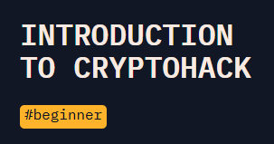


This post marks Day 1 of my 30-day CTF writeup series. I’m starting again with **Introduction to CryptoHack**, where I walk through the beginner challenges and document my first steps back into the platform. The plan is simple: solve at least one challenge every day, take notes, and build a process I can trust when the puzzles get tougher.

Day 1 was all about getting comfortable with the basics and finding a good rhythm again. I wanted to capture everything from the start, so this writeup includes what I saw on each challenge, what I tried, where I got stuck or got lazy, the screenshots I’ll add, the Python scripts I ran, and the flags I uncovered.

This is not meant to be a perfect tutorial. It is a detailed record of me getting back into the CTF mindset, rebuilding consistency, and finishing the series properly this time.

## 1. Finding Flags

Press enter or click to view image in full size

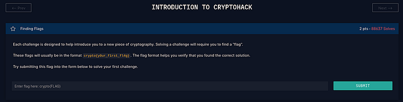

When you first start Introduction To CryptoHack, the course greets you with a short introductory challenge that explains what a “flag” actually looks like. It’s a simple start, but an important one because every challenge on the platform follows the same flag format:

```
crypto{example_flag_text}
```

The page clearly shows the format so you know exactly how your future flags should look and how to submit them.

I typed the example flag into the answer box just to test the system, and it got accepted right away.

**Flag:**

```
crypto{y0ur_f1rst_fl4g}
```

## 2. Great Snakes

Press enter or click to view image in full size

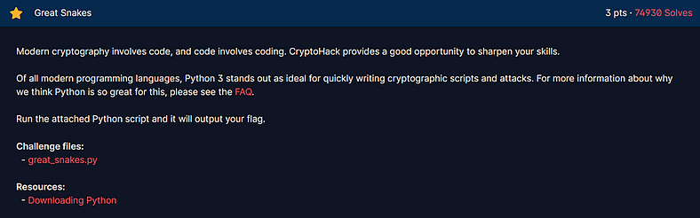

This challenge provided a small Python file called **great_snake.py** that contained a short script demonstrating how simple XOR operations can be used to reveal hidden text.

Press enter or click to view image in full size

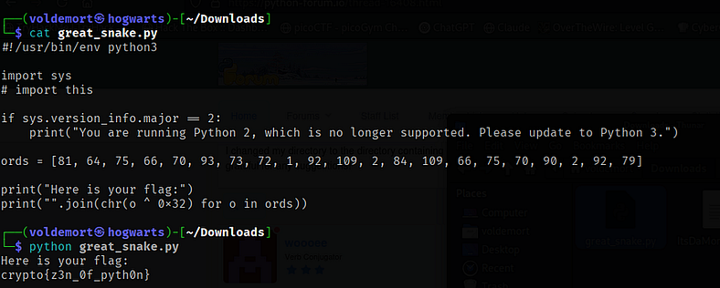

The script looked like this:

```
#!/usr/bin/env python3  
import sys  
ords = [81, 64, 75, 66, 70, 93, 73, 72, 1, 92, 109, 2, 84, 109, 66, 75, 70, 90, 2, 92, 79]  
print("Here is your flag:")  
print("".join(chr(o ^ 0x32) for o in ords))
```

The list `ords` contains a sequence of numbers. Each number is XORed with `0x32` (which equals 50 in decimal). The result of each XOR operation is then converted back into readable text using the `chr()` function and joined together to form the flag.

I ran the script using Python 3 and instantly got the flag:

```
python3 great_snake.py
```

**Flag:**

```
crypto{z3n_0f_pyth0n}
```

A straightforward XOR puzzle and a nice way to get a feel for how simple bitwise operations can hide data.

## 3. ASCII

Press enter or click to view image in full size

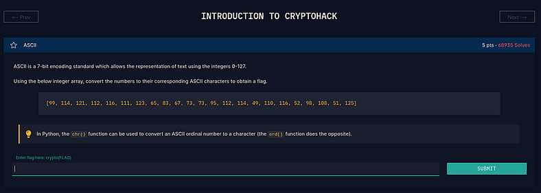

This challenge provided a list of numbers with a small hint that each one represented an ASCII code. The goal was to turn those numbers into readable text.

The given array was:

```
[99,114,121,112,116,111,123,65,83,67,73,73,95,112,114,49,110,116,52,98,108,51,125]
```

Each number here corresponds to an ASCII value. Learning from the description that Python’s `chr()` function converts numbers into characters, I wrote a short script to do the conversion:

```
ascii_array = [99,114,121,112,116,111,123,65,83,67,73,73,95,112,114,49,110,116,52,98,108,51,125]  
flag = ''.join(chr(x) for x in ascii_array)  
print(flag)
```

Running it printed:

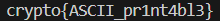

**Flag:**

```
crypto{ASCII_pr1nt4bl3}
```

## 4. Hex

Press enter or click to view image in full size

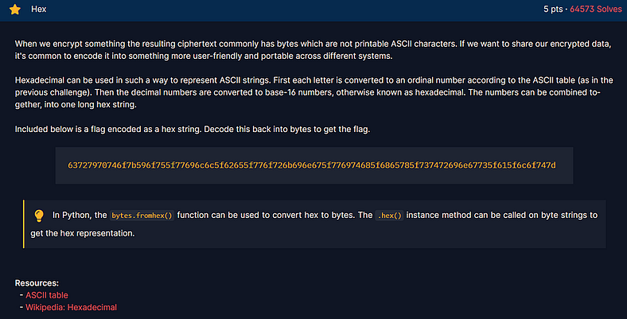

This one felt like a proper CTF challenge. The task was to take a long hexadecimal string and decode it into readable text.

The input string was:

```
63727970746f7b596f755f77696c6c5f62655f776f726b696e675f776974685f6865785f737472696e67735f615f6c6f747d
```

I could have written a quick Python script to decode it, but honestly, I got lazy and opened **CyberChef**. I dropped the hex string into the “From Hex” operation, and it instantly revealed the text.

Press enter or click to view image in full size

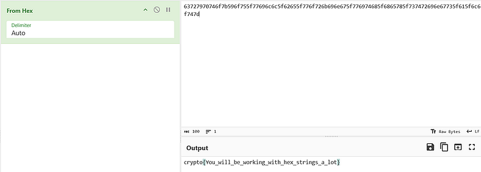

The decoded flag appeared right away:

**Flag:**

```
crypto{You_will_be_working_with_hex_strings_a_lot}
```

A simple and satisfying one. It’s a reminder that hex shows up everywhere in CTFs, so recognizing it instantly is always useful.

## 5. Base64

Press enter or click to view image in full size

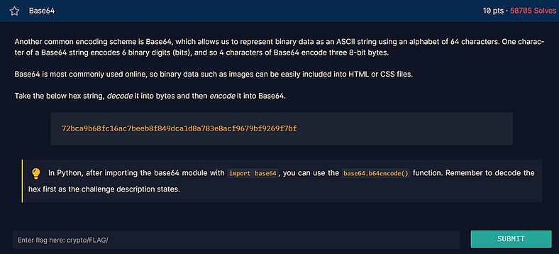

This challenge threw in a fun little combo of two encoding schemes: Hex and Base64. The idea was simple enough. Take a hex string, decode it into bytes, and then convert those bytes into Base64.

Here’s the string that was given:

```
72bca9b68fc16ac7beeb8f849dca1d8a783e8acf9679bf9269f7bf
```

At first, I thought about firing up a quick Python script, but I had CyberChef open already and wasn’t in the mood to switch tools. So I just dragged the hex string into the editor, added **“From Hex”** and then **“To Base64.”** In true CyberChef fashion, it handled everything instantly.

Press enter or click to view image in full size

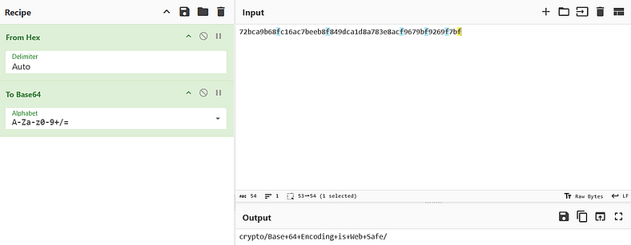

And just like that, the output gave me the flag:

**Flag:**

```
crypto/Base+64+Encoding+is+Web+Safe/
```

Nice and clean. Nothing fancy, just a good reminder that hex and Base64 love showing up together in CTFs.

## 6. Bytes and Big Integers

Press enter or click to view image in full size

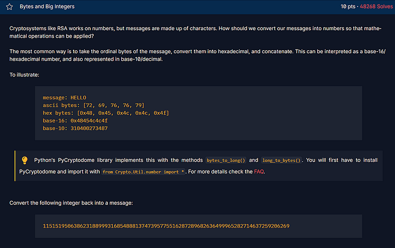

I love how this challenge digs into one of the core ideas behind how encryption systems like RSA handle data. Instead of working directly with text, cryptosystems turn everything into numbers first, perform math on those numbers, and then convert them back into readable text later.

The challenge starts with a quick explanation using the word **HELLO** as an example, showing how it can be represented in different forms:

```
message: HELLO    
ascii bytes: [72, 69, 76, 76, 79]    
hex bytes: [0x48, 0x45, 0x4C, 0x4C, 0x4F]    
base-16: 0x48454c4c4f    
base-10: 310400273487
```

After that, the challenge gives a huge integer and asks to convert it back into readable text:

```
11515195063862318899931685488813747395775516287289682636499965282714637259206269
```

To handle this, I installed **PyCryptodome**, which has a handy function called `long_to_bytes()` that does exactly what we need.

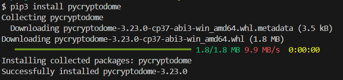

```
pip3 install pycryptodome
```

Once that was done, I wrote a quick Python script to decode the number.

Press enter or click to view image in full size

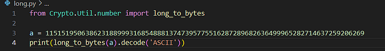

**Python Script:**

```
from Crypto.Util.number import long_to_bytes  
a = 11515195063862318899931685488813747395775516287289682636499965282714637259206269  
print(long_to_bytes(a).decode('ASCII'))
```

After running it, it immediately printed out the flag.

Press enter or click to view image in full size

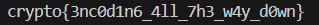

**Flag:**

```
crypto{3nc0d1n6_4ll_7h3_w4y_d0wn}
```

This one was really cool to see in action. Watching a massive number turn back into a readable flag in a single line of code feels kind of “Magical”.

## 7. XOR Starter

Press enter or click to view image in full size

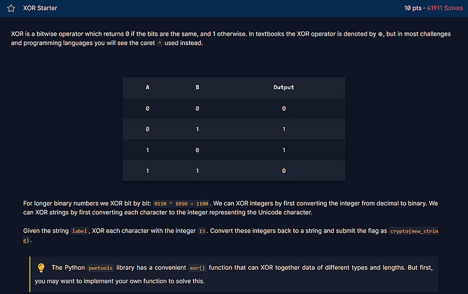

This one walks you through one of the most common operations in CTFs, XOR. It is annoyingly simple but shows up everywhere, so getting comfortable with it early pays off.

The page lays out the truth table and a quick example so you can see how XOR works on bits:

```
A B Output  
0 0 0  
0 1 1  
1 0 1  
1 1 0
```

For a quick binary example it shows that

```
0110 ^ 1010 = 1100
```

which is the bitwise idea behind everything that follows.

The task was tiny and concrete. Take the string `"label"`, XOR each character with the integer `13`, then convert the resulting numbers back into characters to get the flag.

I could have written a one-liner in Python, but I wanted a fast check so I fired up CyberChef. I dropped the input in, selected XOR, set the key to `13` in decimal, and the result popped up immediately.

Press enter or click to view image in full size

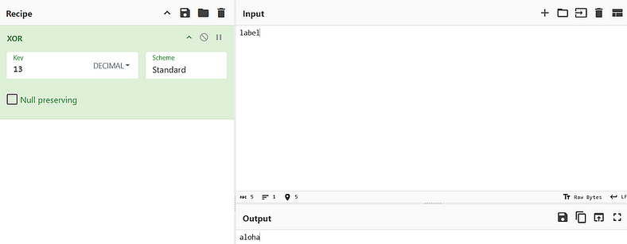

The transformation turned `"label"` into `"aloha"`, which fits the flag format used on CryptoHack.

**Flag:**

```
crypto{aloha}
```

## 8. XOR Properties

Press enter or click to view image in full size

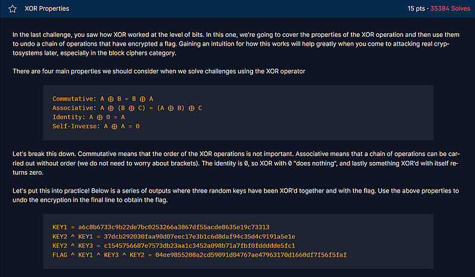

This one builds perfectly on the previous challenge and digs into why XOR is such a favorite in cryptography. It’s not just about flipping bits anymore, it’s about how XOR’s weird little math rules make it both simple and insanely powerful.

The challenge page lays out the core XOR properties that keep showing up everywhere:

- **Commutative:** A ⊕ B = B ⊕ A
    
- **Associative:** A ⊕ (B ⊕ C) = (A ⊕ B) ⊕ C
    
- **Identity:** A ⊕ 0 = A
    
- **Self-Inverse:** A ⊕ A = 0
    

Pretty standard stuff, but the fun starts when you see how these actually play out in code.

Here’s what CryptoHack gives you to work with:

```
KEY1 = a6c8b6733c9b22de7bc0253266a3867d55acde8635e19c73313    
KEY2 ⊕ KEY1 = 37dcb292030faa90d07eec17e3b1c6d8daf94c35d4c9191a5e1e    
KEY2 ⊕ KEY3 = c1545756687e7573db23aa1c3452a098b71a7fbf0fddddde5fc1    
FLAG ⊕ KEY1 ⊕ KEY3 ⊕ KEY2 = 04ee9855208a2cd59091d04767ae47963170d1660df7f56f5faf
```

The goal is to piece this together and figure out the flag. Since XOR is both commutative and associative, the order doesn’t matter, you can shuffle things around and cancel terms out as long as you keep track of the pairs.

I used Python’s **pwntools** library because it makes XOR operations stupidly easy. Here’s the short script I ran:

```
from pwn import xor  
key_1 = bytes.fromhex("a6c8b6733c9b22de7bc0253266a3867d55acde8635e19c73313")  
key_2_key_1 = bytes.fromhex("37dcb292030faa90d07eec17e3b1c6d8daf94c35d4c9191a5e1e")  
key_2_key_3 = bytes.fromhex("c1545756687e7573db23aa1c3452a098b71a7fbf0fddddde5fc1")  
flag_key_1_key_3_key_2 = bytes.fromhex("04ee9855208a2cd59091d04767ae47963170d1660df7f56f5faf")  
flag = xor(key_1, key_2_key_3, flag_key_1_key_3_key_2)  
print(flag)
```

When I ran it, everything clicked into place. Python did all the XORing magic and spat out this:

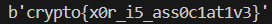

After trimming the byte prefix, I got the final flag:

**Flag:**

```
crypto{x0r_i5_ass0c1at1v3}
```

Honestly, this one was satisfying. It’s one of those moments where you really _see_ how XOR’s math properties make it such a core part of cryptography, simple logic, but super elegant in action.

## 9. Favourite Byte

Press enter or click to view image in full size

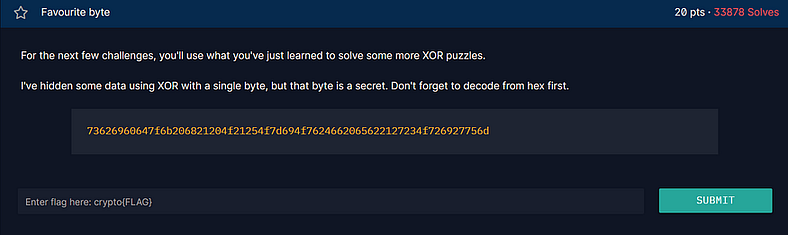

This one is a neat twist on the XOR problems. The key is just a single byte repeated across the whole message, so once you know that, brute forcing becomes trivial.

The ciphertext was provided as hex:

```
73626960647f6b206821204f21254f7d694f7624662065622127234f726927756d
```

The instructions say to decode from hex first, then try every possible single byte key from 0 to 255 until the plaintext looks like a flag. I started in CyberChef because it is great for quick, visual work. I ran From Hex, then XOR Brute Force with key length 1 and had a scrollable list of results to scan. Then I ran a string command with minimum length set to 40 to filter out the flag.

Press enter or click to view image in full size

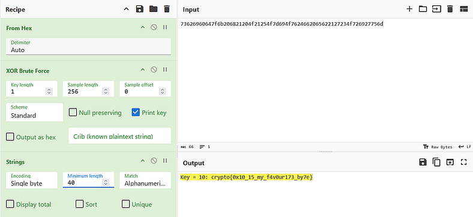

CyberChef showed the working key as `0x10` and the output clearly contained the flag.

**Flag:**

```
crypto{0x10_15_my_f4v0ur173_by7e}
```

## 10. You either know, XOR you do not

Press enter or click to view image in full size

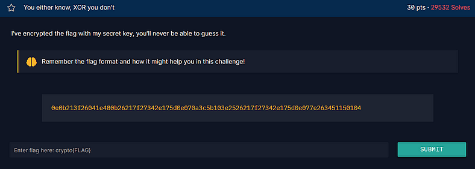

The final challenge from the Introduction To CryptoHack course. The challenge hands you a hex blob and a reminder to remember the flag format. The job is simple in concept: hex to bytes, XOR with the secret key, read the flag.

In CyberChef, I first converted the provided hex into raw bytes with **From Hex.** Then I used XOR with the string `crypto{` as a key because the page hinted at the flag format. That produced `myXORkey`, which looked like the hidden key the author had used. I then applied `myXORkey` as the XOR key in CyberChef to get the final plaintext.

Press enter or click to view image in full size

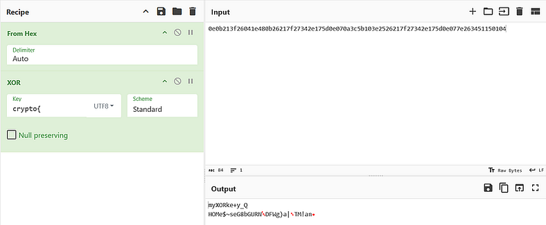

Press enter or click to view image in full size

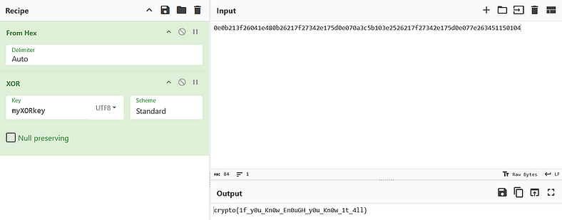


And that concludes my day 1 with Introduction To CryptoHack writeup. The challenges weren’t too hard, but they hit all the right notes getting me to think about encoding, XOR, and how small clues can lead to big reveals. I bounced between Python and CyberChef depending on my mood, and it worked out fine. More than anything, I’m starting to find a rhythm for how I solve and write these up. If the rest of the month keeps this pace, it’s going to be a fun ride. See you tomorrow folks.


