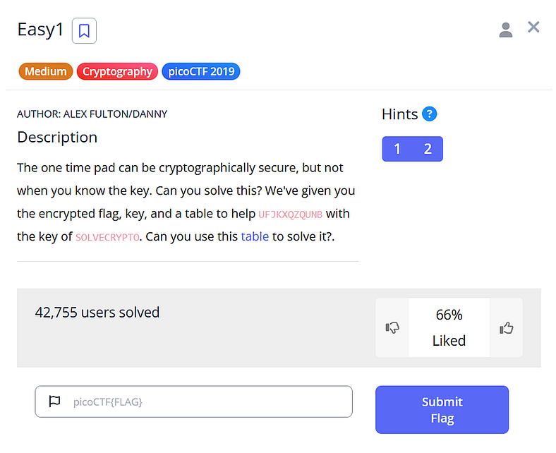
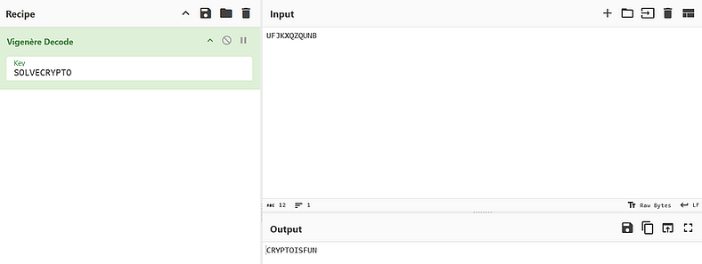

# Day 2: picoCTF 2019 Easy1 Writeup



## Challenge

> _“The one-time pad can be secure, but not when you know the key. We give you the encrypted flag, a key, and a Vigenère table. Can you solve it?”_

- Ciphertext: `UFJKXQZQUNB`
- Key: `SOLVECRYPTO`
- Goal: find the plaintext and wrap it as `picoCTF{...}`.

## Quick intuition

This one’s a gentle warm-up. The challenge throws you a [**Vigenère cipher**](https://en.wikipedia.org/wiki/Vigen%C3%A8re_cipher) problem, one of those classic “fancy Caesar cipher” types from old-school cryptography.

If Caesar cipher shifts every letter by the same amount, Vigenère mixes things up by using a _word_ as the key, where each letter of the key decides how much to shift the corresponding letter of the plaintext. For example, if your key is “DOG”, the first letter gets shifted by _D_, the next by _O_, and the third by _G_. Then the key repeats if the message is longer.

It’s like taking Caesar’s simple shift and putting it on shuffle mode.

The encryption and decryption process usually depends on a **Vigenère table**, or _tabula recta_, which looks like this: (provided inside the challange as text file)

```
A B C D E F G H I J K L M N O P Q R S T U V W X Y Z   
   +----------------------------------------------------  
A | A B C D E F G H I J K L M N O P Q R S T U V W X Y Z  
B | B C D E F G H I J K L M N O P Q R S T U V W X Y Z A  
C | C D E F G H I J K L M N O P Q R S T U V W X Y Z A B  
D | D E F G H I J K L M N O P Q R S T U V W X Y Z A B C  
E | E F G H I J K L M N O P Q R S T U V W X Y Z A B C D  
F | F G H I J K L M N O P Q R S T U V W X Y Z A B C D E  
G | G H I J K L M N O P Q R S T U V W X Y Z A B C D E F  
H | H I J K L M N O P Q R S T U V W X Y Z A B C D E F G  
I | I J K L M N O P Q R S T U V W X Y Z A B C D E F G H  
J | J K L M N O P Q R S T U V W X Y Z A B C D E F G H I  
K | K L M N O P Q R S T U V W X Y Z A B C D E F G H I J  
L | L M N O P Q R S T U V W X Y Z A B C D E F G H I J K  
M | M N O P Q R S T U V W X Y Z A B C D E F G H I J K L  
N | N O P Q R S T U V W X Y Z A B C D E F G H I J K L M  
O | O P Q R S T U V W X Y Z A B C D E F G H I J K L M N  
P | P Q R S T U V W X Y Z A B C D E F G H I J K L M N O  
Q | Q R S T U V W X Y Z A B C D E F G H I J K L M N O P  
R | R S T U V W X Y Z A B C D E F G H I J K L M N O P Q  
S | S T U V W X Y Z A B C D E F G H I J K L M N O P Q R  
T | T U V W X Y Z A B C D E F G H I J K L M N O P Q R S  
U | U V W X Y Z A B C D E F G H I J K L M N O P Q R S T  
V | V W X Y Z A B C D E F G H I J K L M N O P Q R S T U  
W | W X Y Z A B C D E F G H I J K L M N O P Q R S T U V  
X | X Y Z A B C D E F G H I J K L M N O P Q R S T U V W  
Y | Y Z A B C D E F G H I J K L M N O P Q R S T U V W X  
Z | Z A B C D E F G H I J K L M N O P Q R S T U V W X Y
```

When encrypting, you pick the row for the key letter and the column for the plaintext letter, the intersection gives you the ciphertext.  
To decrypt, you do the opposite: find the ciphertext in the row of the key letter, then trace it back to the column header.

But here’s the funny thing the challenge already gives us the key. So, instead of “breaking” anything, we’re really just reversing the process.

## Background

If we think of letters as numbers (A=0, B=1, …, Z=25), the formulas are:

**Encryption:**

C = (P + K) mod 26

**Decryption:**

P = (C - K) mod 26

Since the key and ciphertext are the same length, we can just align them and go letter by letter.

## Step-by-step solve

Let’s line them up:

Ciphertext: U F J K X Q Z Q U N B  
Key       : S O L V E C R Y P T O

Now we subtract the key from the ciphertext (mod 26) to get our plaintext:

| Cipher | Key | C−K | Plain |  
|  ----  |  -  |  -  |  ---  |  
|    U   |  S  |  2  |   C   |  
|    F   |  O  |  17 |   R   |  
|    J   |  L  |  24 |   Y   |  
|    K   |  V  |  15 |   P   |  
|    X   |  E  |  19 |   T   |  
|    Q   |  C  |  14 |   O   |  
|    Z   |  R  |  8  |   I   |  
|    Q   |  Y  |  18 |   S   |  
|    U   |  P  |  5  |   F   |  
|    N   |  T  |  20 |   U   |  
|    B   |  O  |  13 |   N   |

Plaintext: **CRYPTOISFUN**

## Easy solve with CyberChef

This challange can easily be solved using [CyberChef](https://gchq.github.io/CyberChef/).

Recipe: **Vigenère Decode**  
Key: `SOLVECRYPTO`  
Input: `UFJKXQZQUNB`  
Output: `CRYPTOISFUN`

Press enter or click to view image in full size



## Flag

`picoCTF{CRYPTOISFUN}`

The challenge’s entire trick is that Vigenère isn’t secure when you already have the key. Once you know it, decryption is just basic math. The point here is to understand how the cipher _works_, not to brute-force it.


