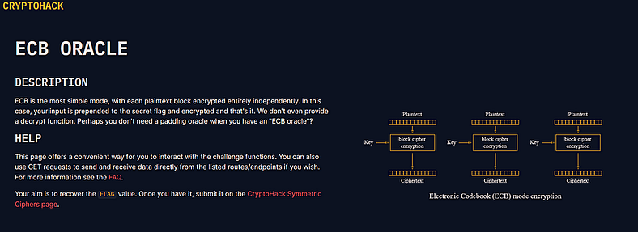
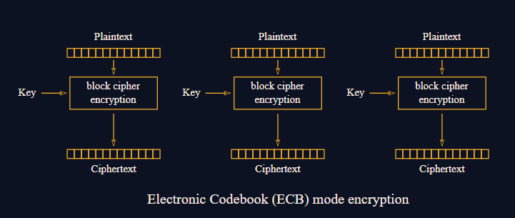

# Day 3: ECB Oracle Writeup



> _A relaxed, story-style explanation of how I solved the ECB Oracle challenge on Cryptohack and what it teaches about the way this oracle actually works under the hood. (An explanation video is added at the end)_

## TL;DR

In this challenge, we interact with an **encryption oracle** that takes any text we send, appends a secret flag to it, and encrypts the result with AES in ECB mode. Because ECB encrypts every block separately, we can take advantage of repeated ciphertext blocks to recover the flag one character at a time.

Press enter or click to view image in full size



## Challenge description (from Cryptohack)

> _“ECB is the most simple mode, with each plaintext block encrypted entirely independently. In this case, your input is prepended to the secret flag and encrypted and that is it. We do not even provide a decrypt function. Perhaps you do not need a padding oracle when you have an ECB oracle?”_

Here’s the simplified backend code provided with the challenge that runs the encryption:

```
from Crypto.Cipher import AES  
from Crypto.Util.Padding import pad  
KEY = ?  
FLAG = ?  
@chal.route('/ecb_oracle/encrypt/<plaintext>/')  
def encrypt(plaintext):  
    plaintext = bytes.fromhex(plaintext)  
    padded = pad(plaintext + FLAG.encode(), 16)  
    cipher = AES.new(KEY, AES.MODE_ECB)  
    encrypted = cipher.encrypt(padded)  
    return {"ciphertext": encrypted.hex()}
```

The idea is simple: you control the **plaintext** part, but the **flag** is secretly added to the end before encryption. You never see the plaintext or the key, only the ciphertext that comes back. Your task is to figure out what the flag is, just by analyzing those ciphertexts.

## How the challenge actually works

When you send something to the endpoint, it builds the plaintext like this:

[ your input ] + [ secret flag ]

This combined string is then padded to a multiple of 16 bytes (since AES works on 16-byte blocks), and each block is encrypted individually using ECB. That means the first 16 bytes of ciphertext come from the first 16 bytes of your input plus part of the flag, the next 16 bytes come from the next chunk, and so on.

Here’s the clever part: if two plaintext blocks are identical, their ciphertext blocks will also be identical. So, by carefully controlling what you send, you can figure out what parts of your input line up with the flag.

For example:

- You send: `AAAAAAAAAAAAAAAA` (16 A’s)
- The server encrypts: `AAAAAAAAAAAAAAAA + FLAG_START`
- The first ciphertext block corresponds to that combination.

If you then change the input slightly and notice how the ciphertext changes, you can infer which characters of the flag affect which parts of the ciphertext. Over many requests, you can literally “read” the flag character by character.

So the challenge is like a puzzle where each ciphertext pattern gives you a tiny hint about what the next hidden byte might be.

## How the attack logic works

Here’s how we turn that pattern leak into a working attack:

1. Start with an empty flag string.
2. Take all possible characters that might appear in the flag (letters, digits, underscores, braces).
3. Guess one character at a time by appending it to your current flag.
4. Wrap it with some padding — for example, `'A' * (16 - len(flag_guess) % 16)` before and after — so it sits nicely inside the 16-byte block boundaries.
5. Send the padded string to the oracle’s encrypt function.
6. The oracle returns the ciphertext. We then split it into chunks (each 32 hex characters = 16 bytes).
7. If two adjacent chunks are identical, that means our guess made the plaintext blocks line up perfectly — confirming our guessed character.
8. Keep going until the flag ends with `}`.

It’s basically like brute-forcing, but guided by patterns in how ciphertext repeats.

## The script

Here’s the working script that automates the entire flag recovery process:

```
import requests  
BASE = "http://aes.cryptohack.org/ecb_oracle/encrypt/"  
def encrypt(text):  
    r = requests.get(BASE + text.encode().hex())  
    return r.json()['ciphertext']  
def pad_input(s):  
    pad = 'A' * (16 - len(s) % 16)  
    return pad + s + pad  
def decrypt_flag():  
    chars = "abcdefghijklmnopqrstuvwxyz1234567890_{}"  
    flag = ""  
    while True:  
        for c in chars:  
            guess = flag + c  
            padded = pad_input(guess)  
            ct = encrypt(padded)  
            size = 2 * ((16 - len(guess) % 16) + len(guess))  
            part1, part2 = ct[:size], ct[size:size*2]  
            if part1 == part2:  
                flag += c  
                print(flag)  
                break  
        if flag.endswith('}'):  
            break  
if __name__ == '__main__':  
    decrypt_flag()
```

Each loop tests one new character and checks whether it produces identical ciphertext blocks meaning we guessed the correct character. Slowly but surely, the full flag reveals itself.

## Wrapping it up

What makes this challenge fun isn’t the math, it’s the logic behind how data flows through AES. The oracle doesn’t “leak” the flag directly, but it leaks **structure** and with ECB mode, structure is everything.

Every time you send data, you’re shifting how your input and the flag align across AES’s 16-byte boundaries. By paying attention to how those ciphertext patterns repeat, you piece together the hidden flag one character at a time.

It’s like solving a puzzle where every move gives you a tiny clue and when you finally get that `}`, it’s pure satisfaction.

🎥 [Watch this visual explanation of ECB mode](https://youtu.be/SLeTFY40PZQ?si=XdcWBFXlQCgeeXZm) (Not promotional, just a very good explaination that helped me understand the challenge)


