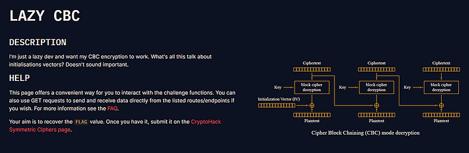

# Day 4: Lazy CBC Writeup



## Intro

Day 4 and I wanted something crisp and satisfying. Lazy CBC fit that description. The challenge is small and tidy, and it rewards one observation: the service reused the AES key as the CBC IV and it returned decrypted bytes when the result was not printable. That felt like an invitation to play. I solved it with a couple of simple requests, one crafted ciphertext, and one XOR. Below I show the intuition in plain language, the deeper math, a step by step exploit, a runnable script, and the exact live run I used to get the flag.

## The scene

The API gives you two helpful endpoints, encrypt and receive, that behave like simple oracles. Instead of hunting padding or timing oracles I focused on block algebra. Reusing the IV is a classic mistake. Returning raw decrypted bytes in an error message is a second mistake that makes exploitation trivial. Put them together and the server hands you what you need to recover the key.

## Why it breaks

Think of AES block decryption as a box that outputs a 16-byte value whenever you feed it one 16-byte input. Call that output the machine output. CBC then mixes that machine output with another 16-byte value to get the final plaintext block. The mixing operation is XOR. XOR is a reversible mixer, and its main trick is that if you XOR something twice with the same value it cancels out.

Small ideas to hold in your head:

- The machine output is like a colored sticker, call it blue.
- The IV or previous ciphertext block is another sticker, call it red.
- CBC mixes blue with red by XOR, and the result is purple. Purple is the plaintext block.
- XOR has this neat property: blue XOR red XOR blue = red. The two blues cancel and only red remains.

Toy story version

- Suppose the box outputs blue for some ciphertext block c0.
- CBC mixes blue with the IV red, producing purple. Purple = blue XOR red.
- If you can get the server to return two plaintext blocks, one purple and one pure blue, then XORing those two blocks will cancel blue and reveal red. That red is the IV. If the IV is also the key, you recovered the key.

How to make the server give you purple and blue

- We control the ciphertext we send.
- Choose a block c0 that decrypts under AES block decryption to D0 = d(c0), that is the blue.
- Send the server three blocks: c0, a zero block, and c0 again. The CBC flow makes the first plaintext p0 = D0 XOR IV, and the third plaintext p2 = D0 XOR 0 = D0. One is purple, the other is blue. XOR them and you get IV.
- The server returns the decrypted bytes in hex when the plaintext is not printable. That gives us p0 and p2. XOR them locally and we have IV, which in this challenge equals the key.

Analogy

Imagine a teacher stamps pages with a secret red stamp and a student prints blue patterns. One page has the blue pattern and then the teacher stamped red on top, making purple. Another page has only the blue pattern. If you overlay and subtract the pure blue page from the purple page, the blue cancels and you see the teacher’s red stamp. That red stamp is the secret.

## Math and intuition

Let d(x) denote AES block decryption of block x. For ciphertext split into blocks c0, c1, c2, CBC decryption gives plaintext blocks:

- p0 = d(c0) XOR iv
- p1 = d(c1) XOR c0
- p2 = d(c2) XOR c1

We want two plaintext blocks where one contains d(c0) XOR iv and the other contains d(c0) alone. That way XORing them cancels d(c0) and leaves iv.

Construct the fake ciphertext:

- c0 || ⁰¹⁶ || c0

Decrypting this sequence yields:

- p0 = d(c0) XOR iv
- p1 = d(0) XOR c0
- p2 = d(c0) XOR 0 = d(c0)

Now compute:

```
p0 XOR p2 = (d(c0) XOR iv) XOR d(c0)  
= d(c0) XOR d(c0) XOR iv  
= 0 XOR iv  
= iv
```

Thus p0 XOR p2 = iv.

Because the server leaks the decrypted bytes as hex when the plaintext is not printable, we can obtain p0 and p2 remotely, XOR them locally, and recover iv. If the service reuses iv as the AES key, the recovered iv is the AES key.

[](https://medium.com/write?source=promotion_paragraph---post_body_banner_home_for_stories_scribble--ef7a6d9e7613---------------------------------------)

A short note about XOR linearity

XOR is addition in the vector space GF(2)¹²⁸ for 16 byte blocks. That linearity is why rearranging blocks and XORing outputs can cancel intermediate terms and expose secrets when intermediate decrypted data is leaked.

## Walkthrough

1. Call the encrypt endpoint with 48 bytes of known plaintext, for example 48 bytes of ASCII ‘a’. The service returns a ciphertext that splits into three 16-byte blocks, call them C0, C1, C2.
2. Build a fake ciphertext: C0, then 16 null bytes, then C0 again. In hex notation that is: C0 || 00..00 || C0.
3. Send that fake ciphertext to the receive endpoint. The server will decrypt and, because the plaintext contains invalid ASCII, return the decrypted bytes as hex in the error field.
4. Parse the returned hex into three 16-byte plaintext blocks P0, P1, P2.
5. Compute key = P0 XOR P2 bytewise. The result equals the IV. In this challenge IV equals the AES key, so key is the AES key.
6. Call get_flag with the recovered key. The endpoint returns the flag bytes in hex. Decode to ASCII and you have the flag.

## Minimal script you can run

This is ready to paste into a terminal. Requires Python 3 and the requests package. Change `BASE` if you run a different instance.

```python
import requests

BASE = "https://aes.cryptohack.org/lazy_cbc"  # change if needed


def xor_bytes(a: bytes, b: bytes) -> bytes:
    return bytes(x ^ y for x, y in zip(a, b))


# 1) request a 3-block ciphertext for known plaintext
plain = b"a" * 16 * 3
r = requests.get(f"{BASE}/encrypt/{plain.hex()}/")
r.raise_for_status()
cipher_hex = r.json()["ciphertext"]
print("ciphertext:", cipher_hex)

# 2) extract C0 and craft fake ciphertext: C0 || zero || C0
c0 = bytes.fromhex(cipher_hex[:32])
zero = b"\x00" * 16
fake = c0 + zero + c0
fake_hex = fake.hex()

# 3) send fake and parse decrypted hex from the error
r2 = requests.get(f"{BASE}/receive/{fake_hex}/")
data = r2.json()
if "error" not in data:
    raise SystemExit("unexpected response, no error field")

err = data["error"]
prefix = "Invalid plaintext: "
if prefix not in err:
    raise SystemExit("unexpected error format: " + err)

decrypted_hex = err.split(prefix)[1]
print("decrypted hex:", decrypted_hex)

# 4) split and xor P0 ^ P2 to recover key/iv
dec = bytes.fromhex(decrypted_hex)
p0 = dec[:16]
p2 = dec[32:48]
key = xor_bytes(p0, p2)
print("recovered key (hex):", key.hex())

# 5) fetch flag using recovered key
r3 = requests.get(f"{BASE}/get_flag/{key.hex()}/")
r3.raise_for_status()
resp = r3.json()
if "plaintext" in resp:
    flag = bytes.fromhex(resp["plaintext"]).decode()
    print("FLAG:", flag)
else:
    print("get_flag response:", resp)
```

## Live run: actual output from the script

I ran the script and saved the raw outputs here so you can see the full recovery in one go.

**Ciphertext returned by the encrypt endpoint**

```
cipher: a4c2627cb0db28a845772617dfc4c4094c0b67258100605f7ae4fe68e0ebdeb6e3ec65cd0720db524fdd7675c81b3dd9
```

**Decrypted hex returned by the receive endpoint (error field)**

```
decrypted hex: 616161616161616161616161616161617460209e222ffd34b80fa9d558131af42c07131badf73393caa10e7679a60505
```
**Recovered key**

```
recovered key (hex): 4d66727acc9652f2abc06f1718c76464
```

**FLAG**

```
crypto{50m3_p30pl3_d0n7_7h1nk_IV_15_1mp0r74n7_?}
```

## Full XOR table — how P0 and P2 produce the key

The decrypted hex splits into three 16-byte blocks, P0 | P1 | P2.

- P0 (hex) = `61616161616161616161616161616161` which is ASCII `aaaaaaaaaaaaaaaa`
- P1 (hex) = `7460209e222ffd34b80fa9d558131af4`
- P2 (hex) = `2c07131badf73393caa10e7679a60505`

XOR P0 with P2 byte by byte to recover the IV/key. Here is the full 16 byte table:

```
index P0 (hex) P2 (hex) P0 XOR P2 (hex) 0 61 2c 4d 1 61 07 66 2 61 13 72 3 61 1b 7a 4 61 ad cc 5 61 f7 96 6 61 33 52 7 61 93 f2 8 61 ca ab 9 61 a1 c0 10 61 0e 6f 11 61 76 17 12 61 79 18 13 61 a6 c7 14 61 05 64 15 61 05 64
```

Concatenating the XOR results gives the 16 byte key:

```
4d66727acc9652f2abc06f1718c76464
```

That matches the recovered key from the script and is the value submitted to `get_flag` to retrieve the flag.

## Afterthought

This one is satisfying because the exploit is short and deterministic, and the vulnerability is easy to explain. Controlling ciphertext layout and reading decrypted bytes from the server turned a small setup mistake into a full key recovery in a few requests. Day 4 of the 31-day series reminded me that simple algebra with XOR can be more powerful than long oracle probing.


