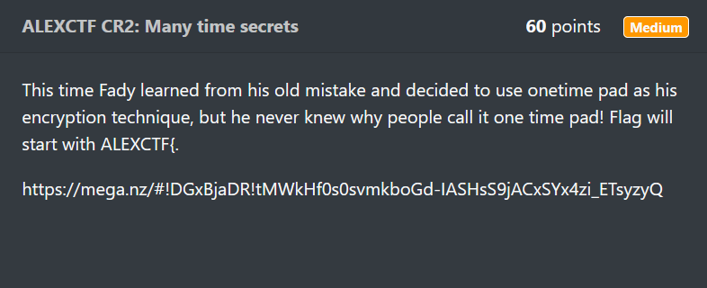

# Day 5: ALEXCTF CR2: Many Time Secrets Writeup

Today was Day 5 of my crypto journey, and this time I stepped away from CryptoHack and picked up a real CTF challenge: AlexCTF CR2 — Many Time Secrets.

This challenge was interesting because it did not throw equations or hints at me. Instead, it gave me a massive piece of hex that looked like gibberish. But behind that chaos was a very famous mistake people make in cryptography: reusing a One-Time Pad key.

A One-Time Pad is supposed to be perfectly secure, but only if you use the key once. If someone reuses it, the entire fortress collapses. And today, I got to experience exactly how it collapses.

Let me walk you through the whole thing, exactly as I used cribdrag.py, what I saw, where I got confused, and how the flag slowly revealed itself one piece at a time.

## Setting the Scene

Press enter or click to view image in full size



**Challenge Description**

Fady finally uses a One-Time Pad, but he does not understand why it is called “one time.” The flag begins with ALEXCTF{.

**Given Ciphertext (hex):**

```
0529242a631234122d2b36697f13272c207f2021283a6b0c79082f28202a302029142c653f3c7f2a2636273e3f2d653e25217908322921780c3a235b3c2c3f207f372e21733a3a2b37263b3130122f6c363b2b312b1e64651b6537222e37377f2020242b6b2c2d5d283f652c2b31661426292b653a292c372a2f20212a316b283c0929232178373c270f682c216532263b2d3632353c2c3c2a293504613c37373531285b3c2a72273a67212a277f373a243c20203d5d243a202a633d205b3c2d3765342236653a2c7423202f3f652a182239373d6f740a1e3c651f207f2c212a247f3d2e65262430791c263e203d63232f0f20653f207f332065262c31683137223679182f2f372133202f142665212637222220733e383f2426386b
```

**Tool Used: cribdrag.py**  
GitHub link: [https://github.com/SpiderLabs/cribdrag](https://github.com/SpiderLabs/cribdrag)

## Before We Start: How This Challenge Actually Works

This part is important for beginners, so here is the challenge logic in simple terms.

## What the attacker (us) receives

A giant XOR-encrypted ciphertext that comes from multiple English messages.  
All encrypted with the **same One-Time Pad key**.

## Why this is a disaster

A One-Time Pad is only secure when:

- the key is completely random
    
- the key is as long as the message
    
- the key is used **once**, ever
    

Fady broke the last rule.  
He reused the key across multiple English sentences.

## Why that breaks OTP

Imagine:

```
C1 = P1 XOR K    
C2 = P2 XOR K
```

If you XOR the two ciphertexts:

```
C1 XOR C2 = (P1 XOR K) XOR (P2 XOR K)
```

The key cancels out:

```
C1 XOR C2 = P1 XOR P2
```

Now instead of two “impossible-to-break” ciphertexts, you get the XOR of two English sentences. English XOR English leaks patterns, spacing, apostrophes, capital letters, and repeated structures.

This is the same weakness exploited in the famous WWII “Many-Time Pad” mistake.

## How cribdrag.py fits into this

Cribdrag takes a **guess** (called a crib), like:

```
ALEXCTF{
```

It slides this guess across the XOR output and shows what the other text would become if that guess were correct.

If the guess is wrong, the XOR output looks like garbage.  
If the guess is right, you see beautiful, readable English.

This is why cribdrag works:

```
Known plaintext + XOR = recover key    
Recovered key + XOR = recover rest of plaintext
```

It becomes a chain reaction.  
Every correct guess reveals more key.  
More key reveals more plaintext.  
More plaintext reveals more places to guess next.

That is exactly how we cracked the whole message.

## Launching Cribdrag

I pasted the big hex ciphertext into the tool:

```
$ ./cribdrag.py <hexstring>
```

It printed two panels.

**Message Panel (plaintext), underscores for unknown bytes:**

```
0  _____________________________________  
40 _____________________________________  
...
```

**Key Panel (OTP key), also underscores:**

```
0  _____________________________________  
40 _____________________________________  
...
```

Both were empty. This is where the fun begins.

## First Crib, Guessing the Flag Start

I knew the flag begins with:

```
ALEXCTF{
```

So I typed:

```
Please enter your crib: ALEXCTF{
```

Cribdrag printed dozens of possible positions and their XOR results.

Most looked like garbage:

```
wf8k;Q`  
lxd3Hj,  
zv,;fjN
```

But one line stood out:

```
*** 0: "Dear Fri"
```

That is obviously English.

I selected that position:

```
Enter the correct position: 0  
Is this crib part of the message or key? message
```

Cribdrag instantly filled:

Plaintext:

```
ALEXCTF{______________________
```

Key:

```
Dear Fri______________________
```

The plaintext starts with the flag.  
The key begins with “Dear Fri”.

## Filling the Next Gap, “Dear Friend,”

Since the key begins with Dear Fri, the logical continuation is:

```
Dear Friend,
```

I entered:

```
Please enter your crib: Dear Friend,
```

This matched the key.

Plaintext became:

```
ALEXCTF{HERE_____________________
```

Now the flag clearly contains “HERE”.

## The “encryption sch” Discovery

More crib dragging revealed:

```
260: "ncryption sch"
```

I tried:

```
encryption sch
```

Placed at position 260, belonging to the plaintext.

Another chunk of the message unlocked.

## Full Phrase, “encryption scheme”

I typed:

```
encryption scheme
```

Cribdrag suddenly produced:

```
259: "}ALEXCTF{HERE_GOE"
```

If the XOR output produces a flag, that means the crib belongs to the key.

After placing it, the flag expanded to:

```
ALEXCTF{HERE_GOE
```

We were very close.

## “agree with me to us”

Crib drag showed:

```
234: "gree with me to u"
```

I entered the crib and placed it in the key.  
Plaintext now contained:

```
}ALEXCTF{HERE_GOES_
```

The ending was in sight.

## “understood my mistake”

Cribdrag aligned:

```
25: "}ALEXCTF{HERE_GOES_TH"
```

Placed into the key, revealing:

```
ALEXCTF{HERE_GOES_TH
```

## “proven to be not crack”

This crib matched:

```
157: "LEXCTF{HERE_GOES_THE_K"
```

And after placing it:

```
ALEXCTF{HERE_GOES_THE_K
```

Almost full flag.

## Final Blow, “sed One time pad encryption”

I entered:

```
sed One time pad encryption
```

And cribdrag responded with:

```
52: "ALEXCTF{HERE_GOES_THE_KEY}A"
```

This was the final unlock.

After placing it:

```
ALEXCTF{HERE_GOES_THE_KEY}
```

Flag complete.

## Final Flag

```
ALEXCTF{HERE_GOES_THE_KEY}
```

## The Full Message, Just for Satisfaction

The entire plaintext decrypted into:

```
Dear Friend, This time I understood my mistake and used One time pad  
encryption scheme. I heard that it is the only encryption method that is  
mathematically proven to be not cracked ever if the key is kept secret.  
Let me know if you agree with me to use this encryption scheme always.
```

He bragged about OTP being unbreakable inside a message that was broken because he reused the key. Beautiful irony.

## Final Thoughts for Day 5

This challenge felt magical.  
Not because it was extremely difficult, but because you literally watch the plaintext and the key reveal themselves one crib at a time. It feels like reconstructing a shredded letter.


