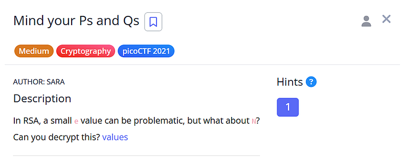
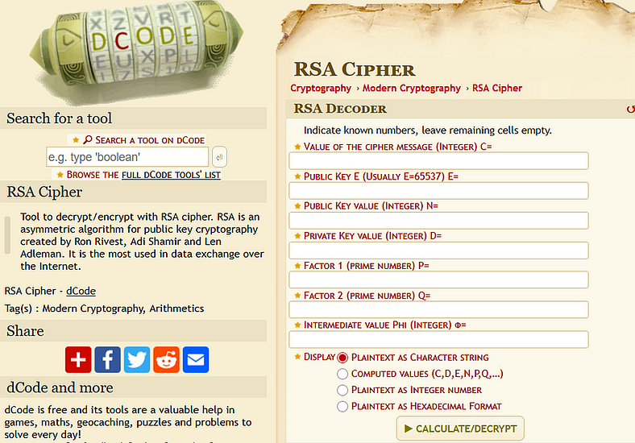
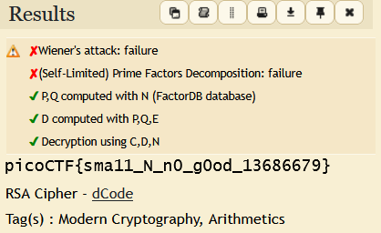

# Day 6: Mind Your Ps and Qs Writeup



## Decrypting RSA when N becomes the weak link

Today was Day 6 of my cryptography journey, and I wanted to try something simple but still realistic. While going through picoCTF challenges, I found one called:

**“Mind your Ps and Qs”**  
Medium difficulty. Cryptography. 2021.

The description asked:

> _“In RSA, a small e value can be problematic, but what about N?”_

That line instantly told me that this would be a modulus weakness challenge rather than an exponent trick.

## Setting the Scene

The challenge provided three values:

```
c = 861270243527190895777142537838333832920579264010533029282104230006461420086153423    
n = 1311097532562595991877980619849724606784164430105441327897358800116889057763413423    

e = 65537
```

At first glance, n looked large, but not large enough for real RSA security. It clearly was not a 2048-bit modulus. Out of curiosity, I placed the values into dcode to see if it could detect anything.



When I clicked calculate, dcode showed the following output:



The interesting part was not the flag itself, but the internal steps dcode displayed:

## What dcode actually did

1. **Wiener’s attack: failure**  
    This checks if d is small. It was not.
2. **Self-limited prime factor decomposition: failure**  
    This means dcode tried quick local factoring but n was slightly too big for its built-in brute force.
3. **P, Q computed with N (FactorDB database)**  
    This is the important line.  
    dcode automatically queries FactorDB in the background.  
    Since this challenge has been solved by many players, the modulus n and its factors p and q are already stored in the public FactorDB database.  
    So dcode simply retrieved the factors directly.
4. **D computed with P, Q, E**  
    Once p and q are known, it computes:  
    phi(n) = (p — 1)(q — 1)  
    d = e inverse mod phi(n)
5. **Decryption using C, D, N**  
    It performs m = c^d mod n  
    and converts the result to bytes.

This is why the solution instantly appeared.  
The weakness was not the ciphertext or exponent.  
It was the modulus.

## The Real Lesson Behind This Challenge

RSA only works when the modulus is large enough to be difficult to factor. The entire system is built on:

N = p * q

If the primes are too small, predictable, or already known in public databases like FactorDB, the whole key collapses. That is exactly what happened here. The modulus was around 150 bits, which is far below modern standards.

Once N is factored, everything else becomes routine:

```
phi(n) = (p - 1) * (q - 1)
```

```
d = inverse_mod(e, phi(n))
```

```
m = pow(c, d, n)
```

No attacks were required. No special math tricks. Just basic RSA decryption enabled by a weak modulus. It is a simple reminder that RSA strength depends on the size of N more than anything else.

## Final Flag

```
picoCTF{sma11_N_n0_g0od_13686679}
```

## Closing Thoughts

Today reminded me that RSA security is only as strong as the numbers behind it. If the modulus is weak, nothing else can protect the encryption.


