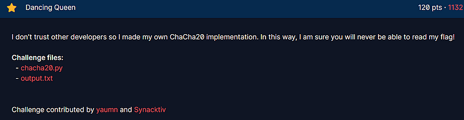

# Day 7: Dancing Queen CTF Writeup

Today’s CTF challenge was called **Dancing Queen**, which already felt suspicious.  
Crypto challenges are normally named things like “AES Nightmare” or “Prime Time”, not ABBA songs.  
But I clicked anyway because I make bad decisions for fun.



The first thing I saw was this line:

```text
“I do not trust other developers so I made my own ChaCha20 implementation.”
```

If you ever see someone say this, please understand that danger is coming.  
Real cryptographers trust math.  
People who write sentences like this trust vibes.

And when someone rewrites ChaCha20 using vibes, something important always goes missing.

## The Challenge Files

The challenge gave me three things:

1. `chacha20.py`
    
2. `output.txt`
    
3. A confident developer who believes their custom cipher is unbreakable
    

Inside `output.txt` were the encrypted values:

```python
iv1 = 'e42758d6d218013ea63e3c49'  
iv2 = 'a99f9a7d097daabd2aa2a235'  
msg_enc = 'f3afbada8237af6e94c7d2065ee0e221a1748b8c7b11105a8cc8a1c74253611c94fe7ea6fa8a9133505772ef619f04b05d2e2b0732cc483df72ccebb09a92c211ef5a52628094f09a30fc692cb25647f'  
flag_enc = 'b6327e9a2253034096344ad5694a2040b114753e24ea9c1af17c10263281fb0fe622b32732'
```

And the script itself encrypted a known message:

```python
msg = b'Lorem ipsum dolor sit amet, consectetuer adipiscing elit. Aenean commodo ligula.'
```

So I ran their code just to see what would happen.  
This was the output I got:

```python
iv1 = 'ddfbe869d20bd1a9ec9264ef'  
iv2 = 'f1e1130c621a01fd13dae3b4'  
msg_enc = 'ba5feb3933b9d3a2d9b5b4dabe6e20a2707a6be92b08cef0906e4642a1dfe48eb6c58728fc3b099f02bd80c63a01e43a8186fd7eeb76d8275e0c88f84ec412b294a4a7a764fdf99903dd58fe4e37ef5d'  
flag_enc = 'b7389262b6dce19194d3871291166094581c2f281518cef6cf68a06344e68f85984984d664'
```

Cool.  
Everything looked normal.  
Except it wasn’t.

## The Fatal Mistake

When I scrolled through the ChaCha20 implementation, everything looked fine at first.  
The constants were correct.  
The quarter rounds were in place.  
The double rounds were present.

And then I stopped.

In real ChaCha20:

After the 20 rounds finish, you add the original state back into the new state.

This is the entire reason ChaCha20 cannot be reversed.  
It is the cryptographic version of cooking the ingredients together so you cannot separate them later.

But in this challenge, the developer forgot that step.

They did the 20 rounds.  
And then they said “ok done”  
and directly XORed that raw, unfinalized internal state with the plaintext.

This is like serving raw flour and calling it bread.

## Why This Breaks Everything (Beginner Friendly)

Here is why this one missing line destroys the entire cipher.

1. We know a plaintext message.
    
2. We XOR plaintext with ciphertext and get the keystream.
    
3. In real ChaCha20, the keystream is scrambled beyond recognition.
    
4. In this broken version, the keystream is literally the internal state after 20 rounds.
    
5. The state after the rounds is reversible because rounds are made of add, XOR, rotate.
    
6. That means you can walk the cipher backward like rewinding a movie.
    
7. If you undo all the rounds, the original state appears.
    
8. Inside that state are the 8 words of the real 256 bit key.
    

In short:

The cipher turned into a reversible blender.  
You could gather every ingredient back out in perfect order.

## The Plan

I did exactly this:

1. XORed the known plaintext with the ciphertext to get the 20 round output.
    
2. Converted the bytes into 16 words.
    
3. Reversed every round one by one.
    
4. Extracted the key straight from the state.
    
5. Loaded the key back into their broken ChaCha20.
    
6. Decrypted the flag like it was asking to be freed.
    

## The Full Solver Script

Here is the complete working solver that recovers the key and the flag.  
Beginner friendly.  
Clean.  
Paste ready.

```python
#!/usr/bin/env python3  
from binascii import unhexlify  

KNOWN_MSG = b'Lorem ipsum dolor sit amet, consectetuer adipiscing elit. Aenean commodo ligula.'  

iv1_hex = 'e42758d6d218013ea63e3c49'  
iv2_hex = 'a99f9a7d097daabd2aa2a235'  
msg_enc_hex = 'f3afbada8237af6e94c7d2065ee0e221a1748b8c7b11105a8cc8a1c74253611c94fe7ea6fa8a9133505772ef619f04b05d2e2b0732cc483df72ccebb09a92c211ef5a52628094f09a30fc692cb25647f'  
flag_enc_hex = 'b6327e9a2253034096344ad5694a2040b114753e24ea9c1af17c10263281fb0fe622b32732'  

iv1 = unhexlify(iv1_hex)  
iv2 = unhexlify(iv2_hex)  
msg_enc = unhexlify(msg_enc_hex)  
flag_enc = unhexlify(flag_enc_hex)  

def bytes_to_words(b):  
    return [int.from_bytes(b[i:i+4], 'little') for i in range(0, len(b), 4)]  

def rotate(x, n):  
    return ((x << n) & 0xffffffff) | ((x >> (32 - n)) & 0xffffffff)  

def word(x):  
    return x % (2 ** 32)  

def words_to_bytes(w):  
    return b''.join([i.to_bytes(4, 'little') for i in w])  

def xor(a, b):  
    return bytes([x ^ y for x, y in zip(a, b)])  

class ChaCha20:  
    def __init__(self):  
        self._state = []  

    def _inner_block(self, state):  
        self._quarter_round(state, 0, 4, 8, 12)  
        self._quarter_round(state, 1, 5, 9, 13)  
        self._quarter_round(state, 2, 6, 10, 14)  
        self._quarter_round(state, 3, 7, 11, 15)  
        self._quarter_round(state, 0, 5, 10, 15)  
        self._quarter_round(state, 1, 6, 11, 12)  
        self._quarter_round(state, 2, 7, 8, 13)  
        self._quarter_round(state, 3, 4, 9, 14)  

    def _quarter_round(self, x, a, b, c, d):  
        x[a] = word(x[a] + x[b]); x[d] ^= x[a]; x[d] = rotate(x[d], 16)  
        x[c] = word(x[c] + x[d]); x[b] ^= x[c]; x[b] = rotate(x[b], 12)  
        x[a] = word(x[a] + x[b]); x[d] ^= x[a]; x[d] = rotate(x[d], 8)  
        x[c] = word(x[c] + x[d]); x[b] ^= x[c]; x[b] = rotate(x[b], 7)  
      
    def _setup_state(self, key, iv):  
        self._state = [0x61707865, 0x3320646e, 0x79622d32, 0x6b206574]  
        self._state.extend(bytes_to_words(key))  
        self._state.append(self._counter)  
        self._state.extend(bytes_to_words(iv))  

    def decrypt(self, c, key, iv):  
        return self.encrypt(c, key, iv)  

    def encrypt(self, m, key, iv):  
        c = b''  
        self._counter = 1  
        for i in range(0, len(m), 64):  
            self._setup_state(key, iv)  
            for _ in range(10):  
                self._inner_block(self._state)  
            c += xor(m[i:i+64], words_to_bytes(self._state))  
            self._counter += 1  
        return c  

def rotr(x, n):  
    return ((x >> n) | ((x << (32 - n)) & 0xffffffff)) & 0xffffffff  

def inv_quarter_round(x, a, b, c, d):  
    a2, b2, c2, d2 = x[a], x[b], x[c], x[d]  
    b1 = rotr(b2, 7) ^ c2  
    c1 = (c2 - d2) & 0xffffffff  
    a1 = (a2 - b1) & 0xffffffff  
    d1 = rotr(d2, 8) ^ a2  
    b0 = rotr(b1, 12) ^ c1  
    c0 = (c1 - d1) & 0xffffffff  
    a0 = (a1 - b0) & 0xffffffff  
    d0 = rotr(d1, 16) ^ a1  
    x[a], x[b], x[c], x[d] = a0, b0, c0, d0  

def inv_inner_block(state):  
    inv_quarter_round(state, 3, 4, 9, 14)  
    inv_quarter_round(state, 2, 7, 8, 13)  
    inv_quarter_round(state, 1, 6, 11, 12)  
    inv_quarter_round(state, 0, 5, 10, 15)  
    inv_quarter_round(state, 3, 7, 11, 15)  
    inv_quarter_round(state, 2, 6, 10, 14)  
    inv_quarter_round(state, 1, 5, 9, 13)  
    inv_quarter_round(state, 0, 4, 8, 12)  

def recover_key(msg, msg_enc):  
    ks = xor(msg_enc[:64], msg[:64])  
    state = bytes_to_words(ks)  
    for _ in range(10):  
        inv_inner_block(state)  
    return words_to_bytes(state[4:12])  

def main():  
    key = recover_key(KNOWN_MSG, msg_enc)  
    print("[+] Recovered key:", key.hex())  
    cipher = ChaCha20()  
    flag = cipher.decrypt(flag_enc, key, iv2)  
    print("[+] Flag:", flag.decode())  

if __name__ == "__main__":  
    main()
```

## The Final Flag

Here is the treasure at the end of this ChaCha disaster:

```text
crypto{M1x1n6_r0und5_4r3_1nv3r71bl3!}
```

A poetic reminder that if you forget the one step that prevents reversibility, the rounds become perfectly invertible and the attacker becomes very happy.

## Closing Thoughts

Dancing Queen ended up being one of the funniest crypto moments I have seen so far.  
ChaCha20 is supposed to be a secure modern cipher.  
Remove one line and the whole thing collapses like a wet tissue.

This was a perfect example of why nobody should write their own crypto.  
Not because they are bad developers, but because cryptography is a dragon that eats people who underestimate it.


