# Day 8: Sakura TryHackMe OSINT Writeup

A simple Sakura writeup where one reused username turns into email, crypto, WiFi, and a flight trail.

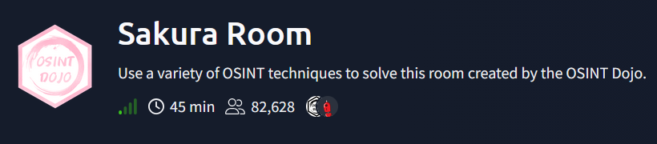

Today’s challenge is Sakura from TryHackMe, and this is also the start of the OSINT part of my CTF writeup series.

After seven days of crypto, I wanted something different. No XOR tables. No broken AES. No questionable developers writing custom ChaCha20 with pure confidence and zero fear.

This time, the challenge gave me a story.

The Dojo had been attacked. There was no major damage, but the attacker left behind an image. That image was supposed to contain clues about who they were.

So the mission sounded simple:

Find the attacker.

That was the first lie.

Then the room stopped pretending to be simple.

One reused username became the first loose thread. I pulled it, and suddenly GitHub coughed up a PGP key, the PGP key exposed an email, the repositories pointed toward a crypto wallet, Twitter started talking too much, and WiGLE somehow got dragged into the crime scene.

Basically, OSINT doing OSINT things.

## Challenge Information

Platform: TryHackMe  
Challenge: Sakura  
Category: OSINT  
Goal: Identify the attacker by following public clues left across different platforms.

This room is built around one major OPSEC mistake: username reuse.

The attacker reused the same or similar identities across different places, and every reused detail opened another door. One clue gave a username. That username gave a GitHub account. GitHub gave a PGP key. The PGP key gave an email. The repositories gave crypto evidence. Social media gave travel clues.

One tiny thread. A whole sweater came apart.

## TIP OFF

### Background

The Dojo had recently been attacked. The admins did not find major damage or other serious indicators of compromise, but they did find an image left behind by the attacker.

The image was available here:

[https://raw.githubusercontent.com/OsintDojo/public/3f178408909bc1aae7ea2f51126984a8813b0901/sakurapwnedletter.svg](https://raw.githubusercontent.com/OsintDojo/public/3f178408909bc1aae7ea2f51126984a8813b0901/sakurapwnedletter.svg)

The question was:

What username does the attacker go by?

### Solve

I opened the image link first.

At first, I expected the SVG file itself to hide something useful. Maybe metadata. Maybe text inside the XML. Maybe some suspicious comment left behind like, “hello investigator, please follow my GitHub.”

But the useful clue was not inside the image.

It was in the URL.

The image was hosted inside a public GitHub repository, and the repository path exposed the username connected to the attacker. 

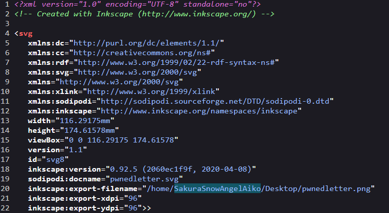

That gave the first answer.
### Flag

```
SakuraSnowAngelAiko
```

## RECONNAISSANCE

The attacker made a classic OPSEC mistake.

They reused their username across other platforms.

This meant the next step was not complicated. I had to search the username and find where else it appeared.

The questions were:

What is the full email address used by the attacker?

What is the attacker’s full real name?

### Searching the Username

I started by searching the username through WhatsMyName.

WhatsMyName is useful in OSINT because it checks whether a username exists across many platforms. Instead of manually typing the same username into ten different websites like a tired raccoon, it does the boring part for you.

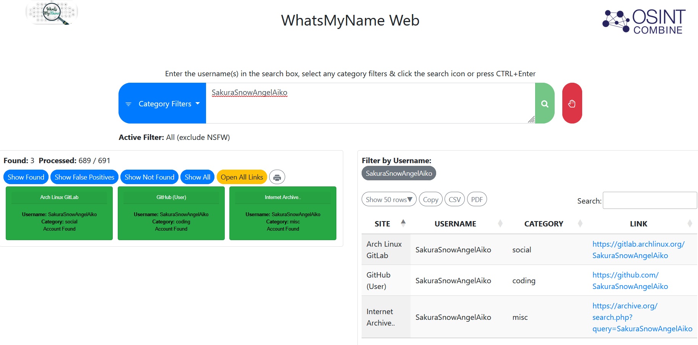


The search revealed a GitHub account connected to the attacker. 

This was the first proper lead.

GitHub accounts are gold in OSINT challenges because people leave all kinds of things there: usernames, emails, old commits, project names, keys, wallet addresses, and sometimes their entire digital personality.

This GitHub account had something even better.

A PGP public key.

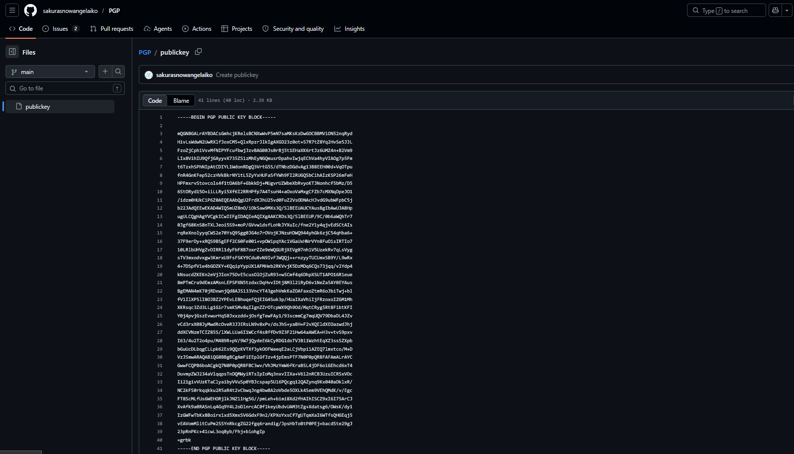

### The PGP Key

Inside the GitHub account, I found a PGP public key.

At first, this looked like one of those moments where the challenge suddenly expects you to understand encryption like you were raised by cryptographers. Im not gonna waste your time explaining what a PGP public key is. You can read this to understand more about pgp encryption. https://proton.me/blog/what-is-pgp-encryption 

But the key idea is simple.

A PGP public key is not secret. It is meant to be shared. Public keys often contain identity information, such as a name or email address, because people need to know who the key belongs to.

So I was not “decrypting” anything here. I was inspecting the public key and checking the identity attached to it.

Once I decoded or inspected the key, the email address appeared.


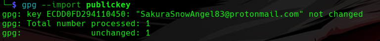

### Flag 1

```
SakuraSnowAngel83@protonmail.com
```

Kudos for using ProtonMail. Privacy-respecting email choice.

Unfortunately, privacy tools do not save you if you reuse your username everywhere like it owes you money.

### Finding the Real Name

Next, I searched the attacker’s username on Google.

The result led to an X/Twitter account.

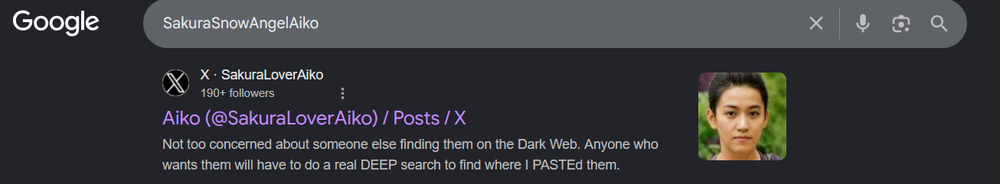

The username did not perfectly match the original GitHub username, so at first I was not fully convinced. It felt slightly weird compared to other OSINT challenges where usernames usually line up cleanly.

But OSINT is not always clean.

Sometimes you follow the suspicious result because it smells connected enough.

So I went "Trust the process" mode and I checked it anyway.

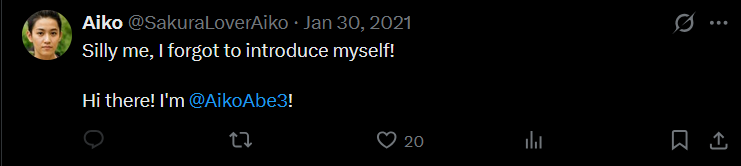

That turned out to be the right call.

Inside the account, the attacker had posted another identity clue:

“Silly me, I forgot to introduce myself!

Hi there! I’m @AikoAbe3!”

Very normal thing to post after committing cybercrime, of course.

From that, the attacker’s real name became clear.

### Flag 2

```
Aiko Abe
```

This part felt a little strange because the usernames did not match as smoothly as I expected. But the account content tied everything together. Maybe this happened because it is a very famous OSINT CTF (?)

## UNVEIL

### Background

The attacker noticed the investigation and started editing or deleting information from their GitHub account.

That sounds scary at first, but GitHub has a habit of remembering things.

Deleted content is not always gone if it existed in an older commit. Git history is basically the “you sure about that?” of source control.

The questions were:

What cryptocurrency does the attacker own a cryptocurrency wallet for?

What is the attacker’s cryptocurrency wallet address?

What mining pool did the attacker receive payments from on January 23, 2021 UTC?

What other cryptocurrency did the attacker exchange with using their cryptocurrency wallet?

### Looking Through GitHub Repositories

Back inside the attacker’s GitHub account, two repositories caught my attention.

One was related to ETH.

The other one was related to Bitcoin.

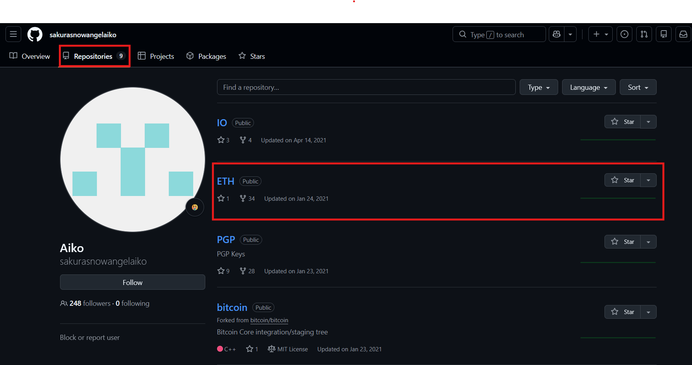

I started with the ETH repository because the challenge question mentioned a cryptocurrency wallet, and ETH looked like the cleaner lead.

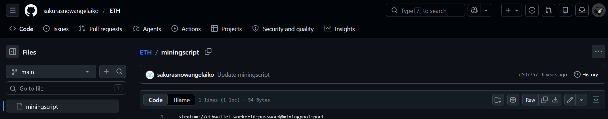

Inside the repository, there was only one line visible.

That felt too empty.

The challenge background also said the attacker had started deleting information. So the obvious next move was to check the commit history.

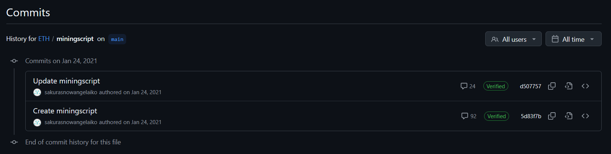

There were only two commits.

So I opened the oldest one.

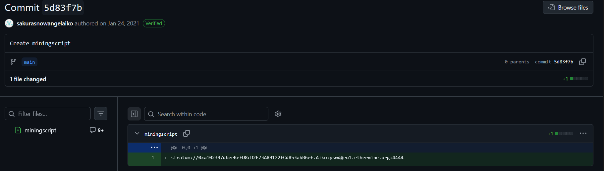

And there it was.

The deleted wallet address.

### Wallet Address

```
0xa102397dbeeBeFD8cD2F73A89122fCdB53abB6ef
```

Since the repository was an ETH repository and the address format matched Ethereum-style wallet addresses, the cryptocurrency was Ethereum.

ETH is the ticker symbol for Ether, the native cryptocurrency of the Ethereum blockchain.

So the first two answers for this section were clear.

### Flag 1

```
Ethereum
```

### Flag 2

```
0xa102397dbeeBeFD8cD2F73A89122fCdB53abB6ef
```

### Finding the Mining Pool

Now came the part where I had to leave my comfort zone.

The question asked what mining pool the attacker received payments from on January 23, 2021 UTC.

I do not spend my free time casually studying crypto mining transaction history, so my first move was very professional.

I Googled it.

Something like:

```
eth crypto mining transaction record
```

Very advanced. Very elite. Definitely hacker movie material... :3

That search led me to Etherscan.

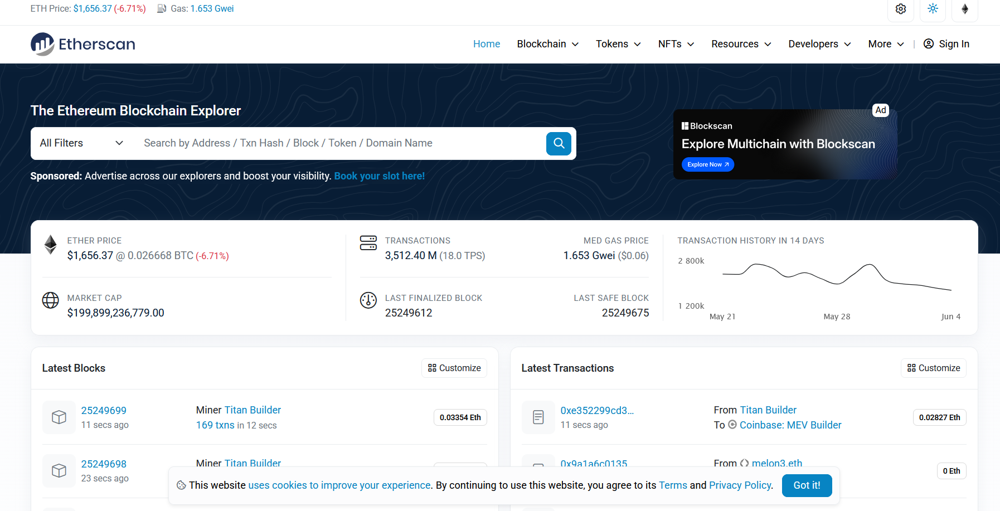

Etherscan is a block explorer for Ethereum. In simple words, it lets you search Ethereum addresses and see public transaction history connected to them.

I pasted the wallet address into Etherscan and found the transaction list.

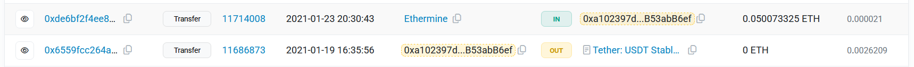

There were 42 transactions.

I sorted or checked the transactions by date and looked for January 23, 2021 UTC.

That transaction showed the attacker receiving payment from Ethermine.

### Flag 3

```
Ethermine
```

### Finding the Other Cryptocurrency

While checking the transaction history, I also noticed activity involving Tether USD.

Tether, often shown as USDT, is a stablecoin. Its value is designed to track the US dollar.

That answered the final question in this section.

### Flag 4

```
Tether
```

### What This Section Taught

This part was a nice reminder of how public blockchains work.

The wallet owner might feel anonymous, but the transactions are public. Once an address gets linked to a person, username, GitHub account, or any other identity, the privacy story starts falling apart.

The blockchain did not reveal the attacker by itself.

The reused identity did.

## TAUNT

### Background

The attacker was aware of the investigation and decided to taunt the Dojo on Twitter.

Because apparently getting caught once was not enough. They wanted to add social media breadcrumbs on top.

The screenshot showed a message sent by the attacker.


The questions were:

What is the attacker’s current Twitter handle?

What is the BSSID for the attacker’s Home WiFi?

### Finding the Current Twitter Handle

From the screenshot, the Twitter handle was already visible.

We are going to pretend I had not already run into it earlier during reconnaissance, because challenge flow deserves some drama.

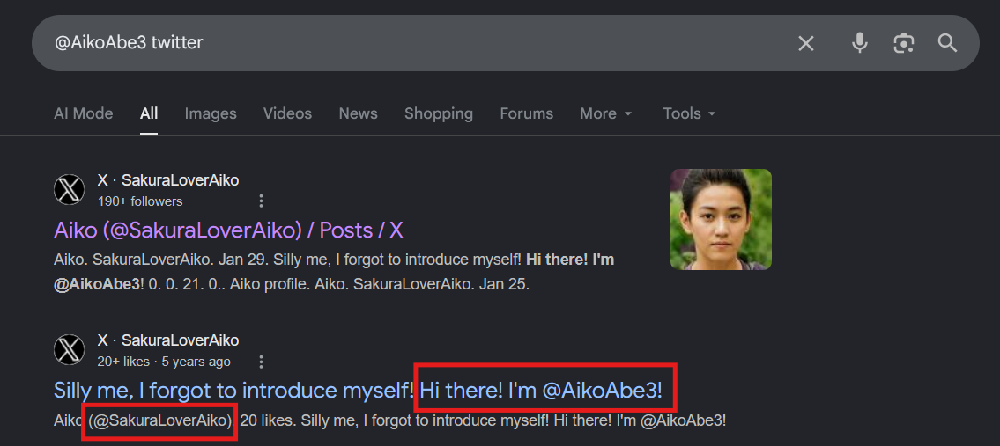

A quick search with the handle confirmed the account and its updated identity.

### Flag 1

```
@SakuraLoverAiko
```

### The DeepPaste Hint

Now the second question asked for the BSSID of the attacker’s home WiFi.

That is where things got more interesting.

The attacker posted access point (AP) information and included a hint:

```
DEEP PASTE'd
```

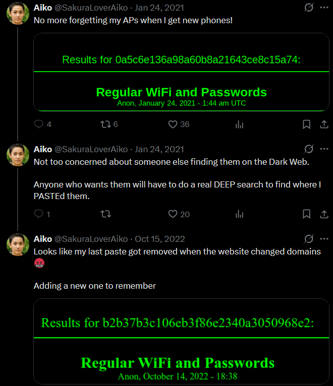

At first, I tried to follow the DeepPaste trail directly.

That became annoying fast.

The original DeepPaste onion route seemed outdated, and older v2 onion links are generally dead now because Tor moved away from them. I also found posts confirming that many of those old links no longer work.

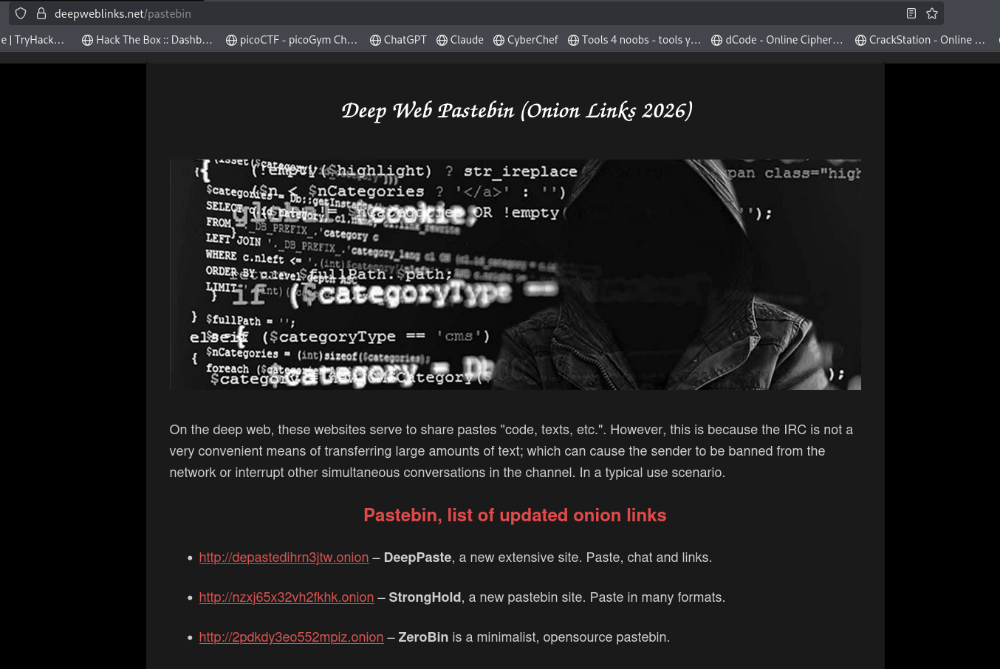

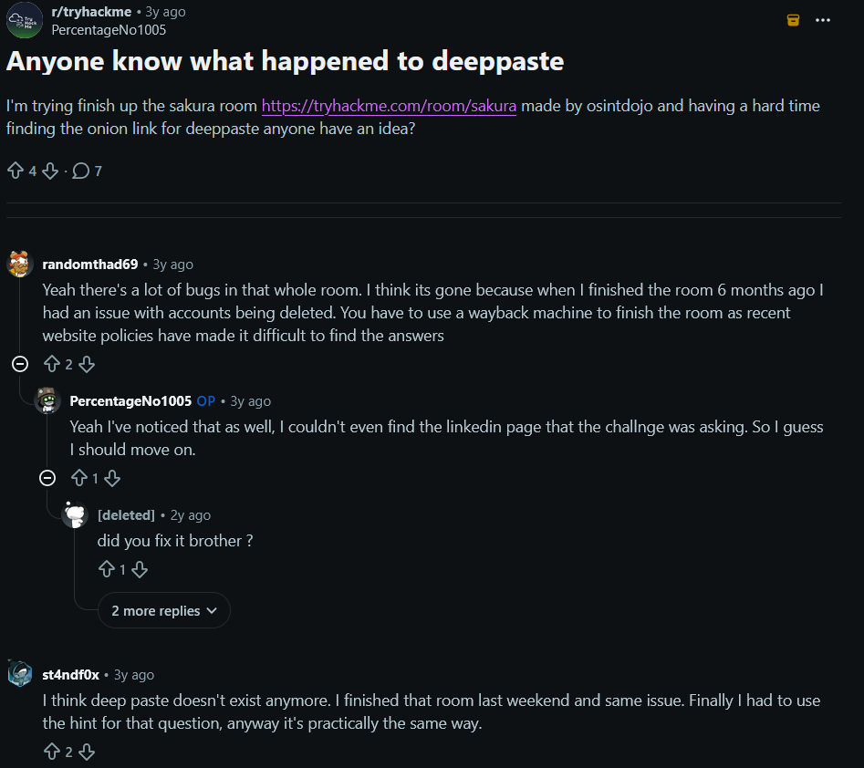

So the original path was messy.

Luckily, this challenge has a public screenshot containing the needed DeepPaste information. (Do not ask me why I know about it and do not ask me why I hate AI so much TvT). Anyways, for those who wants to solve the full Sakura dojo OSINT CTF, this is the link you must follow until DeepPaste is up and running again because currently at the time of this writeup, DeepPaste including the mirror sites are down.

[https://raw.githubusercontent.com/OsintDojo/public/main/deeppaste.png](https://raw.githubusercontent.com/OsintDojo/public/main/deeppaste.png)

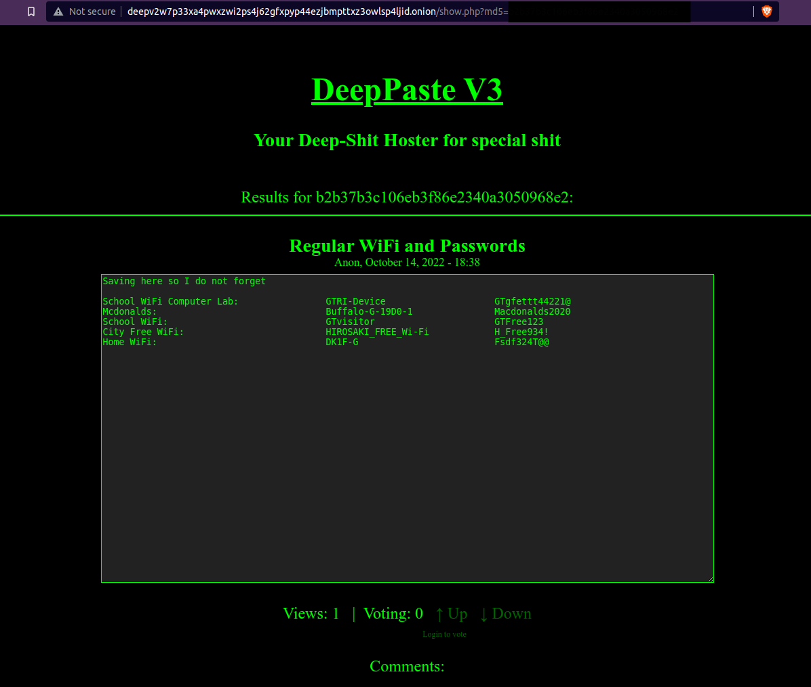

The screenshot listed multiple WiFi names, SSIDs, and passwords.

The SSID I needed to investigate was:

```
DK1F-G
```

The question asked for the BSSID.

A quick explanation:

SSID is the WiFi network name.

BSSID is usually the MAC address of the wireless access point.

So I had the WiFi name. Now I needed the access point address.

### Using WiGLE

To find the BSSID, I used WiGLE.

WiGLE is a public database of wireless network observations. In OSINT challenges, it is useful when you have an SSID and need location or access point information.

I used advanced search (You do need to open an account but if you're someone who loves OSINT CTFs like I do, ABSOLUTELY WORTH IT :D) and searched for the SSID:

```
DK1F-G
```

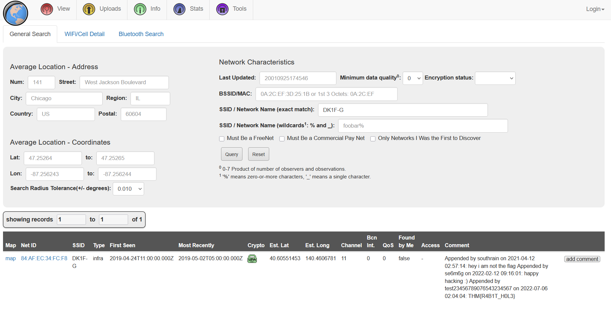

The result gave the BSSID for the attacker’s home WiFi.

### Flag 2

```
84:AF:EC:34:FC:F8
```

This section was probably the most “real OSINT” part of the room.

A leaked WiFi name from a paste, searched through a public wireless database, leading to a physical area.

That is not magic. That is bad privacy hygiene.

## HOMEBOUND

### Background

Based on the attacker’s tweets, they were heading home.

Their Twitter account had several photos that revealed travel clues. By following those images, the challenge expected us to reconstruct the route and identify the final destination.

The questions were:

What airport is closest to the location the attacker shared a photo from prior to getting on their flight?

What airport did the attacker have their last layover in?

What lake can be seen in the map shared by the attacker as they were on their final flight home?

What city does the attacker likely consider “home”?

### First Airport Photo

The attacker posted a photo before getting on their flight.


At first, I considered doing a reverse image search.

Then I noticed the tall white monument in the image.


That is the Washington Monument in Washington, D.C. (It seems I have some GK in me after all)

The closest airport to that area is Ronald Reagan Washington National Airport.

Its airport code is:

```
DCA
```

### Flag 1

```
DCA
```

Sometimes reverse image search is useful.

Sometimes a giant monument stands in the middle of the image screaming the answer at you. xD

### Last Layover

The next photo showed the attacker’s layover.


The important clue here was the Sakura Lounge.

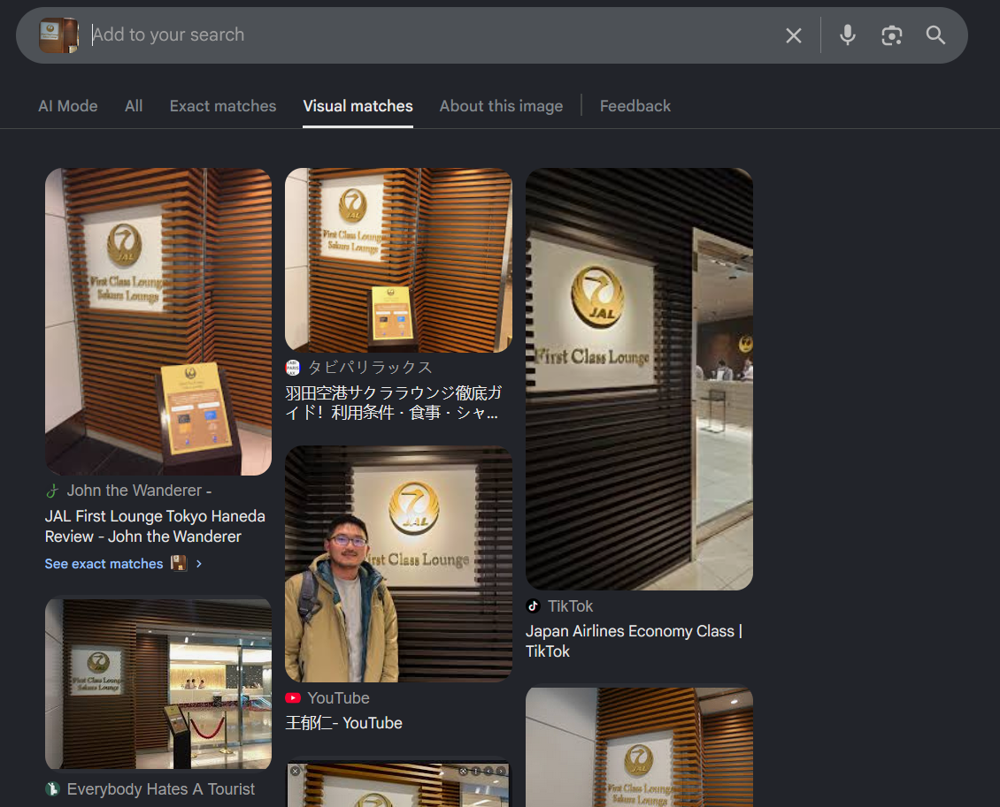

Searching the image and matching the lounge location pointed to Tokyo International Airport, also known as Haneda Airport.

The airport code for Haneda is:

```
HND
```

### Flag 2

```
HND
```

This clue was cleaner than the DeepPaste part. The Sakura Lounge detail made the location much easier to confirm.

### Lake Seen During the Final Flight

The attacker also shared a map image during the final flight home.

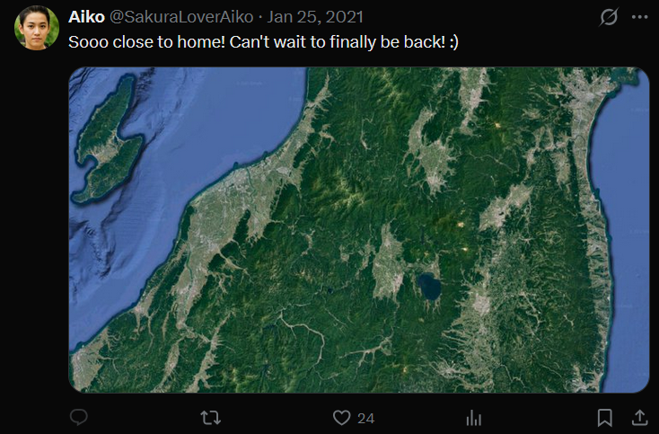

This one was more straightforward.

I checked the visible map area in Japan and matched the lake shape and location.

The lake was:

```
Lake Inawashiro
```

### Flag 3

```
Lake Inawashiro
```

At this point, the route was becoming clear.

Washington, D.C. to Tokyo, then onward into Japan.

### Final Home City

The last question asked what city the attacker likely considers home.

This answer came from connecting earlier evidence.

In the DeepPaste screenshot, one of the WiFi entries was labeled as the attacker’s home WiFi. When I searched the SSID through WiGLE, the location pointed to Hirosaki.

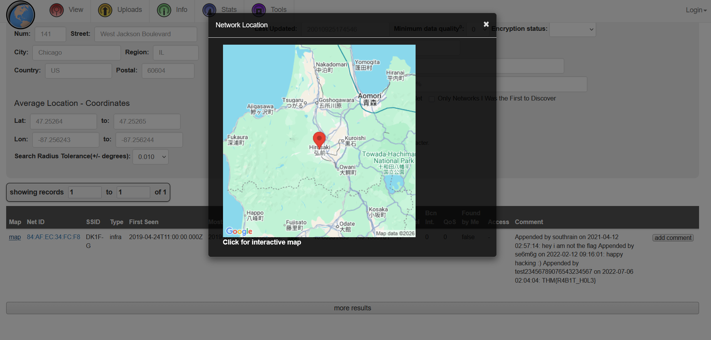

So the attacker’s likely home city was:

```
Hirosaki
```

### Flag 4

```
Hirosaki
```

## Final Answers

### TIP OFF

```
SakuraSnowAngelAiko
```

### RECONNAISSANCE

```
SakuraSnowAngel83@protonmail.com
Aiko Abe
```

### UNVEIL

```
Ethereum
0xa102397dbeeBeFD8cD2F73A89122fCdB53abB6ef
Ethermine
Tether
```

### TAUNT

```
@SakuraLoverAiko
84:AF:EC:34:FC:F8
```

### HOMEBOUND

```
DCA
HND
Lake Inawashiro
Hirosaki
```

## Closing Thoughts

Sakura was a great first OSINT challenge for this part of the series.

It starts with something tiny: a username in a GitHub path.

Then it slowly expands into a full identity trail.

GitHub gave the username and PGP key. The PGP key gave the email. Social media gave the real name and handle. Git history gave the Ethereum wallet. Etherscan gave the mining pool and token activity. DeepPaste and WiGLE gave the home WiFi clue. Travel photos gave the route back home.

None of the individual steps were impossible.

The challenge was about connecting them without losing the thread.

That is what makes OSINT fun for me. It feels less like breaking a system and more like following digital footprints left by someone who thought nobody would check properly.

And the biggest lesson from Sakura is simple:

Privacy tools help, but they do not fix bad OPSEC.

If you reuse usernames, leave keys lying around, delete things only after committing them, post travel photos, and name your WiFi “Home WiFi,” then congratulations.

You did not leave breadcrumbs.

You left a full buffet.

