# Day 9: KaffeeSec SomeINT TryHackMe OSINT Writeup

A simple KaffeeSec SomeINT writeup where a suspicious husband, Reddit history, and SpiderFoot decided to ruin my peace.

Today’s challenge is KaffeeSec SomeINT from TryHackMe.

After Sakura, I wanted another OSINT room because apparently I enjoy staring at social media profiles and pretending I am not one broken link away from losing my mind.

This room gives us a full detective setup.

We are Aleks Juulut, a private investigator based in Greenland. A mysterious person named “H” hires us to investigate Thomas Straussman, who has been acting suspicious lately. His wife, Francesca Hodgerint, thinks something is wrong, but she does not know exactly what.

Since we cannot investigate physically, we have to do everything digitally.

So basically, we are doing an online cheating investigation.

Very professional.

Very dramatic.

Very “why is SpiderFoot involved in someone’s relationship problems?”

## Background Information

The room gives us the first two questions directly:

Who hired you?

Who are you investigating?

The first one is simple. We were hired by “H”.

The second one is also given in the background. We are investigating Thomas Straussman.

Not much hacking yet. More like reading comprehension with a flag box.

### Flags

```text
ks{h}
```

```text
ks{Thomas Straussman}
```

A gentle start.

TryHackMe basically handed us the answers and said, “Please warm up before we ruin your evening.”

## Let’s Get Started

### Questions

What is Thomas’ favorite holiday?

What is Thomas’ birth date?

What is Thomas’ fiancée’s Twitter handle?

What is Thomas’ background picture of?

The room gives us Thomas’ online handle:

```text
tstraussman
```

That is a very searchable username.

So the first move was obvious. I searched the handle online.

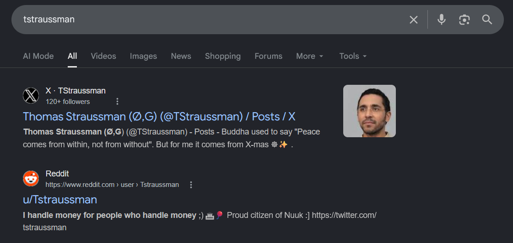

A quick Google search showed both his Twitter/X account and Reddit account.

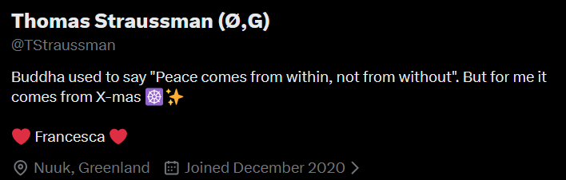

For newer OSINT CTFs, this part might need proper Google dorking.

But this room is older, so the search results were surprisingly useful.

For once, Google did not pretend it had no idea what I wanted.

## Finding Thomas’ Favorite Holiday

Thomas’ X account had the first useful clue.

He posted something like:

“Buddha used to say ‘Peace comes from within, not from without.’ But for me it comes from X-mas.”

That gives the favorite holiday.

### Flag

```text
Christmas
```

Not subtle.

The man basically said, “My inner peace is seasonal and gift-wrapped.”

## Finding Thomas’ Birth Date

Next, I checked his Reddit account.

There was a post about his 30th birthday. In the post, he said he had finally made it to 30.

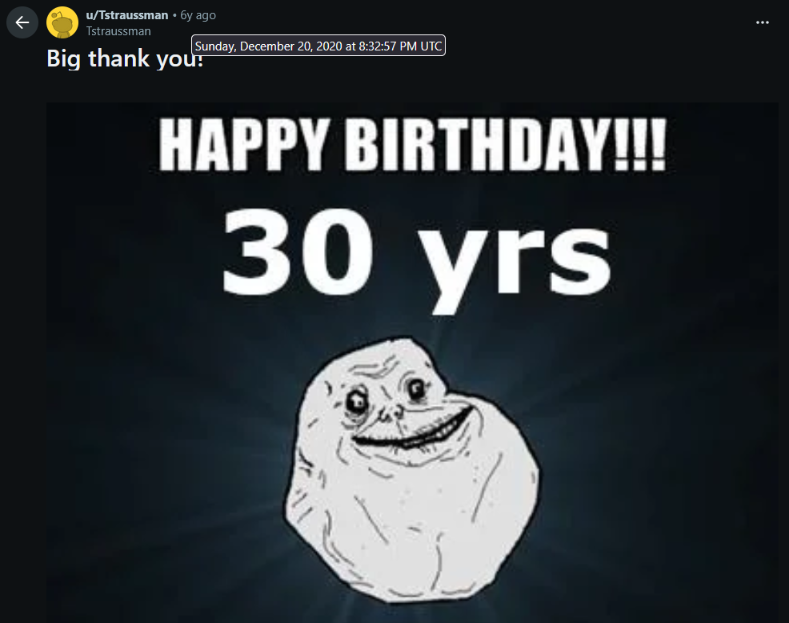

Reddit shows posts as “X years ago,” but that is not enough for the flag.

The useful trick is this:

If you hover over the “X years ago” text, Reddit shows the exact date the post was submitted.

That gave the post date.

Since the post was about his 30th birthday, the birth year becomes 1990.

TryHackMe wanted the answer in MM-DD-YYYY format.

### Flag

```text
12-20-1990
```

This is one of those tiny UI details that feels useless until a CTF makes it your problem.

## Finding Francesca’s Twitter Handle

The next question asked for Thomas’ fiancée’s Twitter handle.

Thomas’ bio gave enough personal information to connect him to Francesca. A Google search with her name and X/Twitter gave the account.

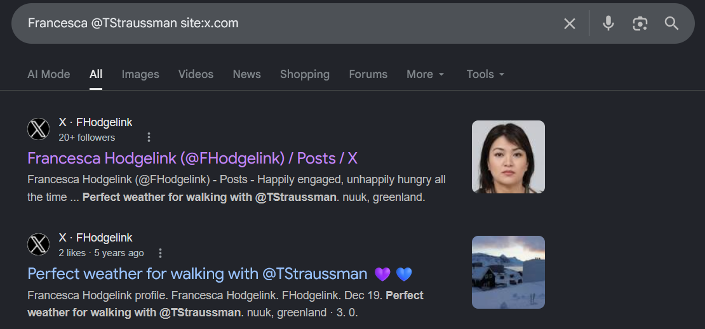

That revealed her handle.

### Flag

```text
@FHodgelink
```

## Finding Thomas’ Background Picture

The final question in this section asked what Thomas’ background picture was.

His Twitter profile had a background image of Buddha.

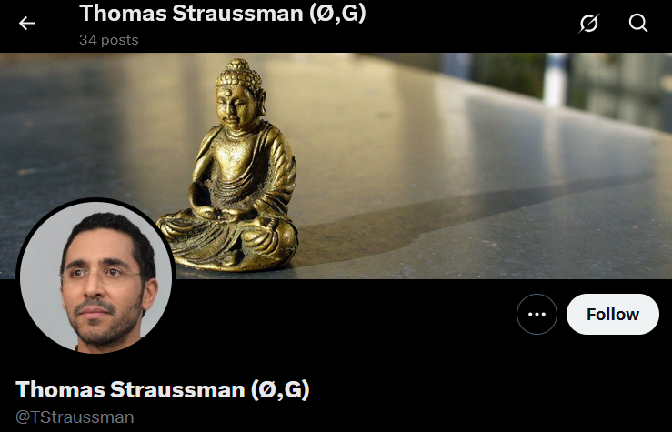

### Flag

```text
Buddha
```

Tiny spelling note: my original notes had “Budddha” with three d’s. That was not a spiritual discovery. That was me fighting my keyboard.

## Spider… What?

### Questions

What was the source module used to find these accounts?

Check the shadowban API. What is the value of “search”?

This section told me to use SpiderFoot.

SpiderFoot is an OSINT automation tool. You give it a target, and it tries to collect related information from different sources.

That sounds simple.

It was not simple.

This section did not give me a cool detective moment. It gave me a tool error and told me to grow as a person.

## Installing SpiderFoot Properly

At first, I thought Kali already had SpiderFoot installed, so I tried using that.

Bad idea.

The version packaged with Kali did not work properly for this room. It did not parse the account list the way I needed, so the results were not useful.

So I installed SpiderFoot manually instead.

The commands I used were:

```bash
wget https://github.com/smicallef/spiderfoot/archive/v4.0.tar.gz
tar zxvf v4.0.tar.gz
cd spiderfoot-4.0
pip3 install -r requirements.txt
python3 ./sf.py -l 127.0.0.1:5001
```

Then I opened it in the browser:

```text
http://127.0.0.1:5001
```

After spending an unholy amount of time trying to make SpiderFoot behave like a normal tool, I finally got useful results.

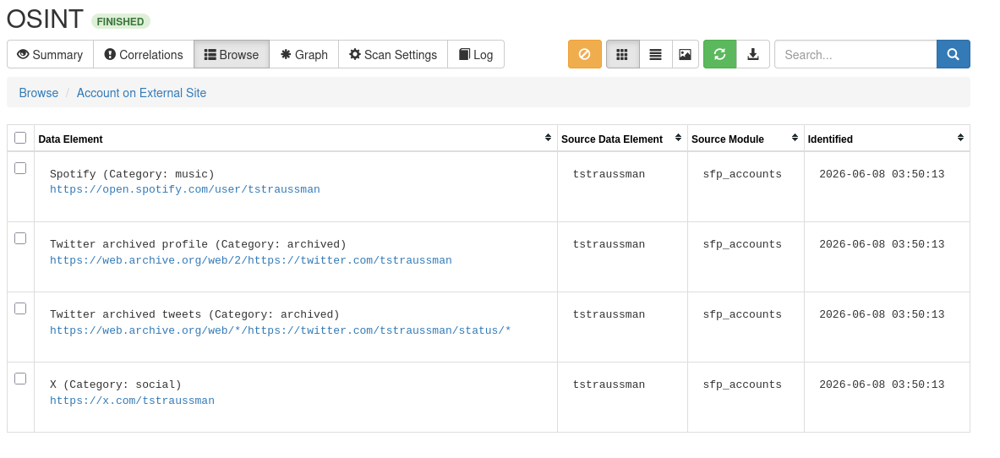

## Finding the Source Module

The question asked:

What was the source module used to find these accounts?

In the SpiderFoot results table, I looked at the source module column.

The account results came from:

```text
sfp_accounts
```

### Flag

```text
sfp_accounts
```

Simple answer.

Painful setup.

Classic.

## Shadowban API Problem

The next question asked:

Check the shadowban API. What is the value of “search”?

This is where the room started acting old.

My SpiderFoot results did not show a working Shadowban link. The room expected a result connected to:

```text
https://shadowban.eu/.api/tstraussman
```

But when I tried opening it, the site did not work.


So I checked another writeup to see if I was missing anything. I used this Secjuice writeup as a reference: [https://www.secjuice.com/try-hack-me-kaffeesec-somesint/](https://www.secjuice.com/try-hack-me-kaffeesec-somesint/). The link was correct, but the service itself looked dead.

Luckily, I already had the Internet Archive open in another tab.

For once, my browser chaos saved me.

I searched the Shadowban API link in the Wayback Machine.

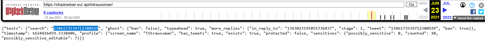

After messing around with the archived version, I found the value of “search”.

### Flag

```text
ks{1346173539712380929}
```

This section was annoying, but satisfying.

Not because SpiderFoot was fun.

Because the Wayback Machine walked in like the tired adult in the room and fixed the problem.

## Connections, Connections

### Questions

Where did Thomas and his fiancée vacation to?

When is Francesca’s mother’s birthday? Without the year.

What is the name of their cat?

What show does Francesca like to watch?

Now that we had Thomas’ Twitter and Reddit accounts, the next move was to pivot to Francesca’s account.

For this section, I mainly checked her Twitter posts and used reverse image search when needed.

## Finding the Vacation Location

Francesca posted a vacation photo.


I ran a reverse image search on the picture.

The result pointed to the Rhine River area in Koblenz, Germany.


### Flag

```text
Koblenz, Germany
```

This is why location images are dangerous in OSINT.

One nice holiday picture and suddenly someone on the internet is identifying the river.

## Finding Francesca’s Mother’s Birthday

Next, I looked through Francesca’s posts and found one about her mother’s birthday.


The post was made on Christmas.

So her mother’s birthday is December 25th.

Her mother and Jesus sharing a birthday is very dramatic calendar behavior.

### Flag

```text
December 25th
```

## Finding the Cat’s Name

The cat’s name was also posted on Twitter.

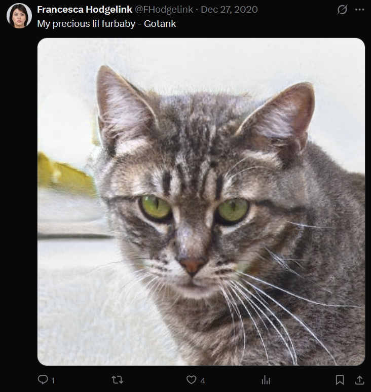

The cat’s name was Gotank.

### Flag

```text
Gotank
```

I support this cat.

At first I thought Gotank meant the cat was built like an armored vehicle.

Then I remembered it sounds suspiciously like a Dragon Ball fusion name.

Which somehow feels even more appropriate for a cat.

Some flags deserve professionalism.

This one deserved anime-powered cat support.

## Finding Francesca’s Favorite Show

For the last question, Francesca had made posts about the show she liked.

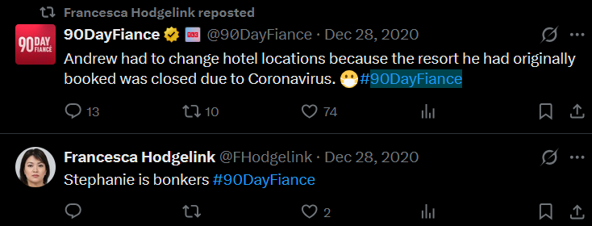

The show was 90 Day Fiancé.

But TryHackMe did not accept “90 Day Fiance” when I tried it.

So I started trying variations, and “90 Day Fiancee” worked.

Was this elegant? No.

Was this a brute-force emotional support moment? Yes.

### Flag

```text
90 Day Fiancee
```

This is the kind of flag where you stop asking questions and accept that the platform has chosen violence.

## Turn Back the Clock

### Questions

What is the name of Thomas’ coworker?

Where does his coworker live?

What is the paste ID for the link we found? Flag format.

Password for the next link? Flag format.

What is the name of Thomas’ mistress?

What is Thomas’ email address?

Now the room moved from Twitter to Reddit.

This section used the Wayback Machine.

The idea was simple:

Look at old Reddit snapshots and find information that is no longer visible in the current version.

Old Reddit and the Wayback Machine are a cursed but useful combo.

## Finding Thomas’ Coworker

I went to Thomas’ birthday post and checked older saved versions through the Wayback Machine.

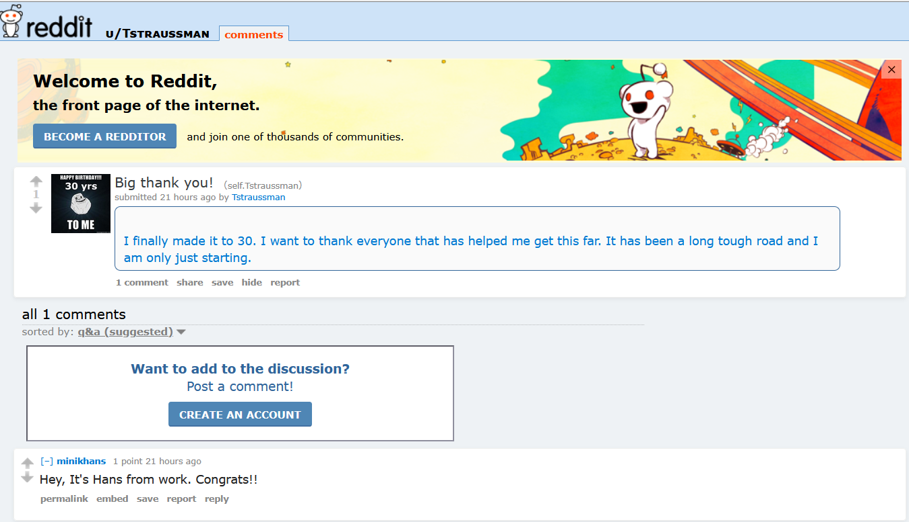

The archived version revealed a comment from someone with the username:

```text
minikhans
```

From that, the coworker’s name was Hans Minik.

At first, I tried “mini khans” because the username looked like that.

That did not work.

Then I tried “hans minik,” and that worked.

### Flag

```text
hans minik
```

Honestly, “Mini Khans” sounds like a cartoon villain group.

But the answer was Hans Minik.

## Finding Where Hans Lives

The next question asked where the coworker lives.

This took more time than expected.

From the archived Reddit content, I could tell he was connected to Greenland, but I needed the exact place.

After struggling with the archived version for a while, I checked his current Reddit profile instead.

And there it was in the bio.


He lives in Nuuk, Greenland.

### Flag

```text
Nuuk, Greenland
```

NUUK.

The capital of Greenland.

And also the exact moment I stopped overcomplicating the Wayback Machine part.

## Finding the Paste ID

Next, I checked later archived snapshots of Hans’ account.

On the March 23, 2021 snapshot, I found a post titled:

```text
disappointed 2 Electric Boogaloo
```

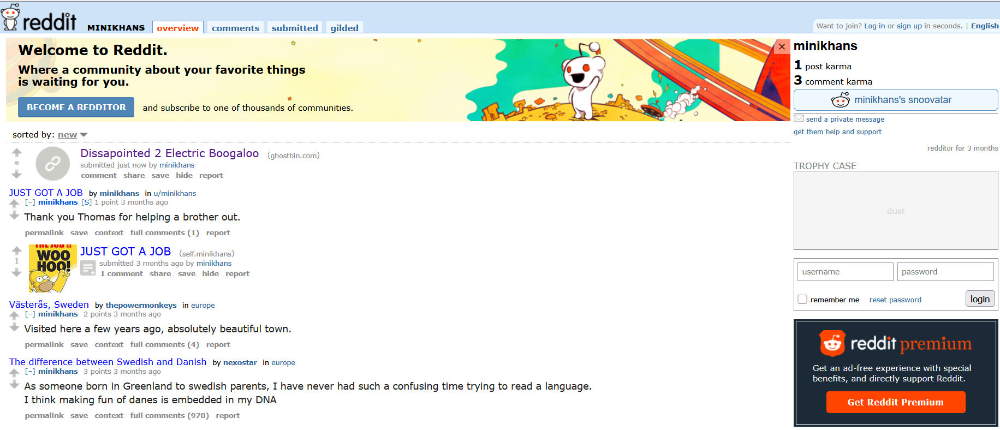

No idea why he named it that.

I respect the chaos.

The post led to a Ghostbin paste.

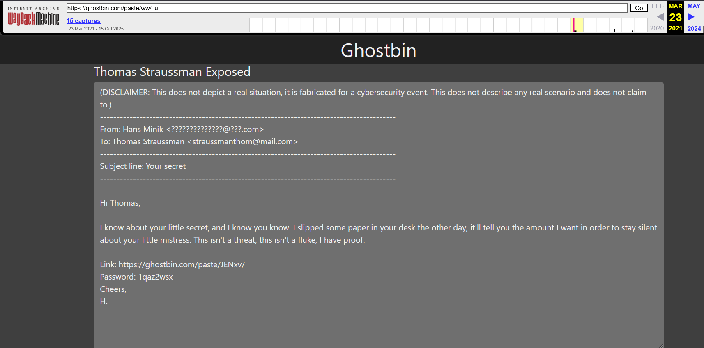

The paste contained information about Thomas and a link. The paste ID was visible in the Ghostbin URL.

### Flag

```text
ks{ww4ju}
```

## Finding the Password

The password for the next link was in the same Ghostbin paste.

It was written below the link.

### Flag

```text
ks{1qaz2wsx}
```

This password has the energy of someone dragging their finger down a keyboard and calling it security.

## Finding the Mistress and Email

To answer the final two questions, I had to use the Ghostbin link from the paste.

The important part was that the paste was encrypted, so the password had to be added to the URL.

The final URL format looked like this:

```text
https://ghostbin.com/paste/JENxv/1qaz2wsx
```

I searched that full URL in the Wayback Machine.

Not only the paste link.

The paste link plus the password.

That part matters.

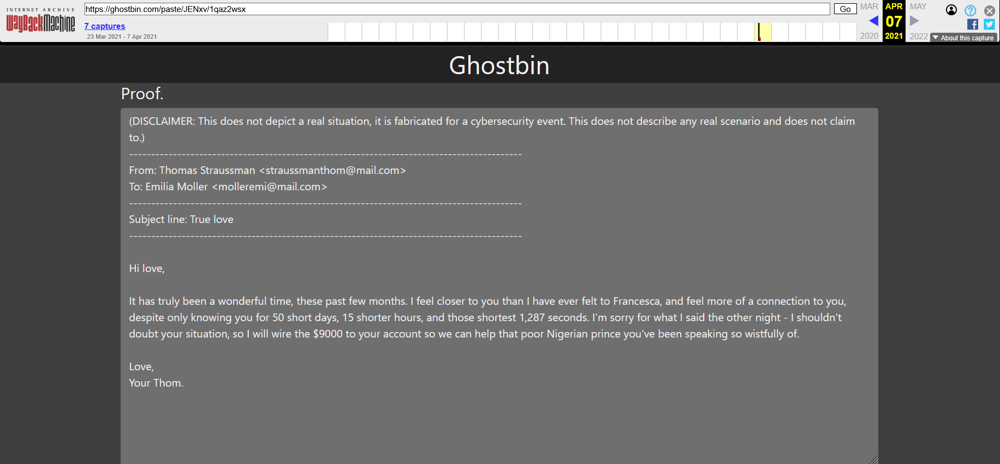

The archived page revealed the mistress’ name and Thomas’ email address.

Poor Thomas.

Not because he got caught.

Because he got caught through archived Reddit and Ghostbin drama.

### Mistress Name

```text
Emilia Moller
```

### Thomas’ Email Address

```text
straussmanthom@mail.com
```

## Final Answers

### Background

```text
ks{h}
```

```text
ks{Thomas Straussman}
```

### Let’s Get Started

```text
Christmas
```

```text
12-20-1990
```

```text
@FHodgelink
```

```text
Buddha
```

### Spider… What?

```text
sfp_accounts
```

```text
ks{1346173539712380929}
```

### Connections, Connections

```text
Koblenz, Germany
```

```text
December 25th
```

```text
Gotank
```

```text
90 Day Fiancee
```

### Turn Back the Clock

```text
hans minik
```

```text
Nuuk, Greenland
```

```text
ks{ww4ju}
```

```text
ks{1qaz2wsx}
```

```text
Emilia Moller
```

```text
straussmanthom@mail.com
```

## Closing Thoughts

KaffeeSec SomeINT was a fun OSINT room, but it also showed why old CTF rooms can be annoying to solve years later.

Some parts still work normally.

Some parts depend on dead services.

Some parts need the Wayback Machine because the original site is gone.

SpiderFoot was the most painful section for me. The built-in Kali version did not work properly, Shadowban was down, and I had to rely on archived data to get the answer.

The rest of the room was much more enjoyable.

Twitter gave the personal clues.

Reddit gave the birthday and coworker trail.

Reverse image search gave the vacation location.

The Wayback Machine gave the old posts and Ghostbin links.

The final lesson is simple:

OSINT is not always about finding something new.

Sometimes it is about finding what used to exist before someone deleted it, before a website died, or before a tool stopped working properly.

Also, never underestimate archived Reddit comments.

They are messy.

They are old.

They are somehow still ready to expose your entire fake CTF relationship drama.

