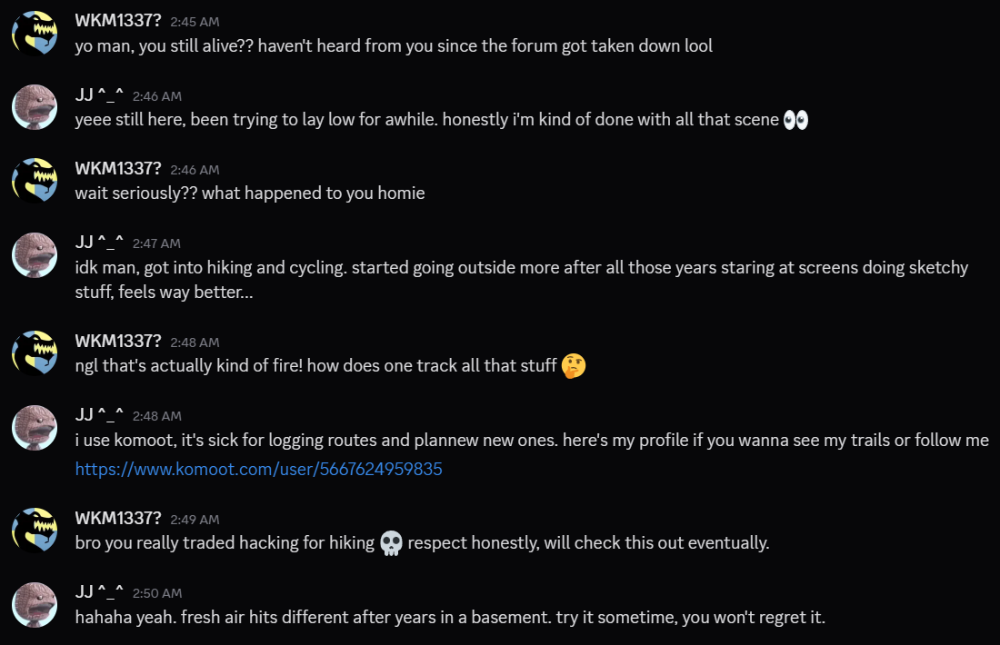
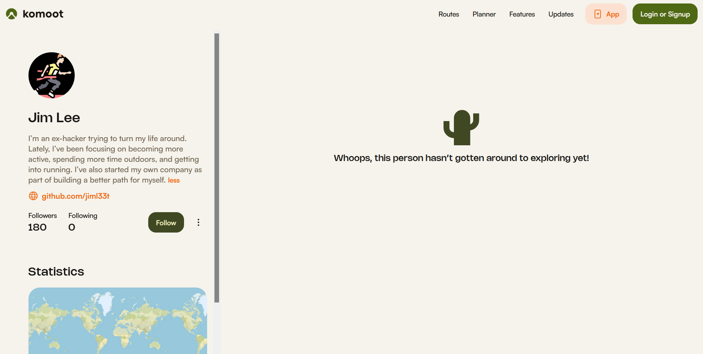
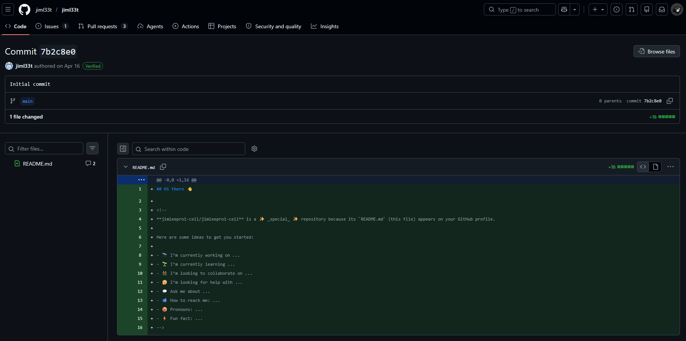
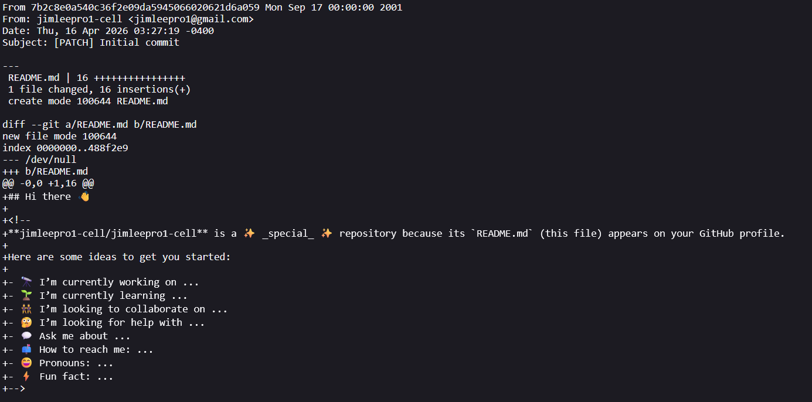
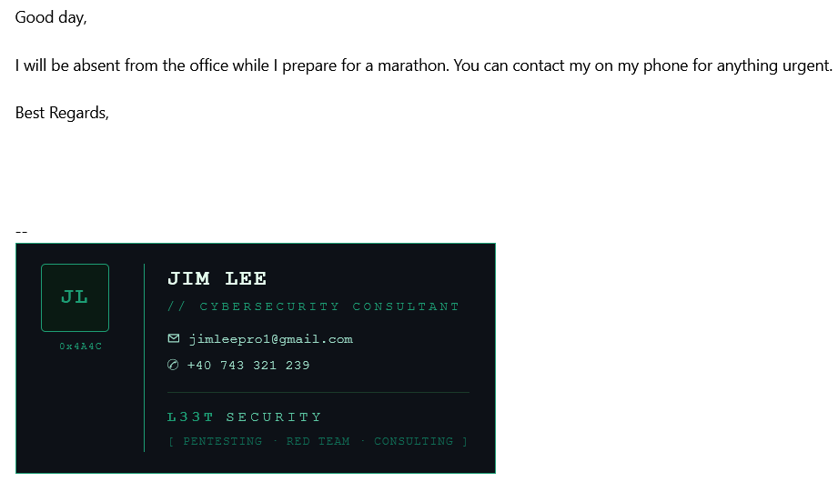
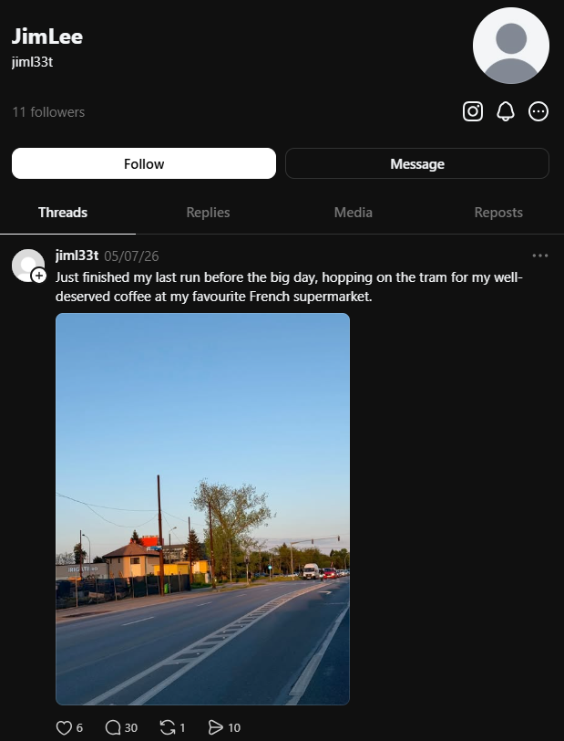
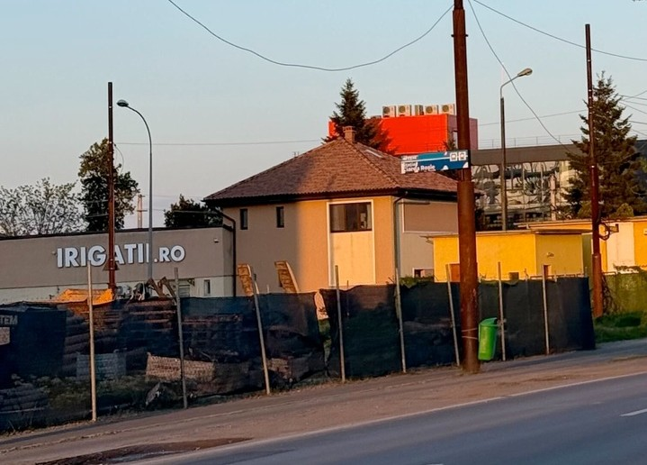
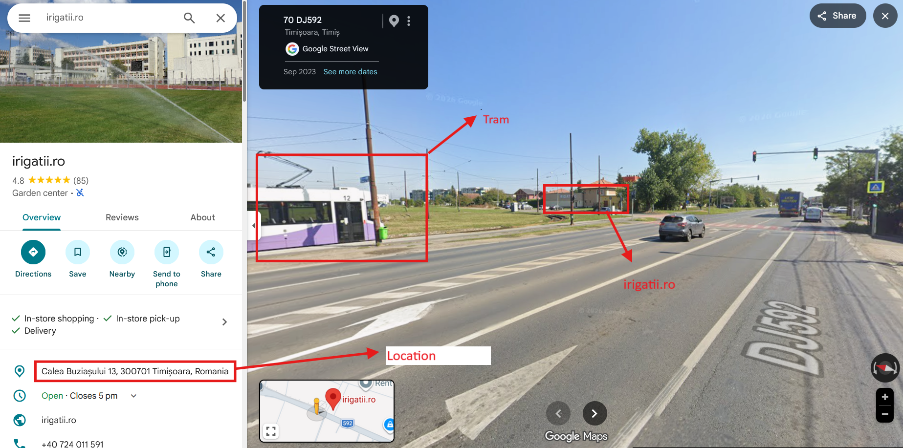
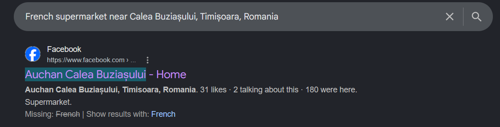
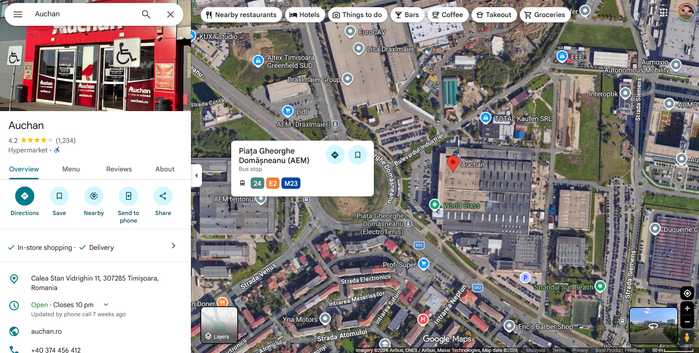

# Day 10: Cache Me Outside TryHackMe OSINT Writeup

A simple Cache Me Outside OSINT writeup where an ex-hacker turned outdoorsman got found through Komoot, GitHub, and one painful auto-reply.

After searching through old OSINT CTFs for way too long, I learned one painful thing.

Old OSINT rooms age badly.

Accounts disappear. Websites die. APIs stop working. Hints rot. Half the time, the real challenge is not OSINT anymore. It is digital archaeology with extra disappointment.

So I wanted something active and still solvable.

That is how I came across Cache Me Outside.

I completed the challenge on TryHackMe while it's still active and fully functional, which was a nice change compared to older OSINT rooms where half the clues have already vanished into the internet graveyard.

The room’s description basically asked:

Can you find this ex-hacker turned outdoorsman?

That sentence already sounded funny to me.

A retired hacker leaving the scene and becoming a hiking guy is character development, I guess.

## Challenge Background

Years after walking away from the scene, a retired hacker left pieces of his identity scattered across the open internet.

At first, the challenge gave us a leaked conversation screenshot. Inside that screenshot was the first clue.

The job was to follow his online presence, connect the exposed details, and figure out where the trail ended.

The questions were:

What is the retired hacker’s full name?

What email address did he accidentally expose?

What is his phone number?

In which city is he located?

Submit the name of the tram station where he got off on the 7th of May, 2026.

The challenge gave this conversation screenshot:



The conversation was already giving us the whole vibe.

The guy left the hacking scene, started hiking and cycling, and now tracks his routes on Komoot.

From sketchy forums to fresh air.

Honestly, good for him.

Bad for his OPSEC, though.

## First Clue: The Big Blue Link

The first thing I focused on was the obvious link in the Discord conversation.

```text
https://www.komoot.com/user/5667624959835
```

It was sitting there in bright blue, basically begging to be searched.

So I searched it.

The link opened a Komoot profile.

Komoot is a navigation and route planning app for hiking, cycling, running, and outdoor activities.

In normal life, it helps people find trails.

In this challenge, it helped me find a retired hacker.

Very healthy app usage.



The profile showed the hacker’s name and bio.

The name was Jim Lee.

### Flag

```text
Jim Lee
```

That was the first answer.

No fancy tool. No magic.

The ex-hacker turned outdoorsman put his name on the profile.

## Finding the GitHub Account

The Komoot bio also had another useful clue.

It said:

“I’m an ex-hacker trying to turn my life around. Lately, I’ve been focusing on becoming more active, spending more time outdoors, and getting into running. I’ve also started my own company as part of building a better path for myself.

github.com/jiml33t”

So now I had his GitHub username:

```text
jiml33t
```

I opened the GitHub account.



There was only one README file.

At first, it looked like a dead end.

But the challenge name is Cache Me Outside, so I had to think about what Git keeps cached or stored behind the scenes.

That is where Git commit metadata comes in.

The man escaped hacking forums, but not Git history.

## Finding the Exposed Email Through Git Patch

Git commits store author information.

Even when the email does not appear on the main profile page, it might still appear inside the commit metadata.

There are a few ways to view this, but the easiest low-effort method is adding `.patch` to the end of a commit URL.

Very Hecker Moment.

By “hecker,” I mean I added six characters to a URL and acted like I was in a terminal-heavy movie scene.

For this commit, the patch URL was:

```text
https://github.com/jiml33t/jiml33t/commit/7b2c8e0a540c36f2e09da5945066020621d6a059.patch
```

I opened the patch file.



The commit metadata revealed the email address.

### Flag

```text
jimleepro1@gmail.com
```

This was a nice clue.

The profile looked empty, but Git still had receipts.

Git does not forget.

Git is petty just like my imaginary girlfriend.

## Finding the Phone Number

This part took me a long time.

And after finding the answer, I felt both impressed and personally attacked.

Because the solution was stupidly simple.

I emailed him.

That is it.

I sent an email to the exposed address, and it returned an automatic response containing his personal contact information.



I had spent time searching around like I was doing elite OSINT, and the answer was sitting inside an auto-reply.

Beautiful.

Painful.

Educational. TvT

### Flag

```text
+40 743 321 239
```

This is one of those solves where you do not know whether to feel smart or mocked by the challenge author.

The ex-hacker turned outdoorsman did not get caught through malware, zero-days, or dark web drama.

He got caught because Gmail said, “Thanks for reaching out, here is my phone number.”

OUCH.

## Finding the City

Next, I searched the GitHub username on Google.

```text
jiml33t
```

The search result showed a possible Instagram account.


I opened it.

The Instagram account was basically empty.

As empty as my fridge at 3 a.m.

But there was one useful thing.


The Instagram profile linked to a Threads account.

Meta really does love shoving its apps into every corner of the internet.

So I checked the Threads account.

Inside the Threads account, there was a post about his big day with a picture.



The image had one detail that caught my attention:

```text
irigato.ro
```



That looked like a Romanian domain.

So I searched it.

The result pointed to a real place, and from there I opened Google Maps.



The location matched the photo, and the surrounding area pointed to the city.

The city was Timișoara.

### Flag

```text
Timișoara
```

This was a good image clue.

No need to overcomplicate it.

The sign gave the place, the place gave the city, and the city gave the flag.

Sometimes the best OSINT tool is reading the text in the photo before pretending to be Sherlock.

Also, for a man trying to enjoy fresh air after years in a basement, he posted a very helpful location clue.

Nature healed him.

OSINT did not.

## Finding the Tram Station

The final question asked:

Submit the name of the tram station where he got off on the 7th of May, 2026.

This was the hardest part for me.

The clue came from his post, where he mentioned his favorite French supermarket.

We already had the area connected to the earlier image.

So I searched around the area using Google Maps.

The search I used was basically:

```text
French supermarket near Calea Buziașului, Timișoara, Romania
```

The result showed a supermarket near that area.



I am still not fully sure how French it was supposed to be, but it matched the direction of the clue.

Then I searched for tram stations near that supermarket.



There was only one tram station with a similar three-word structure, and that led me to the final answer:

```text
Piața Gheorghe Domășneanu
```

### Flag

```text
Piața Gheorghe Domășneanu
```

This part felt a bit vague, but the route made sense after connecting the city, the supermarket clue, and the nearby tram station.

Google Maps did most of the heavy lifting here.

I was mostly there to suffer and zoom in.

At this point, the ex-hacker turned outdoorsman had gone from Komoot trails to tram stations.

A full fitness-to-public-transport pipeline.

## Final Answers

### Full Name

```text
Jim Lee
```

### Email Address

```text
jimleepro1@gmail.com
```

### Phone Number

```text
+40 743 321 239
```

### City

```text
Timișoara
```

### Tram Station

```text
Piața Gheorghe Domășneanu
```

## Closing Thoughts

Cache Me Outside was a nice change after digging through old OSINT rooms where half the internet had already collapsed.

This challenge was short, active, and still solvable.

The solve started from a Discord screenshot and moved through Komoot, GitHub, email, Instagram, Threads, image clues, and Google Maps.

The best part was the email auto-reply.

I had spent time looking for the phone number like it was hidden behind seven layers of OSINT wizardry.

Then the target’s inbox replied like:

“Hello, here is my phone number.”

Thank you, Jim.

Excellent customer service.

Terrible OPSEC.

The main lesson from this challenge is simple:

Public profiles are rarely isolated.

One profile links to another. One username leads to another platform. One photo reveals a location. One commit reveals an email. One email auto-reply reveals contact details.

And sometimes, the most advanced technique is clicking the obvious blue link first.

Jim left the hacker scene and found the outdoors.

Unfortunately for him, the outdoors had breadcrumbs too.

