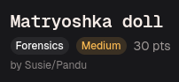
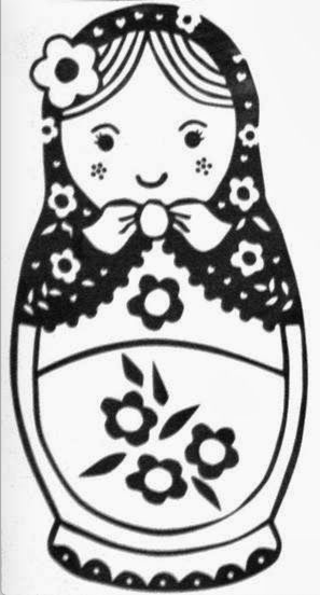
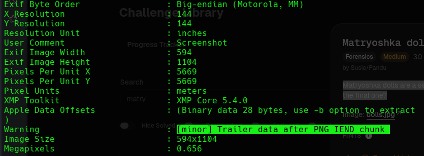
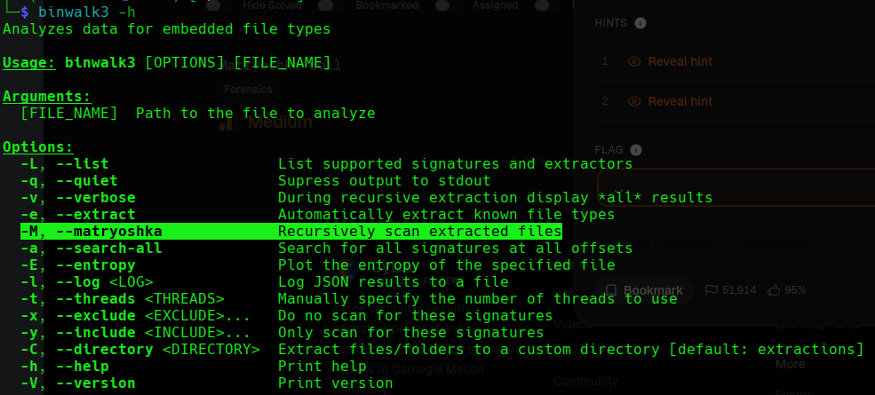
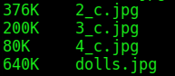

# Day 11: Matryoshka Dolls picoCTF Forensics Writeup

A simple picoCTF forensics writeup where one image kept hiding another image like it was trying to become a family tradition.



For today’s CTF, we are moving into forensics.

From Day 11 until Day 14, I will be focusing on forensic challenges.

And I am going to be honest.

From here onward, for the rest of the categories, I am as noob as my best friend in Valorant.

Sorry bestie.

The only challenge I gave myself was this:

No guides.

No hints.

No writeups.

Just Linux skills and suffering. (As if I have Linux skills.)

The challenge was called **Matryoshka Dolls**, and the description said:

> Matryoshka dolls are a set of wooden dolls of decreasing size placed one inside another. What's the final one?

The challenge also gave this image of a Matryoshka doll:



I have always wanted one of these after watching Toy Story.

But in this case, the doll was not here to be cute.

It was here to hide files.

## Understanding the Clue

The challenge description was basically the hint.

Matryoshka dolls are wooden dolls placed one inside another.

So if the challenge gives me an image of a Matryoshka dolls, that probably means the file has something hidden inside it.

Maybe another image.

Then another image.

Then another.

Basically, image inception.

So I started by checking whether the file had anything unusual inside it.

## Checking the File with ExifTool

The first command I ran was:

```bash
exiftool dolls.jpg
```



The important part was this line:

```text
Trailer data after PNG IEND chunk
```

That means there is extra data after the normal end of the image.

In simple words, the image ends, but the file keeps going.

That is suspicious.

Files do not usually keep extra luggage after the ending unless something has been appended to them.

So this confirmed that the image probably had hidden content inside it.

At this point, the doll was already acting exactly like the challenge name.

Cute on the outside.

Suspicious on the inside.

## Choosing Binwalk3

The tool I chose for this challenge was **binwalk3**.

Binwalk is useful in forensics because it can scan a file and detect embedded content inside it, such as images, compressed files, archives, or other hidden data.

So instead of manually carving out each hidden file, I could let binwalk do the boring part.

And for this challenge, binwalk3 had the perfect option.



The option was:

```text
-M, --matryoshka
```

That name could not be more perfect.

The `-M` option recursively scans extracted files. This means binwalk does not stop after extracting the first hidden file.

It checks the extracted file too.

Then it checks the next extracted file.

Then the next.

Just like opening a Matryoshka doll layer by layer.

The command I used was:

```bash
binwalk3 -Me dolls.jpg
```

Here:

```text
-M
```

means recursive extraction.

```text
-e
```

means extract the embedded files.

So binwalk3 extracted the hidden file, then kept scanning the extracted result until it reached the final layer.

No guide.

No hint.

Just binwalk doing Matryoshka things.

## Finding the Final Flag

After the extraction finished, I looked through the extracted folders.

Eventually, I found the hidden text file containing the final flag.

That was the answer.

The whole challenge was built around the idea that every image had another image inside it, until the final layer revealed the flag.

A very literal challenge.

The doll said “open me.”

Binwalk said “say less.”

## Fun Size Comparison

Another fun thing I noticed was that real Matryoshka dolls get smaller as you open each layer.

The same thing happened with the extracted images.



The file sizes went down layer by layer:

```text
376K    2_c.jpg
200K    3_c.jpg
80K     4_c.jpg
640K    dolls.jpg
```

The original image was 640 KB.

Then the hidden images kept getting smaller:

640 KB → 376 KB → 200 KB → 80 KB

This is not a coincidence.

Each hidden image was appended to the previous image, so the outer file had to contain both its own image data and the entire hidden file.

That naturally creates a size relationship like:

```text
outer file > hidden file
```

at every layer.

As you keep extracting inward, the files tend to get smaller and smaller. So the shrinking file sizes were not just a visual reference to real Matryoshka dolls—they were a side effect of how the hidden files were stored.

Still, it was a nice touch.

For once, the challenge name was not just random CTF poetry.

It actually described the solve.

## Flag

```text
picoCTF{LL9lb1dR4QbGe4l4iWCvGq9pdtwt7392}
```

## Closing Thoughts

This was a fun challenge to start the forensics category.

It was beginner-friendly, but still taught an important idea:

Files can contain more than what they appear to show.

An image might look normal when opened, but tools like ExifTool and binwalk can reveal extra data hidden inside it.

ExifTool helped confirm that something strange existed after the image’s normal ending.

Binwalk3 helped extract the hidden layers.

And the `--matryoshka` option made the whole solve much easier because it recursively checked every extracted file.

So Day 11 started with me being extremely unsure about forensics.

But somehow, Linux did not betray me today.

Rare moment.

We take those.

