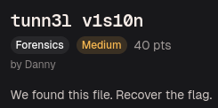
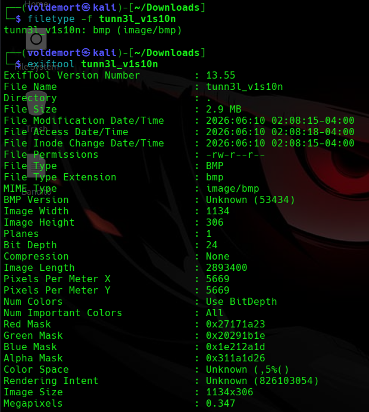
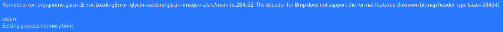
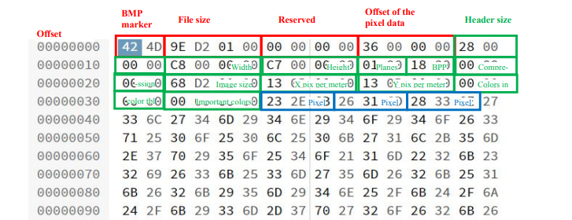
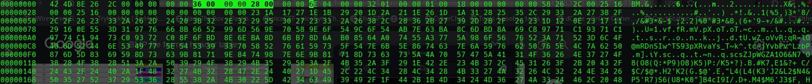
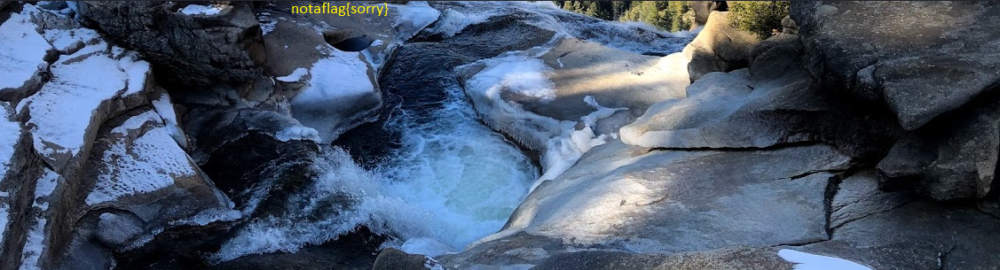
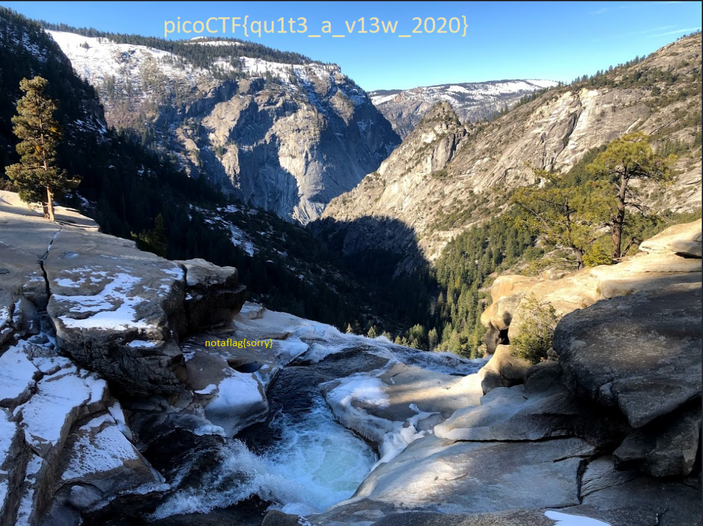

# Day 12: tunn3l v1s10n picoCTF Forensics Writeup

A simple picoCTF forensics writeup where a broken BMP header hides half an image and one very disrespectful fake flag.

Today, we are doing another forensics challenge.

Yesterday, I opened images hidden inside other images. Today, I somehow ended up repairing an image byte by byte.

Forensics is progressing quickly.

My confidence is not.



The challenge gave us a file called:

```text
tunn3l v1s10n
```



I started by checking the file with `file` and ExifTool:

```bash
file "tunn3l v1s10n"
exiftool "tunn3l v1s10n"
```

Both identified it as a BMP image.

BMP stands for **Bitmap Image File**. It is an older image format that stores information such as the image dimensions, colour depth, pixel-data location, and the pixel data itself inside a structured header.

BMP files are often uncompressed, which makes them much larger than JPEGs or PNGs. However, that simple structure also makes their headers easier to inspect and repair manually.

Which was convenient, because this BMP was clearly going through something.

## The Image Would Not Open

I tried opening the file to see the magical picture inside.

It refused.



The image viewer returned this error:

```text
Unknown bitmap header, size 53434
```

I will be honest.

At that moment, `53434` meant absolutely nothing to me.

But the words “unknown bitmap header” strongly suggested that the image data might still exist while the header had been damaged or modified.

So I decided to inspect the file as hexadecimal data.

## Inspecting the BMP Header

My first move was to run `xxd` without any options.

That printed enough hexadecimal data to cover my screen, my terminal history, and probably my future children’s screens too.

So I tried again, this time limiting the output to the first 64 bytes:

```bash
xxd -g 1 -l 64 "tunn3l v1s10n"
```

The options mean:

```text
-g 1    Display one byte per group
-l 64   Read only the first 64 bytes
```

The output was:

```text
00000000: 42 4d 8e 26 2c 00 00 00 00 00 ba d0 00 00 ba d0  BM.&,...........
00000010: 00 00 6e 04 00 00 32 01 00 00 01 00 18 00 00 00  ..n...2.........
00000020: 00 00 58 26 2c 00 25 16 00 00 25 16 00 00 00 00  ..X&,.%...%.....
00000030: 00 00 00 00 00 00 23 1a 17 27 1e 1b 29 20 1d 2a  ......#..'..) .*
```

Naturally, as a small and humble human rather than a DEF CON final boss, I did not immediately understand what any of that meant.

So I searched for the structure of a BMP header.



The diagram showed that a BMP file mainly contains three parts:

1. The **BMP file header**
    
2. The **DIB or image-information header**
    
3. The actual **pixel data**
    

With the diagram beside the hex dump, the numbers finally stopped looking like ancient Minecraft enchantment-table text.

## Reading the BMP Signature

The first two bytes were:

```text
42 4d
```

In ASCII, these bytes represent:

```text
BM
```

That is the standard signature for a BMP file.

So the file was definitely supposed to be a bitmap image. It was not pretending to be one for tax reasons.

## Checking the File Size

The next four bytes were:

```text
8e 26 2c 00
```

This field stores the total file size.

BMP stores multi-byte values in **little-endian** order, meaning the least significant byte appears first.

Reversing the bytes gives:

```text
00 2c 26 8e
```

Written as a hexadecimal number:

```text
0x002c268e
```

Instead of calculating that manually and creating new problems for myself, I let Linux convert it:

```bash
printf "%d\n" 0x002c268e
```

The result was:

```text
2893454
```

So the file header claimed that the complete file was:

```text
2,893,454 bytes
```

That value matched the actual file size, so this part of the header appeared correct.

One field down.

Several suspicious bytes still waiting.

## Finding the Corrupted Header Values

After the file-size and reserved fields, I reached:

```text
ba d0 00 00
```

Because BMP uses little-endian byte order, this becomes:

```text
0x0000d0ba
```

In decimal:

```text
53434
```

This field stores the **pixel-data offset**.

In simple terms, it tells the image viewer:

> Skip this many bytes, and the actual image begins there.

The file was claiming that its pixel data began at byte `53,434`.

That seemed strange.

The same value appeared again immediately afterward:

```text
ba d0 00 00
```

This second field stores the size of the DIB header.

That explained the original error:

```text
Unknown bitmap header, size 53434
```

The image viewer thought the information header itself was `53,434` bytes long.

The file was basically saying:

> My header is enormous. Please do not ask follow-up questions.

Unfortunately for the file, I had follow-up questions.

## Working Out the Correct Values

For a basic 24-bit Windows BMP, the usual structure is:

```text
14-byte BMP file header
40-byte BITMAPINFOHEADER
```

Therefore, the actual pixel data should begin after:

```text
14 + 40 = 54 bytes
```

In hexadecimal:

```text
54 = 0x36
```

Stored in little-endian format:

```text
36 00 00 00
```

The standard DIB-header size is 40 bytes:

```text
40 = 0x28
```

Stored in little-endian format:

```text
28 00 00 00
```

So the two corrupted fields:

```text
ba d0 00 00 ba d0 00 00
```

needed to become:

```text
36 00 00 00 28 00 00 00
```

## Repairing the First Part of the Header

I opened the file using `hexedit`:

```bash
hexedit "tunn3l v1s10n"
```

Then I replaced:

```text
ba d0 00 00 ba d0 00 00
```

with:

```text
36 00 00 00 28 00 00 00
```



After editing the values, I saved the file and opened it again.

This time, the image loaded.

Victory.

Or so I thought.



The image displayed:

```text
notaflag{sorry}
```

I had inspected a binary header, learned little-endian byte order, and repaired two corrupted fields just for the image to say “sorry.”

Thank you, picoCTF. Very cool.

## Realising the Image Was Still Incomplete

The image opened, but something still looked wrong.

It was unusually short, and the message was clearly designed to distract me rather than finish the challenge.

While looking at one of my short king friends who had arrived to disturb my peace, I suddenly realised something.

Maybe the image was also short.

Coincidence?

Probably.

Useful coincidence?

Absolutely.

I checked the width and height values stored in the header:

```text
Width:  6e 04 00 00
Height: 32 01 00 00
```

Converting the little-endian values gave:

```text
Width:  0x0000046e = 1134 pixels
Height: 0x00000132 = 306 pixels
```

So the image viewer was displaying the bitmap as:

```text
1134 × 306
```

However, the file contained much more pixel data than an image only 306 pixels tall should need.

The BMP was not missing data.

It was being told to stop reading too early.

## Calculating the Real Height

The BMP header contained the following image-size field:

```text
58 26 2c 00
```

Reversing the byte order gives:

```text
0x002c2658
```

In decimal:

```text
2,893,400 bytes
```

This represents the total size of the pixel data.

The bitmap used a colour depth of 24 bits per pixel:

```text
18 00 = 0x18 = 24 bits
```

Since 24 bits equals 3 bytes, each pixel requires:

```text
3 bytes
```

The width was 1134 pixels, so one row initially required:

```text
1134 × 3 = 3402 bytes
```

However, BMP rows must be aligned to a multiple of four bytes.

`3402` is not divisible by four, so two padding bytes must be added:

```text
3402 + 2 = 3404 bytes per row
```

Now I could calculate the real image height:

```text
2,893,400 ÷ 3,404 = 850
```

Therefore, the actual height was:

```text
850 pixels
```

So the file claimed to be 306 pixels tall while secretly carrying enough pixel data for 850 pixels.

Short on paper.

Tall in spirit.

## Converting the Correct Height to Bytes

The correct height was:

```text
850
```

Converting that into hexadecimal gives:

```text
850 = 0x00000352
```

Because the BMP header uses little-endian order, it must be stored as:

```text
52 03 00 00
```

The original height bytes were:

```text
32 01 00 00
```

So I replaced them using hexedit again with:

```text
52 03 00 00
```

The corrected dimensions were now:

```text
Width:  1134 pixels
Height: 850 pixels
```

Because the height value is positive, the BMP stores its pixel rows from the bottom upward.

The incorrect height of 306 told the image viewer to display only 306 rows from the bottom of the file. The remaining rows, including the real flag, were ignored.

By changing the height to 850, I told the viewer to stop being lazy and read the whole image.

## Revealing the Real Flag

After saving the corrected height and reopening the file, the previously hidden upper section became visible.



This time, the image finally contained the actual flag.

No apology.

No fake flag.

Just the answer.

## Flag

```text
picoCTF{qu1t3_a_v13w_2020}
```

## Closing Thoughts

This challenge was more technical than Matryoshka Dolls, but it was also much more satisfying.

The image data itself was never missing or encrypted.

The BMP header was simply lying about how the image should be interpreted.

The first repair corrected:

```text
Pixel-data offset: 54 bytes
DIB-header size:   40 bytes
```

That allowed the image to open.

The second repair corrected:

```text
Height: 306 → 850 pixels
```

That revealed the hidden upper portion containing the real flag.

The main lesson from this challenge is that a corrupted image does not always mean the image data itself is damaged.

Sometimes the pixels are perfectly fine.

The header is just confidently wrong.

Day 12 also taught me that fixing a file does not always reward you immediately.

Sometimes the file makes you repair it twice and insults you between attempts.

