# Day 13: Carnage TryHackMe Network Forensics Writeup

A TryHackMe Carnage writeup that I tried to make as detailed as possible so that even a beginner Wireshark user can follow along without needing any prior experience.

Today, we are doing **Carnage**.

Man, I miss Eddie and Venom!!!

Unfortunately, this Carnage was not about a symbiote. It was about network traffic, malware activity, and a PCAP file with way too many questions attached to it.

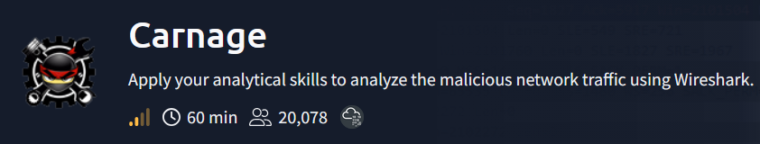

## Challenge Background

Eric Fischer from the Purchasing Department at Bartell Ltd received an email from a known contact with a Word document attached.

He opened it.

Then he clicked **Enable Content**.

The endpoint agent immediately alerted that Eric’s workstation was making suspicious outbound connections.

That is never a good sentence.

The network sensor captured the traffic, and the PCAP was handed over for analysis.

The task was simple in theory:

Investigate the packet capture and uncover the malicious activity.

Simple in theory.

In practice, the room had a whole shopping list of questions.

## Questions

What was the date and time for the first HTTP connection to the malicious IP?

What is the name of the zip file that was downloaded?

What was the domain hosting the malicious zip file?

Without downloading the file, what is the name of the file in the zip file?

What is the name of the webserver of the malicious IP from which the zip file was downloaded?

What is the version of the webserver from the previous question?

Malicious files were downloaded to the victim host from multiple domains. What were the three domains involved with this activity?

Which certificate authority issued the SSL certificate to the first domain from the previous question?

What are the two IP addresses of the Cobalt Strike servers?

What is the Host header for the first Cobalt Strike IP address?

What is the domain name for the first IP address of the Cobalt Strike server?

What is the domain name of the second Cobalt Strike server IP?

What is the domain name of the post-infection traffic?

What are the first eleven characters that the victim host sends out to the malicious domain involved in the post-infection traffic?

What was the length for the first packet sent out to the C2 server?

What was the Server header for the malicious domain from the previous question?

When did the DNS query for the IP-check domain occur?

What was the domain in that DNS query?

What was the first MAIL FROM address observed in the traffic?

How many packets were observed for the SMTP traffic?

Phew.

That is a lot of questions.

This was not a small “find one flag” moment.

This was Wireshark opening the door and saying, “Sit down. We have logs to read.”

## Loading the PCAP

I started the attached machine and opened the analysis folder.

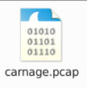

The room gave us a PCAP file.

A **PCAP** file is a packet capture file. It stores network traffic that was captured from a system or network sensor. Instead of seeing only “this machine connected somewhere,” we can inspect the actual packets, protocols, timestamps, domains, IP addresses, HTTP requests, TLS handshakes, DNS queries, and more.

Basically, a PCAP is network traffic frozen in time.

So naturally, I opened it in Wireshark.

## Setting the Time Format

Before answering anything, I changed the time display format in Wireshark.

From the top menu:

```text
View → Time Display Format → UTC Date and Time of Day
```

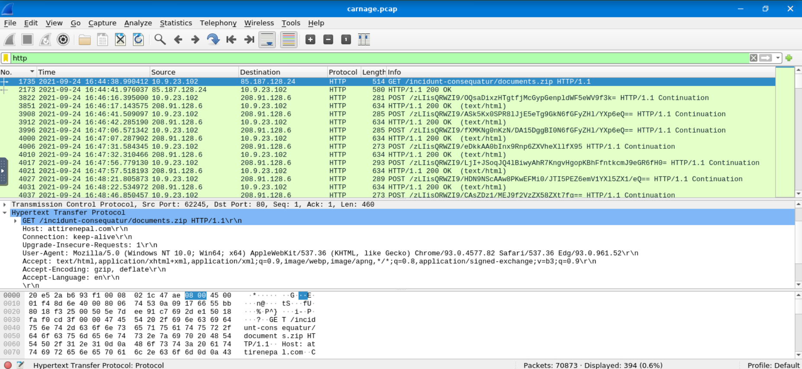

This matters because the room expects the timestamp in a specific format.

Also, changing the time format early prevents future suffering.

I support anything that reduces future suffering.

## Finding the First HTTP Connection

The first question asked:

What was the date and time for the first HTTP connection to the malicious IP?

I started simple and filtered the traffic with:

```text
http
```

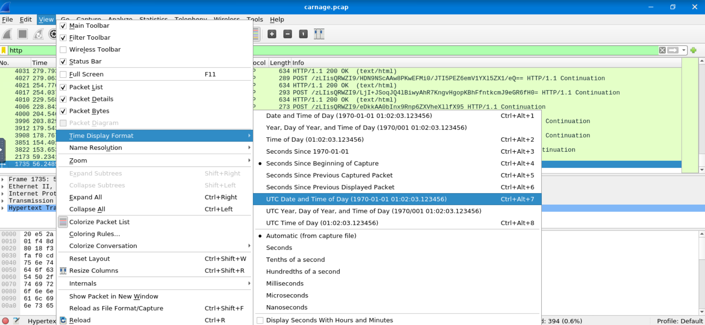

In Wireshark, the top section is the **Packet List pane**. It shows each packet as a row, including the packet number, time, source, destination, protocol, length, and a short summary in the Info column.

The middle section is the **Packet Details pane**. It lets you expand the selected packet and inspect its protocol layers.

The bottom section is the **Packet Bytes pane**. It shows the raw bytes of the selected packet.

After applying the HTTP filter, one request immediately stood out.

There was a `GET` request downloading a suspicious ZIP file.

That first HTTP connection happened at:

### Flag 1

```text
2021-09-24 16:44:38
```

## Finding the Downloaded ZIP File

The next question asked:

What is the name of the zip file that was downloaded?

This was visible in the same HTTP request.

The Info column and Packet Details pane showed the requested file name:

### Flag 2

```text
document.zip
```

The filename was not subtle.

A Word document infection chain followed by `document.zip`.

Very creative, malware people.

## Finding the Domain Hosting the ZIP File

The next question asked:

What was the domain hosting the malicious zip file?

Again, the same HTTP request contained the answer.

The Host header showed the domain:

### Flag 3

```text
attirenepal.com
```

At this point, the first few answers came from one HTTP request.

A rare moment of peace.

Wireshark had not started bullying me yet.

## Finding the File Inside the ZIP Without Downloading It

The next question asked:

Without downloading the file, what is the name of the file in the zip file?

I did not know at first that I could inspect the ZIP contents from inside Wireshark without saving the file separately.

So, like a normal sane person, I Googled.

The method was:

```text
Right-click the packet → Follow → TCP Stream
```

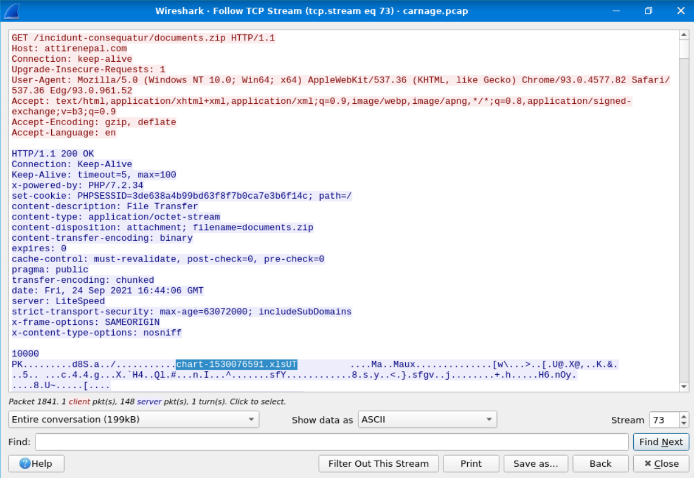

A **TCP stream** shows the reconstructed conversation between two systems over TCP.

Instead of looking at individual packets one by one, Wireshark reassembles the full request and response in order. This is useful for HTTP traffic because it lets us read headers and payload data together.

Inside the TCP stream, I could see the ZIP file content enough to identify the file inside it.

The file inside the ZIP was:

### Flag 4

```text
chart-1530076591.xls
```

So the ZIP contained an Excel file.

Because apparently Word documents were not enough. The malware chain wanted Microsoft Office cinematic universe energy.

## Finding the Web Server and Version

From the same TCP stream, the HTTP response headers also revealed server information.

The web server name was:

### Flag 5

```text
LiteSpeed
```

The version value the room wanted was also shown in the response headers:

### Flag 6

```text
PHP/7.2.34
```

So from one HTTP stream, we answered:

- ZIP file name
    
- Hosting domain
    
- File inside the ZIP
    
- Web server
    
- Version value
    

This is why following TCP streams is useful.

It turns packet chaos into something slightly more readable.

Slightly.

## Finding the Three Domains Serving Malicious Files

The next question asked:

Malicious files were downloaded to the victim host from multiple domains. What were the three domains involved with this activity?

This part confused me at first.

The hint said to narrow down the timeframe from:

```text
16:45:11 to 16:45:30
```

So I filtered for TLS traffic and focused on that time range.

```text
tls
```

Around that window, the victim system communicated with three suspicious domains.

The first one was:

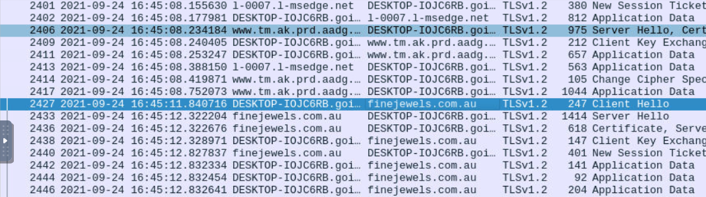

```text
finejewels.com.au
```

The second one was:

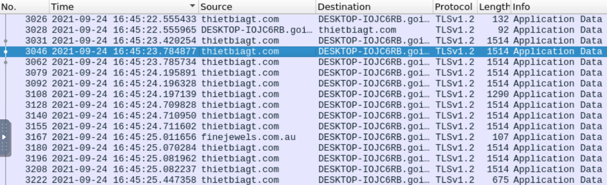

```text
thietbiagt.com
```

The third one was:

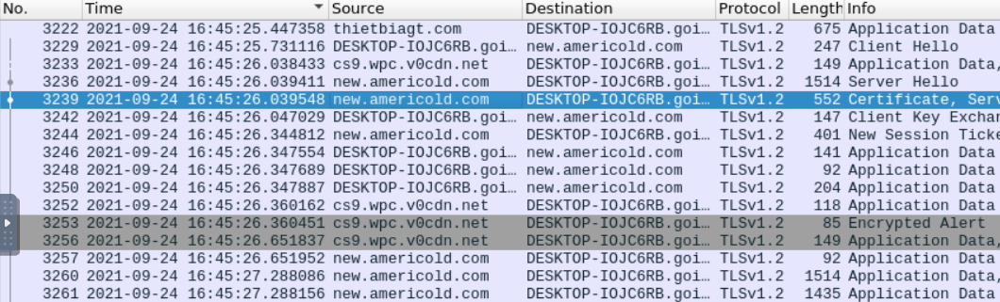

```text
new.anericold.com
```

### Flag 7

```text
finejewels.com.au, thietbiagt.com, new.anericold.com
```

This was one of those sections where the answer was not hard, but finding the right traffic window mattered.

Without the timeframe, I would probably still be scrolling.

## Finding the Certificate Authority

The next question asked:

Which certificate authority issued the SSL certificate to the first domain?

The first domain from the previous answer was:

```text
finejewels.com.au
```

To find the certificate issuer, I selected the TLS packet for that domain and expanded the certificate details in the Packet Details pane.

The path was basically:

```text
Transport Layer Security
→ Handshake Protocol: Certificate
→ Certificates
→ signedCertificate
→ issuer
→ rdnSequence
```

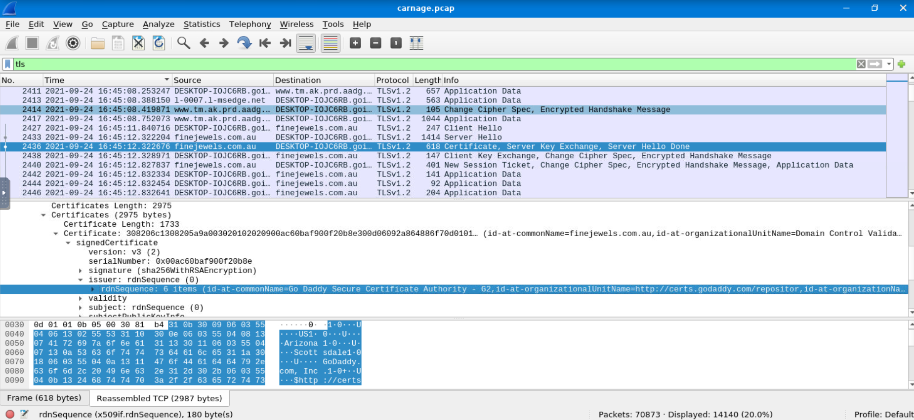

Inside the issuer details, Wireshark showed the certificate authority.

### Flag 8

```text
GoDaddy
```

This was actually a nice Wireshark moment.

TLS may encrypt the content, but the handshake and certificate details can still reveal useful information.

## Finding the Cobalt Strike Servers

The next question asked:

What are the two IP addresses of the Cobalt Strike servers?

The room also said to use VirusTotal Community tab to confirm if the IPs were identified as Cobalt Strike C2 servers.

According to MITRE ATT&CK, Cobalt Strike can communicate over common protocols such as HTTP, HTTPS, and DNS.

The usual ports are:

|Protocol|Port|Transport|
|---|---|---|
|HTTP|80|TCP|
|HTTPS|443|TCP|
|DNS|53|UDP/TCP|

Cobalt Strike can also use alternate HTTP ports, such as `8080`.

So I went to:

```text
Statistics → Conversations → TCP
```

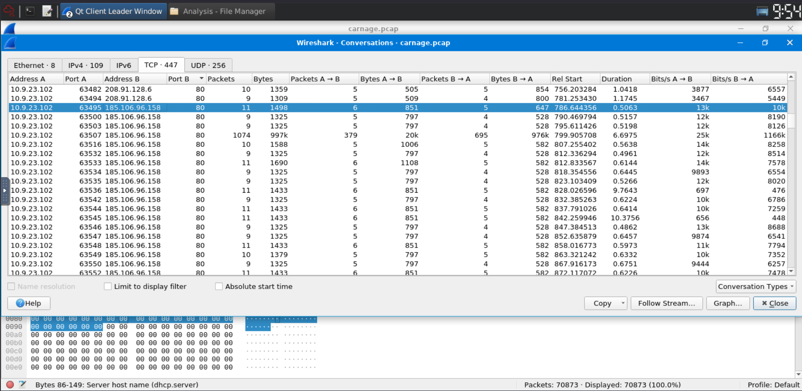

Then I started looking through TCP conversations involving suspicious external IPs and common web ports.

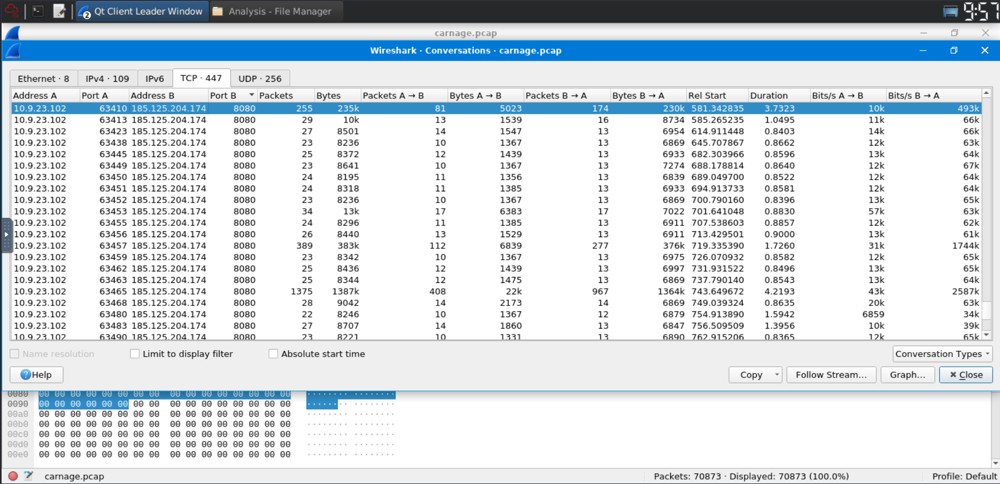

Two IP addresses stood out.

One was using port 80.

The other was using port 8080.

I checked both on VirusTotal and confirmed from the Community tab that they were associated with Cobalt Strike C2 activity.

### Flag 9

```text
185.106.96.158, 185.125.204.174
```

Network forensics rule of the day:

If something looks suspicious, ask VirusTotal.

If VirusTotal’s Community tab starts yelling “Cobalt Strike,” maybe listen.

## Finding the Host Header for the First Cobalt Strike IP

The next question asked:

What is the Host header for the first Cobalt Strike IP address?

The first Cobalt Strike IP was:

```text
185.106.96.158
```

I filtered for that IP:

```text
ip.addr == 185.106.96.158
```

Then I followed the TCP stream.

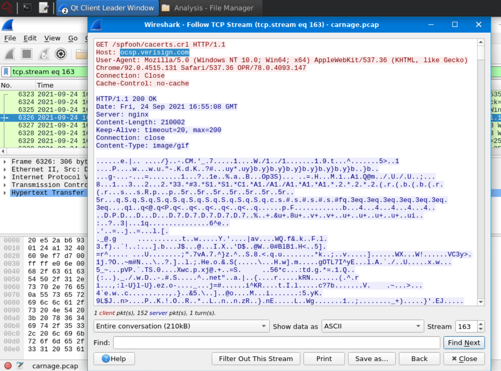

Inside the HTTP request, I found the Host header:

### Flag 10

```text
ocsp.verisign.com
```

This is a good example of why Host headers are useful.

The IP address tells us where the traffic went.

The Host header tells us what domain the HTTP request claimed to be contacting.

Sometimes those two things are normal.

Sometimes they are part of suspicious infrastructure pretending to be boring.

## Finding the Cobalt Strike Domain Names

The next two questions asked for the domain names of the two Cobalt Strike server IPs.

For this, I used the VirusTotal Community tab.

The comments connected the Cobalt Strike IPs to domain names.

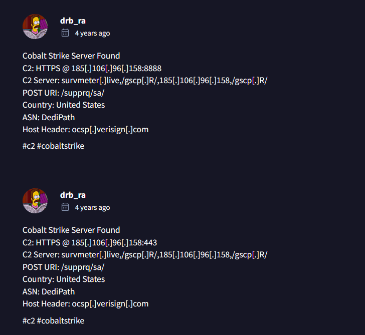

The first Cobalt Strike server domain was:

### Flag 11

```text
survmeter.live
```

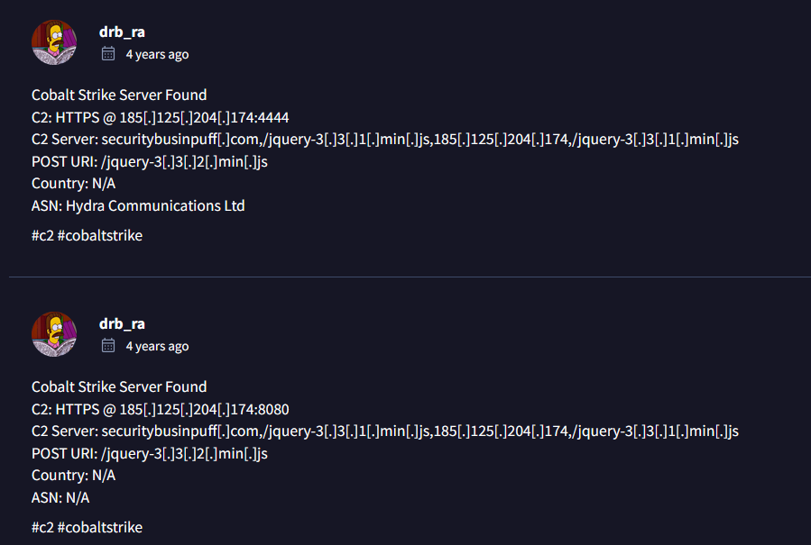

The second Cobalt Strike server domain was:

### Flag 12

```text
securitybusinpuff.com
```

The names sound random enough to be suspicious and boring enough to be malware infrastructure.

Perfectly cursed.

## Finding the Post-Infection Traffic Domain

The next question asked:

What is the domain name of the post-infection traffic?

I searched for HTTP POST requests:

```text
http.request.method == POST
```

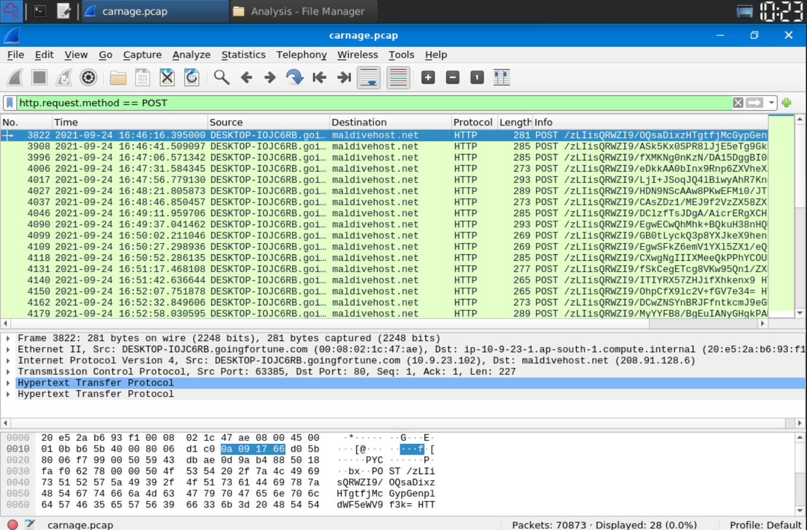

POST requests are interesting because infected systems often use them to send data back to a command-and-control server.

In the results, I saw traffic going to:

### Flag 13

```text
maldivehost.net
```

The POST body also contained encoded-looking data, which made it stand out even more.

At this point, the victim machine was no longer just downloading suspicious files.

It was talking back.

That is usually where the vibes become bad.

## Finding the First Eleven Characters Sent Out

The next question asked:

What are the first eleven characters that the victim host sends out to the malicious domain involved in the post-infection traffic?

From the same POST request, the first characters sent in the request body were visible.

### Flag 14

```text
zLIisQRWZI9
```

This looked like encoded or structured data being sent out to the malicious domain.

Nothing says “normal browsing” like random-looking strings leaving the host after infection.

## Finding the Packet Length

The next question asked:

What was the length for the first packet sent out to the C2 server?

This was visible in the packet list as the Length value for the first matching packet.

### Flag 15

```text
281
```

## Finding the Server Header

The next question asked:

What was the Server header for the malicious domain from the previous question?

I followed the TCP stream for the post-infection HTTP traffic.

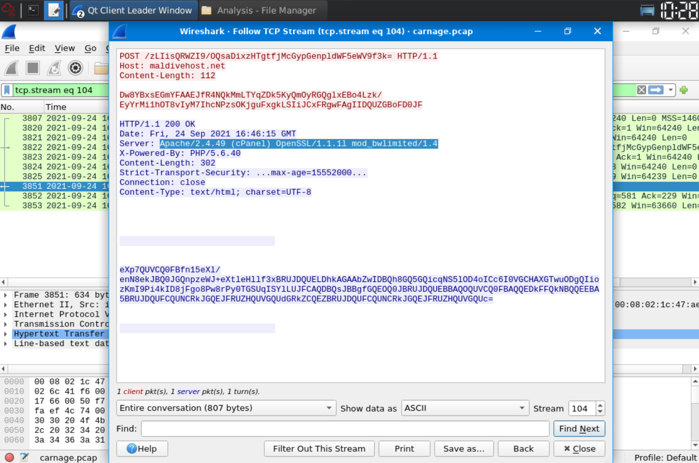

The response headers showed:

### Flag 16

```text
Apache/2.4.49 (cPanel) OpenSSL/1.1.1l mod_bwlimited/1.4
```

Very long server header.

Very generous with information.

Thank you, suspicious infrastructure.

## Finding the IP-Check API Query

The next question said:

The malware used an API to check for the IP address of the victim’s machine. What was the date and time when the DNS query for the IP-check domain occurred?

To search broadly through packet contents, I used:

```text
frame contains "api"
```

This filter searches packet data for the string `api`.

After looking through the results, I found a DNS query for:

```text
api.ipify.org
```

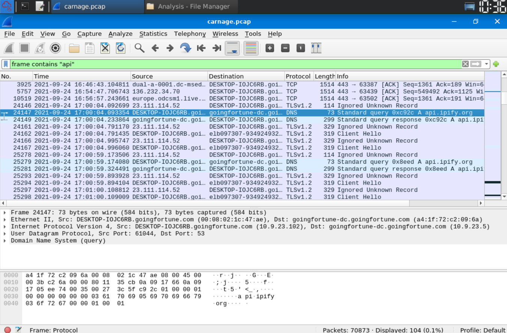

This domain is used to check a machine’s public IP address.

That makes sense in malware traffic because malware may want to know the victim’s external IP before continuing communication or reporting back.

The DNS query happened at:

### Flag 17

```text
2021-09-24 17:00:04 UTC
```

The domain in the DNS query was:

### Flag 18

```text
api.ipify.org
```

## Finding the First MAIL FROM Address

The next question said:

Looks like there was some malicious spam activity going on. What was the first MAIL FROM address observed in the traffic?

I searched for:

```text
frame contains "MAIL FROM"
```

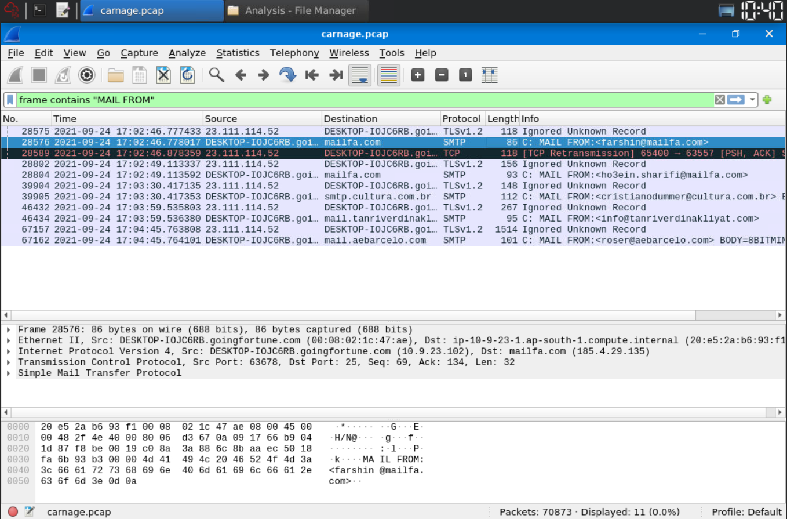

The first result showed the SMTP MAIL FROM address.

### Flag 19

```text
farshin@mailfa.com
```

SMTP traffic in malware cases usually means the host may be involved in spam activity or email abuse.

At this point, Eric’s machine had gone from “opened a Word doc” to “possibly participating in malspam.”

That escalated quickly.

## Counting SMTP Packets

The final question asked:

How many packets were observed for the SMTP traffic?

I filtered for SMTP:

```text
smtp
```

At the bottom right of Wireshark, the displayed packet count showed the total number of packets matching the filter.

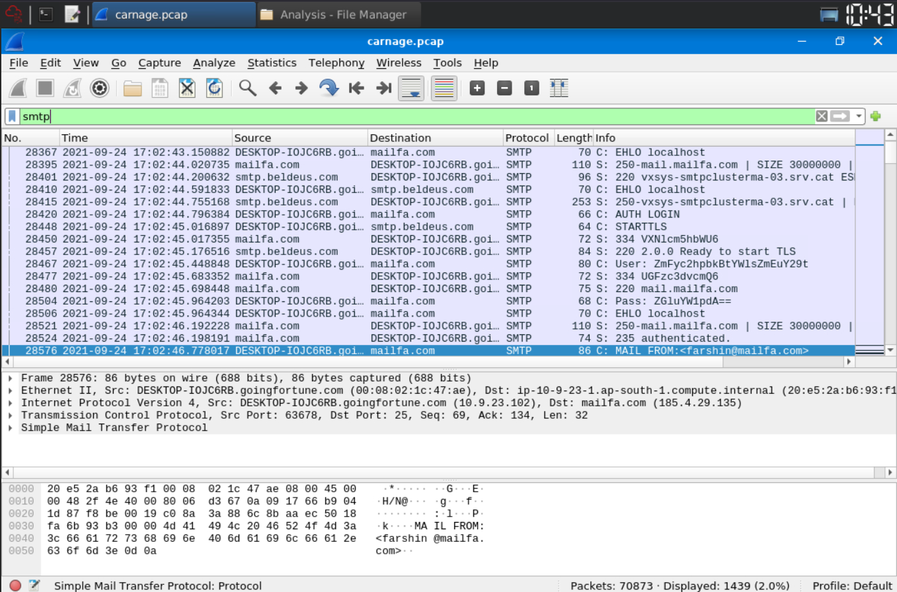

The count was:

### Flag 20

```text
1439
```

That is a lot of SMTP traffic.

Eric clicked “Enable Content” and the machine apparently decided to become an email intern for malware.

## Final Answers

### First HTTP Connection Time

```text
2021-09-24 16:44:38
```

### Downloaded ZIP File

```text
document.zip
```

### Domain Hosting the ZIP

```text
attirenepal.com
```

### File Inside the ZIP

```text
chart-1530076591.xls
```

### Web Server Name

```text
LiteSpeed
```

### Web Server Version

```text
PHP/7.2.34
```

### Three Domains Serving Malicious Files

```text
finejewels.com.au, thietbiagt.com, new.anericold.com
```

### Certificate Authority

```text
GoDaddy
```

### Cobalt Strike Server IPs

```text
185.106.96.158, 185.125.204.174
```

### Host Header for First Cobalt Strike IP

```text
ocsp.verisign.com
```

### First Cobalt Strike Domain

```text
survmeter.live
```

### Second Cobalt Strike Domain

```text
securitybusinpuff.com
```

### Post-Infection Traffic Domain

```text
maldivehost.net
```

### First Eleven Characters Sent Out

```text
zLIisQRWZI9
```

### First Packet Length to C2

```text
281
```

### Server Header

```text
Apache/2.4.49 (cPanel) OpenSSL/1.1.1l mod_bwlimited/1.4
```

### IP-Check DNS Query Time

```text
2021-09-24 17:00:04 UTC
```

### IP-Check Domain

```text
api.ipify.org
```

### First MAIL FROM Address

```text
farshin@mailfa.com
```

### SMTP Packet Count

```text
1439
```

## Closing Thoughts

Carnage was a proper network-forensics challenge.

It was not just one suspicious packet or one hidden file.

It had the full chain:

A malicious document.

A ZIP download.

An Excel file.

Multiple malicious domains.

TLS certificate clues.

Cobalt Strike infrastructure.

Post-infection HTTP traffic.

An IP-check API request.

And finally, SMTP spam activity.

Basically, Eric clicked **Enable Content**, and the network immediately started writing a confession.

This challenge taught me how useful Wireshark becomes when you stop staring at every packet individually and start using filters properly.

The most useful things for me were:

```text
http
tls
ip.addr == <IP>
http.request.method == POST
frame contains "api"
frame contains "MAIL FROM"
smtp
```

Also, following TCP streams was a lifesaver because it showed the HTTP conversations in a readable way instead of forcing me to assemble packet fragments manually like a sad puzzle.

The biggest lesson from this one:

A PCAP looks scary at first because it contains thousands of packets.

But once you know what you are looking for, the noise starts turning into a timeline.

And in this timeline, the story was very clear.

Eric opened the document.

Eric clicked Enable Content.

Eric’s machine chose violence.

