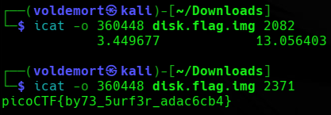

# Day 14: Sleuthkit Apprentice picoCTF Forensics Writeup

A simple picoCTF forensics writeup where Sleuth Kit helped me dig through a disk image without hiding behind Autopsy.

Today, we are doing **Sleuthkit Apprentice**.


There are two main ways to solve this challenge.

One way is using **Autopsy**, which gives you a graphical interface to browse the disk image.

The other way is using **The Sleuth Kit** from the command line.

Since the challenge is literally called Sleuthkit Apprentice, using Autopsy felt like bringing a calculator to a mental math contest.

So for the sake of learning, I used the CLI tools.

Painful? Maybe.

Useful? Definitely.

## Extracting the File

The challenge gave us a compressed `.gz` file.

A `.gz` file is compressed using gzip, so the first step was to extract it.

The command is:

```bash
gunzip disk.flag.img.gz
```

or:

```bash
gzip -d disk.flag.img.gz
```

After extraction, I got the disk image:

```text
disk.flag.img
```

Now the actual investigation could begin.

## Tiny Sleuth Kit Memory Trick

Before starting, this is the short version I kept in mind:

```text
mmls    = show partitions
fsstat  = show filesystem info
fls     = list files
icat    = cat file by inode
istat   = inspect inode
ffind   = inode to filename
ifind   = block to inode
blkls   = dump unallocated blocks
mactime = make timeline
```

The basic holy trinity for this challenge was (or most ctf in general):

```text
mmls → fls → icat
```

That means:

1. Use `mmls` to find the partitions.
    
2. Use `fls` to list files inside a partition.
    
3. Use `icat` to read a file by its inode.
    

If you do not know what a command does, MAN UP.

Basically:

```bash
man mmls
```

/Finding the Partitions with mmls

I started by running:

```bash
mmls disk.flag.img
```

The output was:

```text
DOS Partition Table
Offset Sector: 0
Units are in 512-byte sectors

      Slot      Start        End          Length       Description
000:  Meta      0000000000   0000000000   0000000001   Primary Table (#0)
001:  -------   0000000000   0000002047   0000002048   Unallocated
002:  000:000   0000002048   0000206847   0000204800   Linux (0x83)
003:  000:001   0000206848   0000360447   0000153600   Linux Swap / Solaris x86 (0x82)
004:  000:002   0000360448   0000614399   0000253952   Linux (0x83)
```

`mmls` shows the partition layout of the disk image.

The important part here is the **Start** column.

The disk image had two Linux file system partitions:

```text
2048
360448
```

There was also a Linux swap partition starting at:

```text
206848
```

I ignored the swap partition because swap is used for temporary memory storage, not normal user files.

So the two useful offsets were:

```text
2048
360448
```

These offsets matter because Sleuth Kit tools need to know where the file system starts inside the full disk image.

Without the correct offset, the tool is basically looking at the wrong part of the disk and getting confused on purpose.

## Searching for Flag Files with fls

CTF challenges often place the flag inside a file with `flag` in the name.

Not always.

But often enough that it is worth checking first.

So instead of manually browsing every folder like a lost tourist, I used `fls` with `grep`.

The command format was:

```bash
fls -o <starting-sector> -r disk.flag.img | grep flag
```

Breaking that down:

```text
fls
```

lists files and directories from a file system.

```text
-o <starting-sector>
```

tells Sleuth Kit where the partition starts inside the disk image.

```text
-r
```

recursively lists files inside directories.

```text
| grep flag
```

filters the output and only shows lines containing the word `flag`.

So I tested the first Linux partition:

```bash
fls -o 2048 -r disk.flag.img | grep flag
```

That did not return anything useful.

Then I tested the second Linux partition:

```bash
fls -o 360448 -r disk.flag.img | grep flag
```



This time, I got something interesting:

```text
++ r/r * 2082(realloc): flag.txt
++ r/r 2371:    flag.uni.txt
```

Now we had two possible files.

The important numbers here are the inode numbers:

```text
2082
2371
```

An inode is basically a file-system record that stores information about a file, such as where its data lives.

In simple terms:

The filename is the label.

The inode is where the file system actually tracks the file.

## Reading Files with icat

To read a file by inode, I used `icat`.

`icat` works like `cat`, but instead of giving it a normal filename, you give it an inode number from a disk image.

The command format is:

```bash
icat -o <starting-sector> disk.flag.img <inode>
```

I first tried the inode for `flag.txt`:

```bash
icat -o 360448 disk.flag.img 2082
```

That did not give the flag.

The `*` and `(realloc)` in the `fls` output suggested that this file entry was deleted or reallocated, so it was not the useful one.

Then I tried the second inode:

```bash
icat -o 360448 disk.flag.img 2371
```


This time, it worked.

Inside `flag.uni.txt`, I found the flag.

## Flag

```text
picoCTF{by73_5urf3r_adac6cb4}
```

## Final Command Flow

The whole solve came down to this:

```bash
gunzip disk.flag.img.gz
mmls disk.flag.img
fls -o 360448 -r disk.flag.img | grep flag
icat -o 360448 disk.flag.img 2371
```

Short.

Clean.

Suspiciously simple after you understand the tools.

## Closing Thoughts

This was a good beginner Sleuth Kit challenge.

The main lesson was learning how to move through a disk image from the command line.

First, `mmls` showed the partitions.

Then, `fls` helped search through the file system.

Finally, `icat` read the file using its inode.

I could have used Autopsy and clicked through everything, but using the CLI made the process clearer.

It also made me feel slightly more like a forensic investigator and slightly less like someone randomly poking a disk image with a stick.

Progress.

Tiny progress, but still progress.

