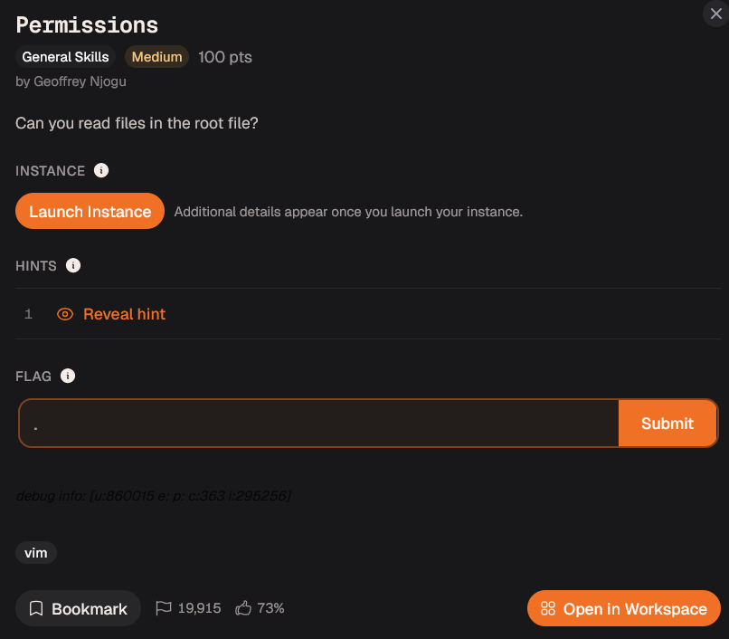
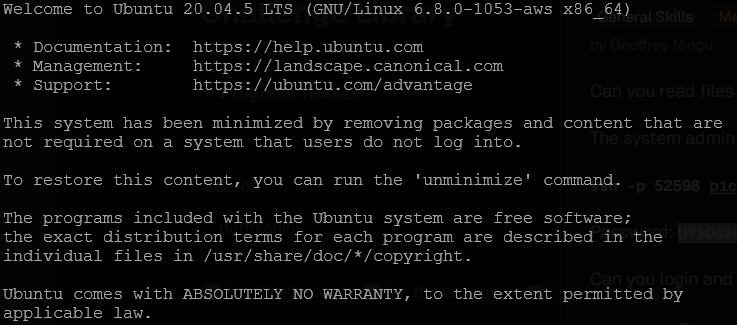
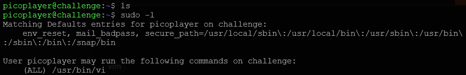
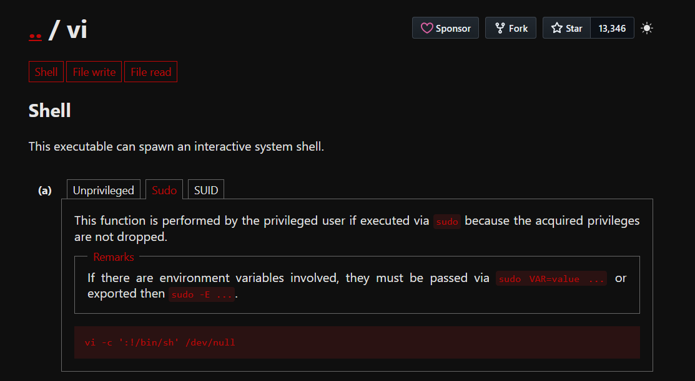
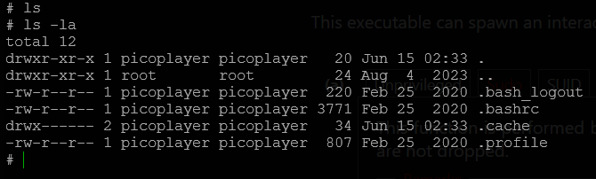
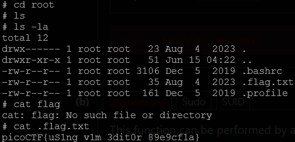

# Day 15: Permissions picoCTF Writeup

A simple Linux permissions challenge where one sudo rule for `vi` was enough to become root.

Today, we are tackling **Permissions**, a medium-level CTF challenge about privilege escalation on a Linux system.



The challenge gave us an SSH command and a password.

So I connected to the machine using SSH.



And just like that, I was inside.

Very welcoming machine.

Probably too welcoming.

## Checking the Environment

The first thing I did was check what files were available in the current directory.

```bash
ls
```

Nothing useful showed up.

So instead of randomly wandering around the machine, I checked whether the current user had any sudo permissions.

```bash
sudo -l
```



That showed something very interesting.

The user had sudo permission to run:

```text
/usr/bin/vi
```

`vi` is a text editor. On many systems, it may actually be Vim running in vi-compatible mode, but the important part is this:

`vi` can execute shell commands from inside the editor.

So if we are allowed to run `vi` with sudo, there may be a way to use it to spawn a root shell.

That sounds bad.

For the machine.

Good for the flag.

## Checking GTFOBins

The next step was to check **GTFOBins**.

GTFOBins is a curated list of Unix-like binaries that can be abused to bypass local security restrictions when they are misconfigured.

In simple words:

If a system lets you run certain programs with extra privileges, GTFOBins shows how those programs can sometimes be used to escape into a shell, read files, or escalate privileges.

I searched for `vi`.



GTFOBins showed that if `vi` can be run with `sudo`, it can be used to spawn a shell.

The command was:

```bash
sudo vi -c ':!/bin/sh' /dev/null
```

Breaking it down:

```text
sudo vi
```

runs `vi` with sudo privileges.

```text
-c ':!/bin/sh'
```

tells `vi` to run a command as soon as it opens.

Inside `vi`, `:!` runs a shell command.

So:

```text
:!/bin/sh
```

starts `/bin/sh`.

Since `vi` was started with sudo, the shell also runs with elevated privileges.

```text
/dev/null
```

is just a harmless file target so `vi` has something to open.

Basically, we are not using `vi` to edit text.

We are using it as a very dramatic door into a root shell.

## Getting a Root Shell

I ran:

```bash
sudo vi -c ':!/bin/sh' /dev/null
```

It asked for the password, so I entered the password provided by the challenge.

After that, I got a shell.

At first, I ran:

```bash
ls
```

Nothing useful showed up.

But `ls` only shows normal visible files.

So I used:

```bash
ls -la
```

This shows hidden files and gives more details about permissions and ownership.



From there, I moved up through the directories and found the root directory.

```bash
cd ..
ls -la
cd ..
ls -la
```

Eventually, I saw:

```text
/root
```

Since I had a root shell now, I could access it.

So I entered:

```bash
cd /root
```

Inside `/root`, there was a hidden flag file.

## Reading the Flag

To read the flag, I used:

```bash
cat .flag.txt
```



And there it was.

## Flag

```text
picoCTF{uS1ng_v1m_3dit0r_89e9cf1a}
```

## Closing Thoughts

This challenge was short, but it taught an important Linux privilege escalation idea.

The issue was not that `vi` itself was malicious.

The problem was that the user was allowed to run `vi` with sudo privileges.

Since `vi` can execute shell commands, that sudo permission became enough to spawn a root shell.

The main lesson is:

Always check sudo permissions first.

```bash
sudo -l
```

If a user can run certain programs as root, those programs may become privilege escalation paths.

In this case, the entire challenge came down to:

```bash
sudo -l
```

finding `vi`, checking GTFOBins, and turning a text editor into a root shell.

Very normal editor behavior.

Definitely not suspicious at all.

