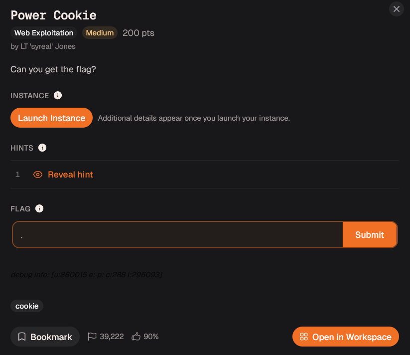
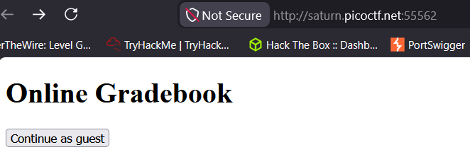
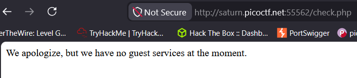
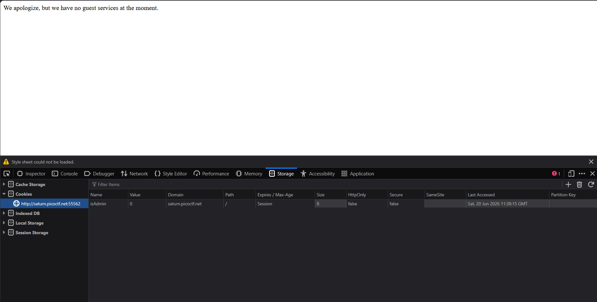
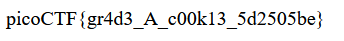

# Day 20: Power Cookie picoCTF Web Exploitation Writeup

A simple picoCTF web challenge where the website trusted a browser cookie a little too much.

Today marks the start of the web category.

We are starting with **Power Cookie** from picoCTF, or CyLab if we want to sound like we read the official branding properly.



The challenge did not give much explanation.

It simply asked me to launch an instance and visit the website.

So I launched it.

No dramatic lore.

No suspicious company email.

No haunted ZIP file.

Just a website and a cookie waiting to make bad decisions.

## Opening the Website

After opening the instance, I landed on this page:



There was a button that said:

```text
Continue as guest
```

So I clicked it.

That took me to:

```text
check.php
```

And the page showed this message:

```text
We apologize, but we have no guest services at the moment.
```



At first, this looks like a normal message.

But it raises one very important question:

How did the website know I was a guest?

The challenge is called **Power Cookie**, so the answer was probably not hiding in a 500-line JavaScript file or a secret admin portal guarded by dragons.

It was probably in the cookies.

## Understanding the Cookie Idea

Before changing anything, I wanted to understand why cookies matter here.

HTTP is stateless.

That basically means every request is treated like a fresh request. The server does not automatically remember what happened before.

So if there were no cookies or sessions, a website would have a hard time remembering things like:

```text
Who is logged in?
What account is this?
What settings did the user choose?
Is this user a guest or an admin?
```

That is where cookies come in.

A cookie is a small piece of data stored in the browser. When the browser sends another request to the same website, it automatically sends the cookie along with it.

So cookies help websites keep track of state between requests.

For normal websites, cookies can be used for things like login sessions, themes, preferences, shopping carts, or remembering that you already clicked something.

But in web security, cookies become interesting because they sometimes contain important values, such as:

```text
session tokens
user IDs
role values
admin flags
encoded data
```

And that is where things can go wrong.

The browser belongs to the user.

So if a website stores something sensitive in a cookie and blindly trusts it, the user may be able to edit that value.

In this challenge, the website was basically asking my browser:

“Are you admin?”

And the browser had a cookie that answered:

```text
isAdmin=0
```

So my next question became obvious:

What happens if I change that `0` to `1`?

## Checking Cookies in Firefox

I used Firefox for this because Firefox Developer Tools are very comfortable for CTFs.

To check the cookies, I opened Developer Tools:

```text
Right-click → Inspect → Storage
```

Then I checked the cookies for the website.



There was a cookie named:

```text
isAdmin
```

Its value was:

```text
0
```

That was the entire clue.

The website appeared to be using the cookie value to decide whether the user was an admin.

So the logic probably looked something like this:

```text
isAdmin=0 → guest
isAdmin=1 → admin
```

That means the website was trusting a value stored in my own browser.

This is like asking someone at the door:

“Are you staff?”

And they say:

“Wait, let me edit my badge real quick.”

## Changing the Cookie

Since the cookie value was set to:

```text
0
```

I changed it to:

```text
1
```

Then I refreshed the page.



And the flag appeared.

That was it.

No password.

No SQL injection.

No JavaScript wizardry.

Just changing:

```text
isAdmin=0
```

to:

```text
isAdmin=1
```

The website saw the cookie and basically said:

“Seems legit. Welcome, boss.”

## Flag

```text
picoCTF{gr4d3_A_c00k13_5d2505be}
```

## What Went Wrong?

The issue here was not that the website used cookies.

Cookies are normal.

The issue was that the website trusted a user-controlled cookie for authorization.

Authorization means deciding what a user is allowed to access.

That decision should be verified safely on the server side.

If the server simply trusts:

```text
isAdmin=1
```

from the browser, then anyone can open Developer Tools, change the value, and become admin.

A safer approach would be to store the real session and permission information on the server, then use the cookie only as a session reference.

The browser should not get to decide whether the user is admin.

The browser is the client.

And as this challenge politely demonstrated, the client lies.

## Final Answer

```text
picoCTF{gr4d3_A_c00k13_5d2505be}
```

## Closing Thoughts

Power Cookie was short, but the lesson was clean.

The website did not need to be broken with a complex exploit.

It was already trusting the wrong thing.

The whole challenge felt like changing my own wristband from “Guest” to “VIP” and watching security open the velvet rope.

That is the core lesson:

Never let the client grade its own permission slip.

Cookies can store data.

They should not be the final authority on who gets admin access.

