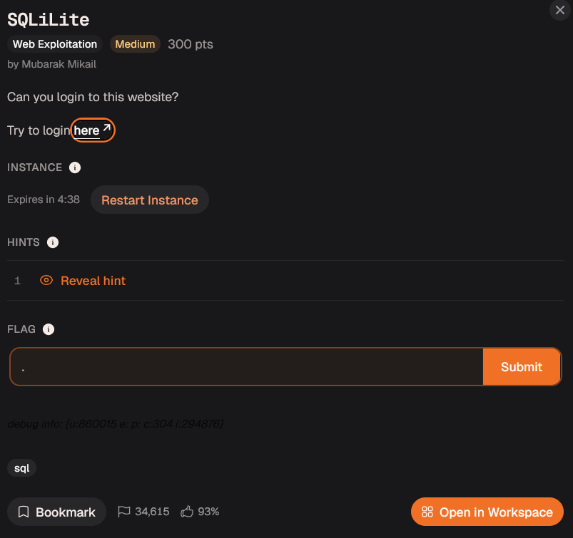
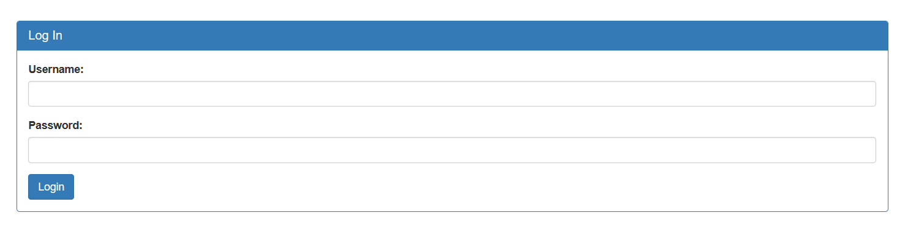
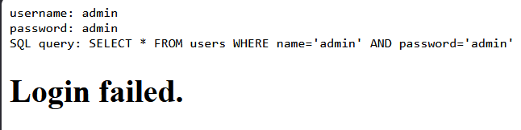
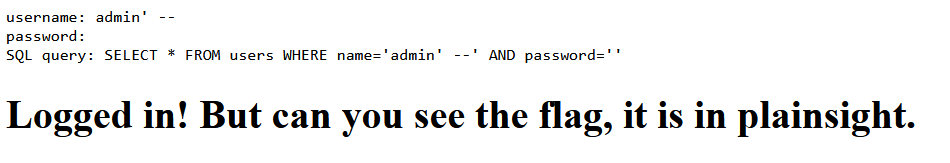
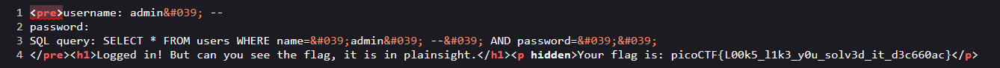

# Day 21: SQLiLite picoCTF Web Exploitation Writeup

A simple picoCTF SQL injection writeup where the login page exposed its own query and politely showed me where to poke it.

Today, we are doing **SQLiLite** by picoCTF, or CyLab if we are following the newer naming.

The challenge says:

> Can you login to this website?

Sure.

But where is the username and password, my lord?

You cannot just place me outside the castle gate and say, “Enter.”

At least give me a royal invitation, a forged seal, or one emotionally unstable guard to trick.

Instead, the website gave me a login page.

So I brought SQL injection to the castle.



## Opening the Website

After launching the instance, I opened the website.

It showed a simple login page with two fields:

```text
Username
Password
```



Since this was a login page, I started with the classic test:

```text
Username: admin
Password: admin
```

Not because I expected it to work.

But because every login form deserves to be judged by the ancient `admin:admin` ritual.

After clicking login, the page gave a very useful response.

It showed the SQL query being executed:

```sql
SELECT * FROM users WHERE name='admin' AND password='admin'
```



That was the big clue.

The application was showing us that our input was being placed directly into the SQL query.

That means the website was probably building the query like this:

```text
Take username input
Take password input
Put both directly into SQL query
Run query
```

That is dangerous because if user input is not properly handled, we can change the meaning of the SQL query.

That is where SQL injection comes in.

## Quick SQL Injection Explanation

SQL is used to talk to databases.

For example, a login query might look like this:

```sql
SELECT * FROM users WHERE name='admin' AND password='admin';
```

In normal English, this means:

```text
Find a user where the name is admin and the password is admin.
```

Both conditions must be true.

So if the username is correct but the password is wrong, the login should fail.

The problem happens when the website directly inserts user input into the query without safely separating code from data.

If I can type something that changes the SQL structure, then I am no longer just entering a username.

I am editing the question the database is being asked.

At that point, the login form is not a castle gate anymore.

It is a guard who reads anything you hand him and follows it as law.

## Bypassing the Password Check

Since the query looked like this:

```sql
SELECT * FROM users WHERE name='admin' AND password='admin'
```

I wanted to remove the password check.

To do that, I used this payload in the username field:

```text
admin' --
```

And I left the password field empty.

The apostrophe after `admin` closes the username string.

Then `--` starts a SQL comment.

In SQL, a comment tells the database to ignore the rest of the line.

So the query becomes:

```sql
SELECT * FROM users WHERE name='admin' --' AND password=''
```



The important part is this:

```sql
SELECT * FROM users WHERE name='admin'
```

The password check is still visible in the output, but it has been commented out.

So the database only checks whether a user named `admin` exists.

It no longer checks the password.

That is why the login worked.

Basically, I told the database:

```text
Check if admin exists.
Ignore the password part.
Thank you.
```

And the database said:

```text
Understandable. Welcome in.
```

That was not authentication.

That was the database being too agreeable.

## Logged In, But No Flag Yet

After the injection worked, the page said:

```text
Logged in! But can you see the flag, it is in plainsight.
```

That message was basically the website whispering:

“Please inspect the page.”

So I did what every CTF beginner eventually learns to do.

I checked the page source.



And there it was.

The flag was sitting inside the HTML source.

Not hidden behind another exploit.

Not buried in a database.

Just chilling in the page source like it paid rent there.

## Flag

```text
picoCTF{L00k5_l1k3_y0u_solv3d_it_d3c660ac}
```

## Final Payload

```text
admin' --
```

## Final Query

```sql
SELECT * FROM users WHERE name='admin' --' AND password=''
```

## Closing Thoughts

SQLiLite was a clean beginner SQL injection challenge.

The website made the learning part easier by showing the SQL query directly.

That helped me understand exactly what my input was doing.

The main mistake was that the application trusted raw user input and placed it directly into a SQL query.

Because of that, I could close the username string, comment out the password condition, and log in as admin without knowing the password.

The second lesson was also important:

After logging in, always inspect the page.

Sometimes the flag is not behind another attack.

Sometimes it is just sitting in the HTML like a castle treasure chest with the lid already open.

The challenge name says SQLiLite, and honestly, that fits.

Not a full medieval siege.

More like walking up to the castle gate, saying “I am admin,” and watching the guard update the guest list himself.

