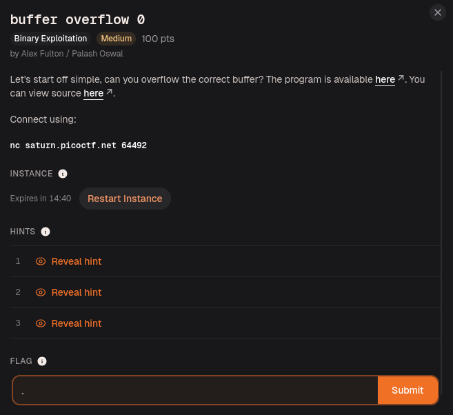
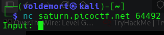
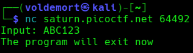
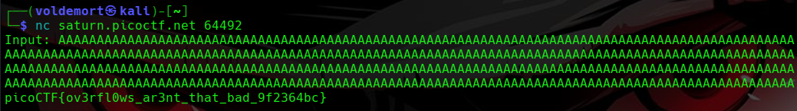

# Day 25: buffer overflow 0 picoCTF Binary Exploitation Writeup

A first step into picoCTF binary exploitation, where spamming A’s somehow became a legitimate strategy.

Today, we are stepping into a new category, we are entering **pwn**, also known as **binary exploitation**.

The category where people start talking about memory, registers, stack frames, and suddenly everyone acts like they were born inside GDB.

So yes, today we are doing the Matrix looking side of CTFs.

Except instead of wearing a black hoodie in a dark room with green code falling behind me, I am sitting here trying to understand why typing thirty-two A’s can bully a program into giving me a flag.

Now I will be as real as Mark Zuckerberg being a normal human man and definitely not a lizard wearing sunscreen:

I know almost nothing about pwn.

This is my first proper attempt at this category, so do not judge me if I sound like a kid explaining rocket science because he once dropped Mentos into Coca-Cola and called it a chemical experiment.

We are starting with **buffer overflow 0** from picoCTF.



## Challenge Information

The challenge is called:

```text
buffer overflow 0
```

The description basically says:

> Let's start off simple, can you overflow the correct buffer?

It also gives us a program file, the source code, and a remote service to connect to:

```bash
nc saturn.picoctf.net 64492
```

So the goal is to connect to the running program, send input, and figure out how to make it give us the flag.

Very simple sentence.

Very suspicious sentence.

## Connecting with Netcat

Before reading the source code, I wanted to see how the program behaved normally.

So I used Netcat:

```bash
nc saturn.picoctf.net 64492
```

`nc`, or Netcat, lets us connect to a remote host and port from the terminal.

In this challenge, picoCTF is running the vulnerable program on a server. By connecting with Netcat, I can interact with that program like I am typing directly into it.

After connecting, the program asked for input:



Since I had no idea what to enter yet, I tried something simple:

```text
ABC123
```

The program replied:

```text
The program will exit now
```



So normal input did nothing special.

No flag.

No crash.

No dramatic Matrix code falling down the screen.

Just the program politely leaving the conversation.

## The Ancient Wisdom of AAAAAA

At this point, I remembered something a friend once told me.

We were not even talking about hacking.

We were probably discussing something completely unrelated, like whether biryani without potato should be considered a war crime.

Then, out of nowhere, he said:

> In binary exploitation, when in doubt, spam A’s.

No buildup.

No explanation.

Just ancient pwn wisdom dropped into the middle of food politics.

And somehow, that sentence stayed with me.

So I tried it.

I connected again and entered a lot of A’s:

```text
AAAAAAAAAAAAAAAAAAAAAAAAAAAAAAAAAAAAAAAAAAAAAAAAAAAAAAAAAAAAAAAA
```

And the program gave me the flag.

I was stunned.

Mesmerized.

Hypnotized.

For one beautiful second, binary exploitation looked easy.

Then reality came back and slapped me.

Because yes, I got the flag, but I had no idea why it worked.

There is a saying in programming:

> If it works, do not touch it.

Unfortunately, I am trying to learn.

So I had to commit the forbidden act.

I questioned the working thing.

## Reading the Source Code

Now I had the flag, but I still had no idea why screaming the letter `A` at a program worked.

So I opened the source code and focused only on the parts that actually mattered.

The first important part is this:

```c
char flag[FLAGSIZE_MAX];

fgets(flag, FLAGSIZE_MAX, f);
```

This tells us the program creates space for the flag and then reads the flag from `flag.txt` into memory.

So before I even type anything, the flag is already loaded inside the program.

The program is basically walking around with the flag in its pocket while saying:

“Please do not crash me.”

Dangerous confidence.

Then I noticed this:

```c
signal(SIGSEGV, sigsegv_handler);
```

This sets up a handler for `SIGSEGV`.

`SIGSEGV` means segmentation fault, which usually happens when a program messes up memory access and crashes.

Normally, a crash is bad.

But here, the crash has a reward system.

The handler looks like this:

```c
void sigsegv_handler(int sig) {
  printf("%s\n", flag);
  fflush(stdout);
  exit(1);
}
```

So if the program segfaults, this function runs and prints the flag.

That means the goal is not to control the program like a pwn wizard yet.

The goal is simply:

```text
Make the program crash in the right way.
```

And honestly, that is the most beginner-friendly pwn objective possible.

Break the thing.

Get paid in flag.

## Where the Buffer Overflow Happens

The input part starts here:

```c
char buf1[100];
gets(buf1);
vuln(buf1);
```

`buf1` can hold 100 characters.

Then the program uses `gets()` to read my input.

That is already suspicious because `gets()` does not check how much data the buffer can safely hold. The Linux man page is very explicit about this:


>Never use gets(). Because it is impossible to tell without knowing the data in advance how many characters gets() will read, and because gets() will continue to store characters past the end of the buffer, it is extremely dangerous to use. It has been used to break computer security. Use fgets() instead.


When the documentation itself is yelling “do not use this,” you know the function has a criminal record.

After reading my input into `buf1`, the program sends it to `vuln()`:

```c
vuln(buf1);
```

And this is where the real problem happens:

```c
void vuln(char *input){
  char buf2[16];
  strcpy(buf2, input);
}
```

Inside `vuln()`, there is another buffer:

```c
char buf2[16];
```

This buffer can only safely hold 16 characters.

But then the program uses:

```c
strcpy(buf2, input);
```

`strcpy()` copies the input into `buf2`, but it does not check whether `buf2` is big enough.

So if I enter more than 16 characters, `strcpy()` keeps copying anyway.

The extra input spills past `buf2` and corrupts nearby memory.

That is the buffer overflow.

In normal human language:

```text
buf2 has 16 seats.
I sent more than 16 passengers.
C still tried to fit everyone.
The bus became evidence.
```

## Why the A’s Worked and Getting the Flag

So now the A’s finally made sense.

When I entered a long string of A’s, the program did this:

```text
Input goes into buf1.
buf1 gets passed into vuln().
strcpy() copies it into buf2.
buf2 is only 16 bytes.
The extra A’s overflow buf2.
Memory gets corrupted.
The program segfaults.
The segfault handler prints the flag.
```

So the A’s were not magic.

They were just enough input to crash the program.

Since `buf2` is 16 bytes, anything longer than 16 characters starts overflowing it. But just barely overflowing it may not always crash the program properly.

A clean payload that worked was 32 A’s:

```text
AAAAAAAAAAAAAAAAAAAAAAAAAAAAAAAA
```

That is enough to go past `buf2` and corrupt nearby stack memory.

Instead of manually typing A’s like a caveman with a keyboard, I could also generate them with Python:

```bash
python3 -c 'print("A" * 32)'
```

And send them directly to the remote service:

```bash
python3 -c 'print("A" * 32)' | nc saturn.picoctf.net 64492
```

In harder buffer overflow challenges, I would probably need to care about exact offsets, return addresses, stack layout, and GDB trauma.

But for this one, I did not need to control execution.

I only needed to crash the program.

The program itself kindly handled the flag printing after the crash.

So yes, my friend’s ancient advice was correct.

When in doubt, spam A’s.

Somehow, that became computer science.



## Flag

```text
picoCTF{ov3rfl0ws_ar3nt_that_bad_9f2364bc}
```

## Final Payload

Manual version:

```text
AAAAAAAAAAAAAAAAAAAAAAAAAAAAAAAA
```

Command-line version:

```bash
python3 -c 'print("A" * 32)' | nc saturn.picoctf.net 64492
```

## Final Explanation

The vulnerability comes from two unsafe functions:

```c
gets(buf1);
```

and:

```c
strcpy(buf2, input);
```

`gets()` reads input without checking how much data the buffer can safely hold.

`strcpy()` copies input without checking whether the destination buffer is large enough.

The first buffer is:

```c
char buf1[100];
```

The second buffer is:

```c
char buf2[16];
```

So when a long input is copied from `buf1` into `buf2`, it overflows `buf2` and corrupts memory.

That causes a segmentation fault.

The program has a custom segmentation fault handler:

```c
signal(SIGSEGV, sigsegv_handler);
```

And that handler prints the flag:

```c
printf("%s\n", flag);
```

So we do not need shellcode.

We do not need to hijack execution.

We do not need to become best friends with GDB yet.

We only need to crash the program in the correct way.

For once, breaking the program was not a mistake.

It was the intended solution.

## Closing Thoughts

buffer overflow 0 was a perfect first binary exploitation challenge.

At first, it looked like I got the flag by throwing A’s at the terminal like a confused monkey with a keyboard.

But after reading the source code, it made sense.

The program loaded the flag into memory.

It registered a handler that prints the flag if the program segfaults.

Then it used unsafe functions that allowed my input to overflow a small buffer.

That combination made the solve simple:

```text
Long input
Buffer overflow
Segmentation fault
Handler prints flag
```

This was my first step into binary exploitation.

I am not Neo yet.

Right now, I am more like the guy in The Matrix who accidentally trips over a cable and discovers reality has no bounds checking.

But progress is progress.

And today, 32 A’s were enough to bend the program.

