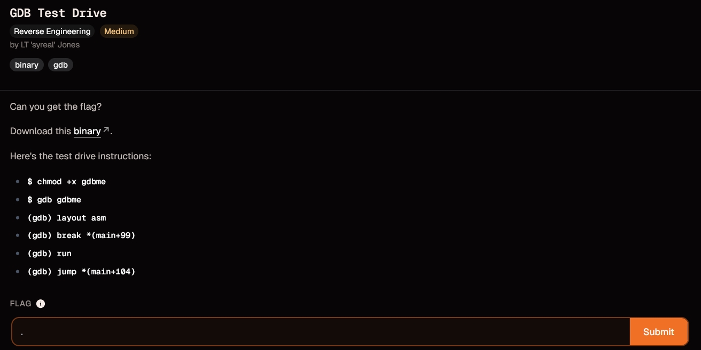
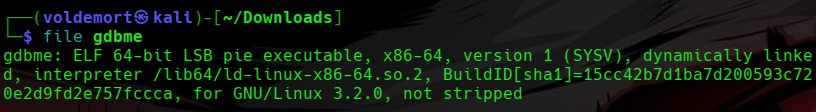
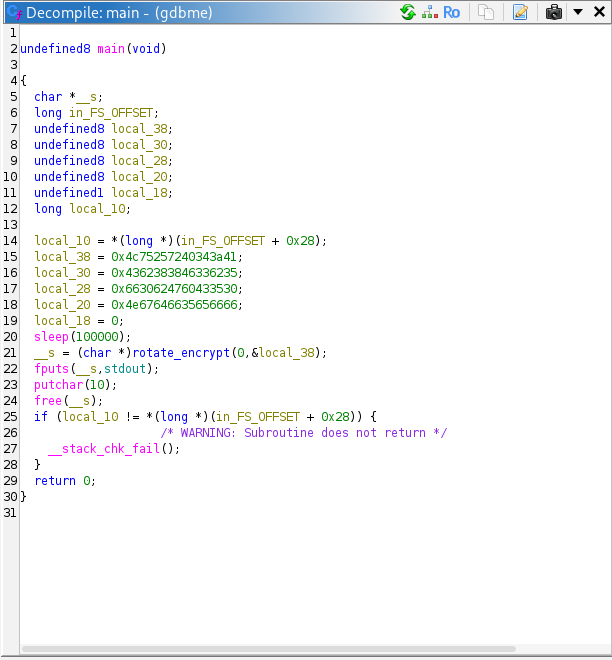
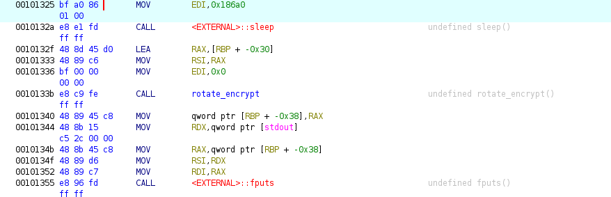
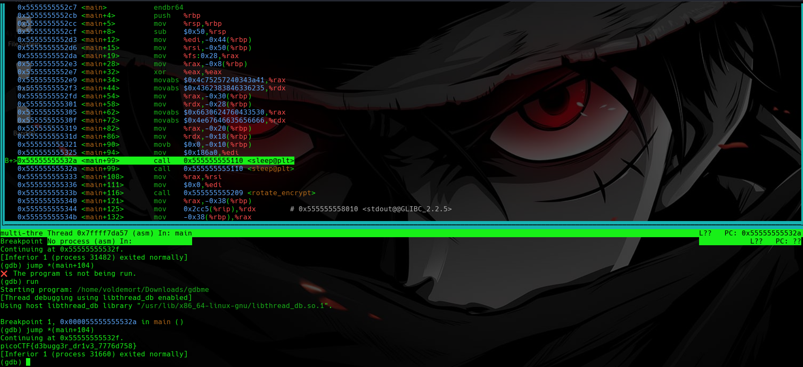

# Day 30: GDB Test Drive picoCTF Reverse Engineering Writeup

A simple picoCTF reversing writeup where Ghidra showed me the map, and GDB let me skip the traffic.

Today, we are setting foot into **reverse engineering**.

We are starting with **GDB Test Drive** from picoCTF.

This was my first time using **GDB and Ghidra together** to understand program logic instead of exploiting a crash.

So no buffer overflow today.

No cyclic pattern.

No yelling at `RIP`.

Just me trying to understand why the program is wasting my time and how to politely skip that part.



## Challenge Instructions

The challenge already gave us the commands:

```text
$ chmod +x gdbme
$ gdb gdbme
(gdb) layout asm
(gdb) break *(main+99)
(gdb) run
(gdb) jump *(main+104)
```

Technically, I could have just copied these commands and gotten the flag.

But that would not really teach me anything.

Since this was supposed to be my first proper reverse engineering step, I wanted to understand **why** these commands work.

Blindly copy-pasting GDB commands would get me the flag, sure.

But I would still be sitting there like:

```text
I did something.
The flag appeared.
No idea what spiritual event just happened.
```

So I opened the binary in Ghidra first.

## Preparing the Binary

Before running it, I made the file executable:

```bash
chmod +x gdbme
```

This gives the binary permission to run.

Then I checked what kind of file it was:

```bash
file gdbme
```



It showed that `gdbme` was an ELF binary.

My beginner translation:

```text
ELF = Linux executable
```

So nothing too strange yet.

It was a normal Linux binary, which meant Ghidra should be able to analyze it.

## Opening the Binary in Ghidra

Next, I opened Ghidra and imported the binary.

The steps were:

```text
File -> New Project
File -> Import File
Select gdbme
```

After importing it, Ghidra asked if I wanted to analyze the file.

I clicked:

```text
Yes
```

Because if Ghidra offers to do painful work for me, I am not going to pretend I am built different.

After the analysis finished, I went to the left side where the **Symbol Tree** is shown.

Then I opened:

```text
Functions -> main
```



This showed me the `main()` function.

Ghidra has two useful views here:

```text
Decompiler view  -> C-like version of the code
Listing view     -> assembly instructions
```

The decompiler view is not the original source code, but it is readable enough to understand the program flow.

And that was all I needed for this challenge.

## Understanding the Program Logic

In Ghidra, `main()` showed that the program stores some encoded values, then does something very annoying:

```c
sleep(100000);
```

After that, it calls something like:

```c
rotate_encrypt(...);
```

and then prints the result using:

```c
puts(...);
```

So the program was not asking me to manually reverse the encryption.

It was mostly asking me to avoid waiting forever.

The program flow looked something like this:

```text
Set up encoded data
Sleep for a very long time
Decode / transform the data
Print the flag
```

So the actual enemy was not encryption.

The enemy was waiting.
## Why main+99 and main+104 Matter

The official instructions included this command:

```gdb
break *(main+99)
```

At first, this looked random.

But after looking at Ghidra, it made more sense.

`main+99` means:

```text
the address of main() + 99 bytes
```

So it is an offset inside the `main()` function.

It is not a random magic number.

It points to a specific instruction inside `main()`.

The next important command was:

```gdb
jump *(main+104)
```

This means:

```text
force the program to continue execution from main+104
```

So the idea is:

```text
Stop at main+99
Skip to main+104
Continue from there
```

In beginner language:

```text
main+99  = where the annoying sleep call happens
main+104 = right after the sleep call
```

So GDB is not being used to exploit a crash here.

It is being used to fast-forward the program.

Like skipping a cutscene, except the cutscene is `sleep(100000)` and the game is a suspicious ELF file.

## Checking the Assembly in Ghidra

To confirm this, I switched from the decompiler view to the listing/disassembly view in Ghidra.

There, I looked around the `main()` function.



Ghidra showed that:

```text
main+99  -> sleep(100000)
main+104 -> instruction right after sleep()
```

In the listing, this matched:

```text
0010132a -> sleep call
0010132f -> after the sleep call
```

So now the official GDB commands were clear.

They were not random.

They were doing this:

```text
Pause before the sleep call
Jump over the sleep call
Let the program continue
Print the flag
```

This was the moment the challenge clicked.

The binary was not hard.

It was just trying to waste 100,000 seconds of my life.

GDB said:

```text
No.
```

## Running It in GDB

Now that I understood the idea from Ghidra, I moved back to GDB.

I opened the binary:

```bash
gdb gdbme
```

Then I used:

```gdb
layout asm
```

This opens the assembly layout inside GDB.

So instead of only typing commands blindly, I can actually see the instructions around where the program is running.

Then I set the breakpoint:

```gdb
break *(main+99)
```

A breakpoint means:

```text
pause the program when it reaches this exact instruction
```

Then I ran the program:

```gdb
run
```

The program started normally and stopped at the breakpoint.

At this point, it was paused right before the part I wanted to skip.

Then I used:

```gdb
jump *(main+104)
```

This forced the program to continue from after the sleep call.

So instead of waiting for the program to finish sleeping, I manually moved execution forward.

The program then continued, decoded the flag, and printed it.



## Flag

```text
picoCTF{d3bugg3r_dr1v3_7776d758}
```

## What Each GDB Command Did

The full command flow was:

```bash
chmod +x gdbme
```

Makes the binary executable.

```bash
gdb gdbme
```

Opens the binary in GDB.

```gdb
layout asm
```

Shows the assembly view inside GDB.

```gdb
break *(main+99)
```

Sets a breakpoint at the instruction around the sleep call.

```gdb
run
```

Starts the program.

```gdb
jump *(main+104)
```

Skips over the sleep call and continues execution after it.

## Final Logic

The whole solve came down to this:

```text
Use Ghidra to understand the program flow.
Notice the long sleep call.
Understand that main+99 points to the sleep call.
Understand that main+104 points after it.
Use GDB to stop before sleep.
Jump past sleep.
Let the program print the flag.
```

## Closing Thoughts

This challenge felt very different from the pwn challenges I did before.

There was no buffer overflow.

No stack smashing.

No return address overwrite.

No ROP chain.

This was more about understanding what the program does and controlling where it runs.

The biggest lesson for me was:

```text
Ghidra helps you understand the program while it is not running.
GDB helps you control the program while it is running.
```

Ghidra is like reading the map.

GDB is like grabbing the steering wheel.

And in this challenge, the roadblock was just a giant sleep call.

So instead of waiting 100,000 seconds like a loyal NPC, I used GDB to skip the line and drive straight to the flag.

