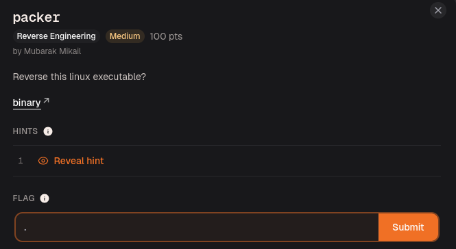
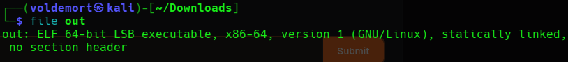
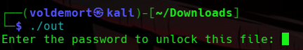
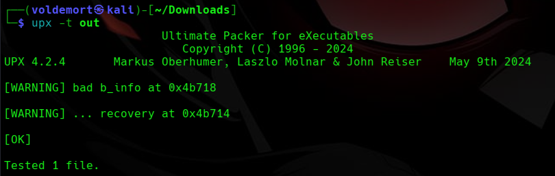
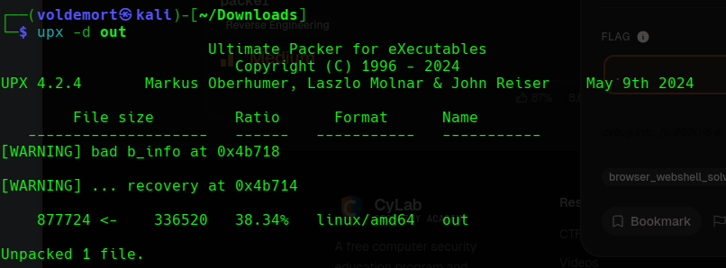
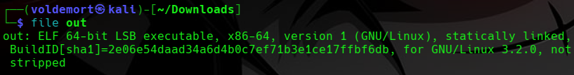
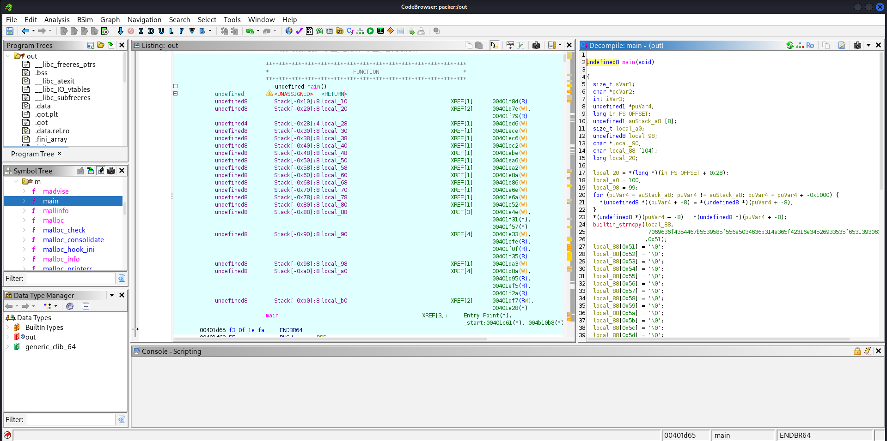
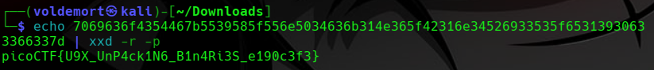

# Day 31: Packer picoCTF Reverse Engineering Writeup

A picoCTF reversing challenge where the binary looked normal, acted suspicious, and was secretly wearing a UPX jacket.

For today’s challenge, we are doing **packer**, a medium-level reverse engineering challenge from picoCTF.



The description said:

> Reverse this linux executable?

Was that a command?

Was that a question?

Was picoCTF also unsure?

Now I am confused too.

The challenge gave us a binary executable named:

```text
out
```

So the first thing I did was check what kind of file it was.

```bash
file out
```



The `file` command showed that `out` is an ELF 64-bit executable.

At first, that sounds normal.

But the challenge name is literally **packer**, so I did not fully trust the binary yet.

A **packer** is something that compresses or wraps a program so the real code is hidden until the program runs. So from the outside, the binary may look like a normal executable, but inside it can mostly contain unpacking code instead of the actual program logic.

In normal human words:

```text
The binary is wearing a hoodie.
Before reversing the real program, I need to check what hoodie it is.
```

## Running the Binary First

Before jumping into Ghidra, I ran the program to see what it does.

```bash
chmod +x out
./out
```



The program asked for a password.

So now the situation was:

```text
There is a binary called out.
It asks for a password.
The challenge is called packer.
The real program is probably packed.
```

At this point, I could have thrown it into Ghidra immediately.

But if a binary is packed, Ghidra may show me the unpacking stub instead of the real logic.

That means I might spend time reversing the wrapper instead of the actual program.

Basically, I would be interrogating the bodyguard while the real suspect is standing behind him eating snacks.

So before going full Ghidra mode, I checked whether this was packed with UPX.

## Checking for UPX

Since the challenge is called **packer**, UPX was the first thing that came to mind.

UPX is a common executable packer. It compresses binaries, and when the program runs, the binary unpacks itself into memory before executing the real code.

Instead of dumping a huge `strings` output and trying to guess from chaos, I used a more direct check:

```bash
upx -t out
```



This confirmed that the binary was packed with UPX.

So the challenge name was not just being decorative.

The binary really was packed.

## What Happens If We Do Not Unpack It?

This part is important.

If I try to reverse the packed binary directly, Ghidra can still open it, but the decompiler output may not show the real program clearly.

Instead of seeing the actual password/flag logic, I would mostly be looking at the UPX unpacking code.

That can make the challenge look harder than it really is.

The program is basically saying:

```text
You want to reverse me?
Cool.
First reverse my packaging.
```

But since this is UPX, we do not need to manually unpack it from memory or do anything painful yet.

UPX can usually unpack normal UPX-packed binaries by itself.

So the correct move was to remove the wrapper first.

## Unpacking the Binary

I unpacked it with:

```bash
upx -d out
```



After unpacking, I checked the file again.

```bash
file out
```



Now the binary was unpacked.

That means Ghidra should have a much easier time showing the actual program logic.

So now it was finally time to reverse the real thing.

## Opening the Binary in Ghidra

I opened Ghidra and imported the unpacked `out` binary.

```text
File -> Import File -> out
```

Then I let Ghidra analyze it.

```text
Analyze -> Yes
```

After the analysis finished, I went to:

```text
Symbol Tree -> Functions -> main
```

and opened the `main()` function.



This was much better than trying to inspect the packed version directly.

Now Ghidra showed the real program logic instead of just the UPX unpacking code.

Inside `main()`, I did not immediately see a clean readable flag like:

```text
picoCTF{...}
```

Instead, I saw a long hex-looking string being copied into a local variable using `builtin_strncpy()`.

The line looked like this:

```c
builtin_strncpy(local_88,
"7069636f4354467b5539585f556e5034636b314e365f42316e34526933535f65313930633366337d",
0x51);
```

At first, this looked like random numbers and letters.

But the beginning stood out:

```text
7069636f4354467b
```

I recognized this pattern because hex can represent ASCII characters.

Breaking it into bytes:

```text
70 69 63 6f 43 54 46 7b
```

decodes to:

```text
picoCTF{
```

That was the moment the challenge started making sense.

The flag was not shown directly as readable text.

It was stored as a hex string.

## Decoding the Hex String

I copied the full hex string from Ghidra and decoded it with `xxd`.

```bash
echo 7069636f4354467b5539585f556e5034636b314e365f42316e34526933535f65313930633366337d | xxd -r -p
```



Breaking that command down:

```bash
echo <hex_string>
```

prints the hex string.

```bash
xxd -r -p
```

converts plain hex back into raw text.

The `-r` means reverse the hex dump.

The `-p` means plain hex format.

So the command basically says:

```text
Take this hex.
Turn it back into readable text.
```

And that gave the flag.

## Flag

```text
picoCTF{U9X_UnP4ck1N6_B1n4Ri3S_e190c3f3}
```

## Final Solve Flow

The solve flow was:

```text
Check the binary with file.
Run the program and see it asks for a password.
Notice the challenge name is packer.
Check for UPX using upx -t.
Unpack the binary using upx -d.
Open the unpacked binary in Ghidra.
Go to main().
Find the hex-looking flag string.
Decode the hex with xxd.
Get the flag.
```

## Closing Thoughts

This challenge was a good reminder that reverse engineering is not always about immediately understanding the password check.

Sometimes the first step is realizing that the thing you are reversing is not the real thing yet.

The packed binary was hiding the actual program logic behind UPX.

Once I unpacked it, Ghidra showed the real `main()` function much more clearly.

Then the final trick was noticing that the flag was stored as hex and decoding it.

So when the description asked:

```text
Reverse this linux executable?
```

the real answer was:

```text
Sure.
But first, unpack the hoodie.
Then decode the receipt inside.
```

No password cracking.

No scary encryption.

Just UPX, Ghidra, and one hex string pretending it was more mysterious than it actually was.

