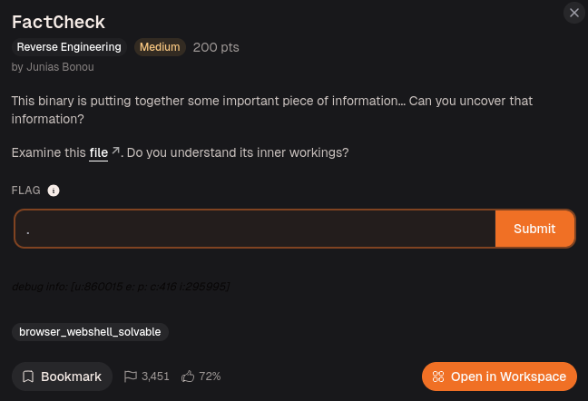
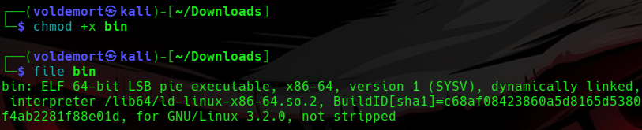
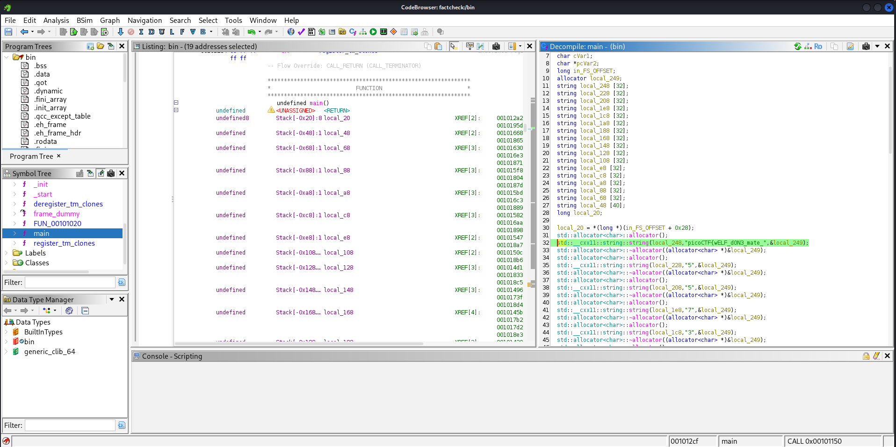
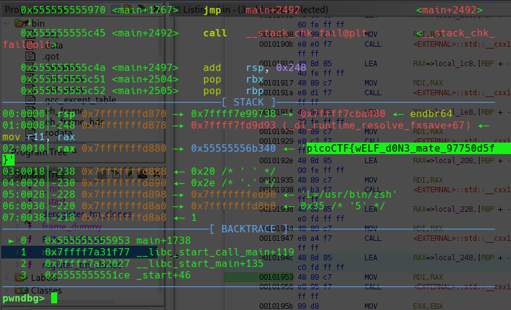

# Day 32: FactCheck picoCTF Reverse Engineering Writeup

The final challenge of my 30-day CTF series, where the binary said nothing, but Ghidra and GDB caught it building the flag anyway.

Today we are tackling **FactCheck**, the last CTF for my 30-day CTF series.

Well, technically this is Day 32.

So yes, my 30-day series became more than 30 days.

Very accurate.

Very on brand.

But nonetheless, this is the last one.



The challenge description says:

> This binary is putting together some important piece of information... Can you uncover that information?  
> Do you understand its inner workings?

The challenge gave us a binary file.

So, as usual, I started with the basic checks.

```bash
chmod +x bin
file bin
```



The `file` command showed that `bin` is an ELF 64-bit executable.

Since this was the final challenge of the series, I was kind of hoping picoCTF would be sentimental and give me a simple goodbye flag.

Obviously, it did not.

picoCTF looked at my 32 days of suffering and said:

```text
You want closure?
Reverse a C++ binary.
```

## Running the Binary

First, I ran the binary to see if it printed anything useful.

```bash
./bin
```

And nothing happened.

No password prompt.

No output.

No error.

No emotional farewell.

Just silence.

At first, that felt useless, but it was actually a clue.

If a binary runs and prints nothing, that usually means one of two things:

```text
1. It is doing something silently.
2. It builds something internally but never directly shows it.
```

The challenge description said:

```text
This binary is putting together some important piece of information...
```

The keyword here is **putting together**.

That made me think the flag might not be stored as one clean string like:

```text
picoCTF{full_flag_here}
```

Instead, the program might be building it piece by piece while running.

So if I only run the binary normally, I get nothing.

If I only search for a clean full flag, I might also get nothing.

That means I need to understand what the program does internally.

So I opened it in Ghidra.

## Opening the Binary in Ghidra

I imported the binary into Ghidra:

```text
File -> Import File -> bin
Analyze -> Yes
```

After the analysis finished, I opened:

```text
Symbol Tree -> Functions -> main
```



The `main()` function looked very C++-ish and ugly.

There were a lot of lines involving things like:

```text
std::__cxx11::basic_string
operator+=
operator[]
```

At first, this looked like C++ had personally decided to punish me.

But after staring at it for a bit, the pattern became clearer.

The binary was creating strings, checking characters, and appending selected pieces into one main string.

So the program was not simply storing the flag as one obvious value.

It was doing something closer to:

```text
Start with part of the flag.
Check some small string values.
Append one piece.
Append another piece.
Append another piece.
Eventually add the closing }.
```

That matched the challenge description really well.

The binary was literally **putting together** the important information.

## Finding the Flag Construction

Inside the decompiler, I saw the beginning of the flag being created as a C++ string.

It looked something like this:

```cpp
std::__cxx11::basic_string(..., "picoCTF{wELF_d0N3_mate_");
```

That was enough to confirm I was in the right place.

The binary was definitely building a picoCTF flag.

But I did not want to manually reconstruct the whole thing by reading every single `operator+=` line.

That would be possible, but painful.

Also, it would feel less like reversing and more like copying tiny string crumbs from Ghidra until my brain gives up.

So I decided to let the program do the annoying work itself.

If the binary builds the flag while running, then I can:

```text
Let the program build the flag.
Pause it after the flag is complete.
Inspect the finished string in memory.
```

That felt cleaner.

Instead of manually rebuilding the flag, I would catch the binary after it finished building it.

Basically:

```text
Me: You build the flag.
Binary: Fine.
Me: Pause. Hand it over.
```

## Choosing Where to Break

In Ghidra, I scrolled near the lower part of `main()` where most of the string appending was happening.

The important area had a lot of calls that looked like:

```cpp
std::__cxx11::basic_string<...>::operator+=(...)
```

Near the end, I also saw the program appending:

```text
}
```

That mattered because once the closing brace is added, the flag should be complete.

So I took the address around the instruction after the final append.

The address I used was:

```text
0x1953
```

This was the point where the flag should already be assembled in memory.

Now it was time to move into GDB.

## Using GDB to Inspect the Finished String

I opened the binary with GDB/pwndbg:

```bash
pwndbg ./bin
```

Then I set a breakpoint at the address I found from Ghidra.

```gdb
breakrva 0x1953
```

`breakrva` sets a breakpoint using an offset relative to the binary.

This is useful because the full runtime address can change, but the offset from the binary’s base is still something I can work with.

Then I ran the program:

```gdb
run
```

When the program hit the breakpoint, it paused around the point where the flag had already been built.

And there it was.



```text
picoCTF{wELF_d0N3_mate_97750d5f}
```

So the binary did not print the flag normally.

But while it was running, the completed flag existed in memory.

That was the trick.

## Flag

```text
picoCTF{wELF_d0N3_mate_97750d5f}
```

## Final Logic

The solve was not:

```text
Run binary.
Get output.
Done.
```

Because running the binary gave nothing.

The solve was more like:

```text
Run the binary and notice it prints nothing.
Open it in Ghidra.
Find main().
Notice C++ string construction.
Find where the flag is completed.
Use GDB to pause after the construction.
Inspect memory.
Get the finished flag.
```

The key idea was:

```text
Ghidra showed how the flag was being built.
GDB showed the final result while the program was running.
```

## Closing Thoughts

This was a good final challenge for the series.

It was not about exploiting a crash.

It was not about overflowing a buffer.

It was not about building a ROP chain.

It was about understanding program behavior.

The binary stayed silent when I ran it normally, but Ghidra showed that it was building something behind the scenes.

Then GDB let me pause the program at the right moment and inspect what already existed in memory.

The biggest lesson was:

```text
Static analysis shows what the program is trying to do.
Dynamic analysis shows what actually exists while the program is running.
```

Ghidra showed me the construction logic.

GDB showed me the final flag.

And after 32 days of CTFs, this final challenge basically said:

```text
You do not always need to solve every tiny condition manually.
Sometimes you can let the binary finish its work, then inspect the result.
```

Honestly, that is a pretty good ending.

Thirty days became thirty-two.

My sleep schedule took damage.

My brain now recognizes `std::__cxx11::basic_string` against its will.

But the final flag fell out.

Series complete.

